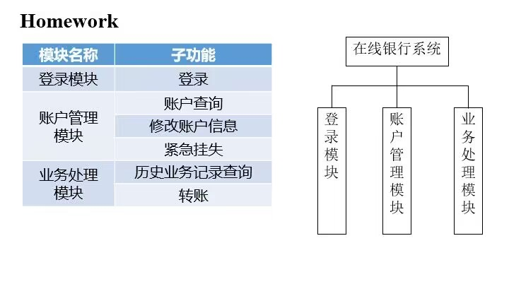
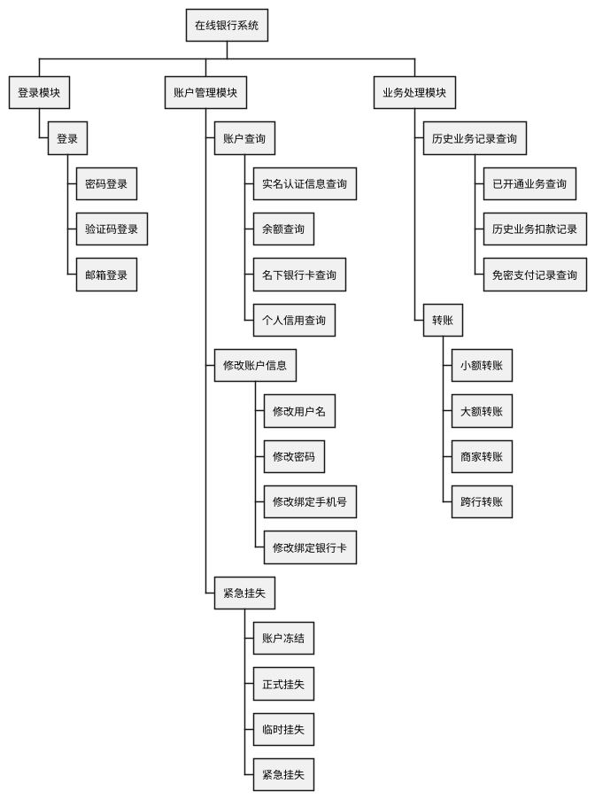
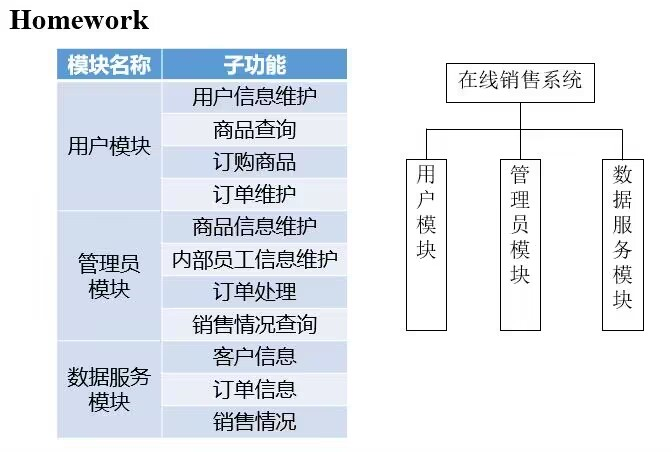
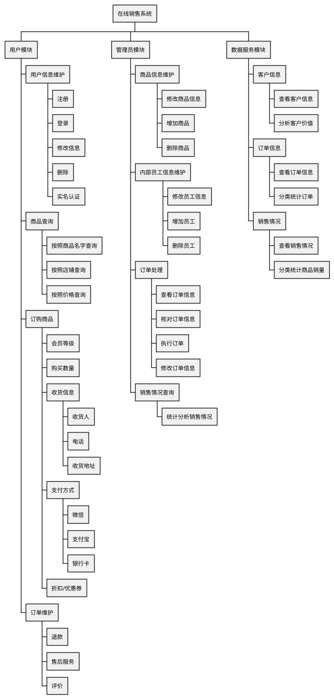

```plantuml
@startwbs 在线银行系统
* 在线银行系统
** 登录模块
*** 登录
**** 密码登录
**** 验证码登录
**** 邮箱登录
** 账户管理模块
*** 账户查询
**** 实名认证信息查询
**** 余额查询
**** 名下银行卡查询
**** 个人信用查询
*** 修改账户信息
**** 修改用户名
**** 修改密码
**** 修改绑定手机号
**** 修改绑定银行卡
*** 紧急挂失
**** 账户冻结
**** 正式挂失
**** 临时挂失
**** 紧急挂失
** 业务处理模块
*** 历史业务记录查询
**** 已开通业务查询
**** 历史业务扣款记录
**** 免密支付记录查询
*** 转账
**** 小额转账
**** 大额转账
**** 商家转账
**** 跨行转账
@endwbs
```

---

```plantuml
@startwbs 在线销售系统
* 在线销售系统
** 用户模块
*** 用户信息维护
**** 注册
**** 登录
**** 修改信息
**** 删除
**** 实名认证
*** 商品查询
**** 按照商品名字查询
**** 按照店铺查询
**** 按照价格查询
*** 订购商品
**** 会员等级
**** 购买数量
**** 收货信息
***** 收货人
***** 电话
***** 收货地址
**** 支付方式
***** 微信
***** 支付宝
***** 银行卡
**** 折扣/优惠券
*** 订单维护
**** 退款
**** 售后服务
**** 评价
** 管理员模块
*** 商品信息维护
**** 修改商品信息
**** 增加商品
**** 删除商品
*** 内部员工信息维护
**** 修改员工信息
**** 增加员工
**** 删除员工
*** 订单处理
**** 查看订单信息
**** 核对订单信息
**** 执行订单
**** 修改订单信息
*** 销售情况查询
**** 统计分析销售情况
** 数据服务模块
*** 客户信息
**** 查看客户信息
**** 分析客户价值
*** 订单信息
**** 查看订单信息
**** 分类统计订单
*** 销售情况
**** 查看销售情况
**** 分类统计商品销量
@endwbs
```
