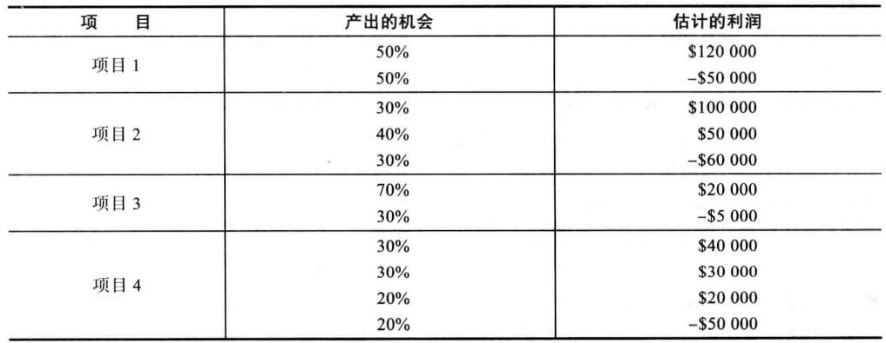
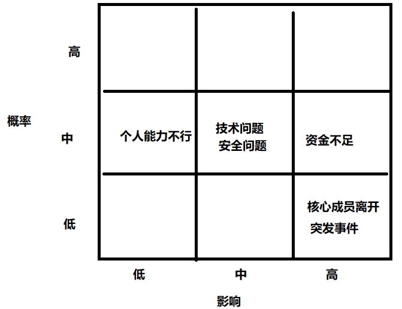
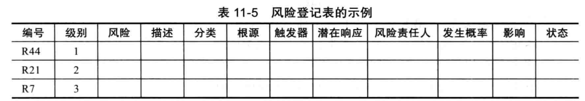
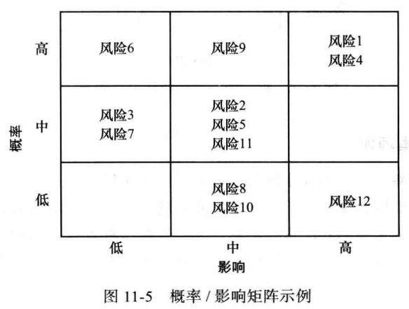

## 快速测验
1. d
2. b
3. c
4. a
5. d
6. b
7. d
8. c
9. a
10. a

## 讨论题

### 4.对风险识别来说，头脑风暴和德尔菲技术有什么不同？每种方法各有什么优缺点？描述风险登记表的内容，并阐述风险登记表如何在风险管理过程中使用？
德尔菲法与头脑风暴法的区别

一、应用不同
1. 德尔菲法主要用于技术预测、政策制订、经营管理、方案评估等。
2. 头脑风暴法一般用于对战略性问题的探索。

二、专家选择的代表、人数不同
1. 头脑风暴法专家选择缺乏代表性，易受权威、会议气氛和潮流等因素影响。所选专家人数为 5~15 人。
2. 德尔菲法专家选择相对广泛，采用匿名征询的方式征求专家意见消除了专家会议调查法中专家易受权威、会议气氛和潮流等因素影响的缺陷。所选专家人数在 15~50 人。

三、获取专家意见的工具不同
1. 德尔菲法运用编制调查表的方法，把调查表分发给受邀参加预测的专家。专家之间互不见面和联系，不受任何干扰独立地对调查表所提问题发表自己的意见。
2. 头脑风暴法的会议一般采用“圆桌会议”的形式，进行即兴发言。

四、专家对问题的回答不同
1. 运用德尔菲法的专家对调查表的提问有充分时间作出充分的论证、详细的说明或提出充足的依据。
2. 头脑风暴法因为是即兴发言，因而普遍存在逻辑不严密、意见不全面、论证不充分等问题，同时易受表达能力的限制。

五、所用时间不同
1. 德尔菲法要进行四轮的征询调查，所用时间通常比较长。
2. 头脑风暴法的会议讨论的是时间一般为 20~60 分钟，如果讨论的问题较多，可以多召集几次会议。

风险登记簿RiskRegister系统
1. 利于传播风险知识：行业风险知识库和案例库以及企业自身开展项目的风险登记簿是企业风险管理成果积累的重要组成部分。通过浏览、调用历史风险知识和案例以及对以往风险登记簿内容的回顾，不仅有利于管理人员总结风险管理经验教训、促进风险知识的传播，而且有利于管理人员识别和评估风险，对当前的风险管理提供有益的参考和借鉴。
2. 利于开展头脑风暴与研讨交流：风险登记簿的建立便于团队成员采用网络研讨会模式协作开展风险评估与管理，鼓励成员间的更多的交流与互动，具有较强的内容延展性。借助和使用风险登记簿中积累的风险知识和案例，能够激发团队成员更多的启发和思考，有效提高了头脑风暴和研讨交流方法的应用效果。
3. 利于提高风险管理效率和质量：风险登记簿系统的建立有利于帮助管理人员规范化开展风险管理活动、执行风险管理流程，有效率地识别、评估和管理风险，提高风险管理决策质量，同时促进了风险信息在不同阶段和不同管理团队之间的传递和交底。
4. 利于开展决策风险审计：作为风险管理各阶段工作的输出成果，风险登记簿完整记录了风险评估和管理的过程及结果，保留了制定风险决策使用到的历史数据和决策依据，这为回溯决策过程和决策风险审计提供了工具和手段。
5. 利于开展培训与学习：风险登记簿采用标准化风险数据结构，有利于培养统一形式的风险思维、培养学员使用标准语言描述和分析风险、理解风险的发生机理、提高学习掌握风险应对措施的效果和效率，有利于有效缩短风险管理培训时间并提高学员的实战技能和经验。
6. 利于发现风险管理人才：风险登记簿在设计上融入互联网知识社区概念，建立了“人员-风险知识-人员”的连接，并通过多向信息传递途径将人员与风险知识联系在一起。在登记簿中可以通过人员找到他们关注的风险，也可以通过风险信息找对有经验的管理人员，这有利于发现和挖掘风险管理人才，有效提升企业风险管理能力。

### 5.描述风险定性分析中如何使用概率/影响矩阵和十大风险事件追踪技术？你怎么在一个项目中使用这些技术？
概率/影响矩阵
- 风险概率影响矩阵是项目管理工作中风险度量、定性风险分析最常用的工具之一。通常来讲，项目风险是指如果某一事件发生将会给项目目标带来不利影响。虽然由美国项目管理协会(PMI)制定的项目管理知识体系PMBOK中，将风险定义为威胁以及机会两个方面，但是在项目管理软件中，风险主要还是指不确定的威胁。
- 风险发生的概率，一般可以分为五个等级：很高、高、中、低、很低。
- 风险发生后对项目造成的影响，一般也可以分为五个等级：很高、高、中、低、很低。
- 我们把影响程度作为横向坐标，把发生概率作为纵向坐标，既可以得到一个5乘5的矩阵。

十大风险事件跟踪技术
这是一种风险定性分析工具，除了可以识别风险之外，还能通过监控风险在整个项目生命周期内保持风险意识。它使管理部门或者客户定期审查项目最重大的风险事项。对项目十大风险来源进行汇总，从而开始这种审查。
汇总包括各风险事件目前级别、以前的级别、在一段事件内出现在列表上的次数以及自从上次审查以来解决这一风险事项所取得的进展。

会在项目开始时根据对项目风险的评估设立风险概率影响矩阵，并根据该矩阵指定工作计划。
在项目进行时，充分利用十大风险事件跟踪技术识别风险的同时保持项目的风险意识，降低项目风险发生的概率，并减少解决问题的成本。

## 练习题

### 4.假设你的组织正在决定在4个项目中投标哪一个，各个项目的相关信息见下表。
假设所有的前期投资无法收回，所以用负利润显示。画一个表，并计算各项目的EMV。写几段话来解释你会投标的项目。确定使用EMV信息和你的个人风险承受力来论证你的答案。

EMV(项目1) = 50% \* 120 000 + 50% \* (-50 000) = 35 000

EMV(项目2) = 30% \* 100 000 + 40% \* 50 000 + 30% \* (-60 000) = 32 000

EMV(项目3) = 70% \* 20 000 + 30% \* (-5 000) = 12 500

EMV(项目4) = 30% \* 40 000 + 30% \* 30 000 + 20% \* 20 000 + 20% \* (-50 000) = 15 000

| 项目  | EMV    |
| ----- | ------ |
| 项目1 | 35 000 |
| 项目2 | 32 000 |
| 项目3 | 12 500 |
| 项目4 | 12 000 |

我会选择投资项目1、2，根据EMV数值来看，其盈利期望较高。项目资金相对充裕，能够接收相应的亏损。另外，从经济学上来说，低收益意味着亏损，所以项目3的收益太低，不适合投资，项目4拥有更低的收益i期望和更高的亏损风险。综合考虑，决定投标项目1、2这种。
<!-- 项目3的盈利概率较高，且亏损概率个亏损都较小。 -->

## 运行案例
Tony和他的项目团队同事在第一个月发现了娱乐与健康内网项目的一些风险。但是，他们做的仅仅是记录在案。他们从未对这些风险进行排序和制订任何响应策略。由于出现了一些问题，例如核心队员离开公司，用户不合作，开发团队同事没有提供很好的状态信息，所以Tony打算着手风险管理。他希望同时考察正面和负面的风险。

### 1.像表11-5那样，创建一张风险登记表。识别6种潜在风险，包括上面描述问题相关的风险，也包括负面和正面的风险。
对于娱乐与健康内网项目，潜在风险包括：
项目负责人和团队成员个人能力不足，导致项目进度滞后或质量不足。
项目资金不足，导致项目难以实施或实施效果不佳。
项目目标与实际需求不一致，导致项目无法满足预期效果。
项目遇到突发事件，导致项目无法继续进行。
项目实施过程中出现技术问题，导致项目停滞不前。
此外，由于娱乐与健康内网项目涉及到大量的用户数据，因此还需要考虑数据安全风险，避免用户数据泄露或被非法使用。

### 2.像图11-5那样，做出概率/影响矩阵。给矩阵的每个风险赋予一个数值。
使用1~10来表示风险，1表示最低风险。对于简单的风险因子计算，将概率值和影响值相乘。在影响列右边添加一个风险得分列，为该列输入新的值。写下你为每个正面和负面风险打分的缘由。

- 核心成员离开、突发事件：8
  - 风险影响较大，但是否发生概率较低。
- 资金不足：9
  - 资金不足能导致项目进度延误，无法完成需求，核心成员离开。且由于预算失误或者需求的频繁变更，拥有较高的发生频率。
- 技术和安全问题：7
  - 临时变更技术和修补安全漏洞较为困难，且可能导致项目工期延误，预算超支，客户不满等，对项目产生较大的影响。
- 需求变更：6
  - 需求变更可能对项目的开发思路产生较大的影响，频繁的需求变更可能导致项目成员难以开发项目，但是由于需求变更对于一个项目来说是常会发生的，因此我们通常在项目初期的时候就会对项目的变更做出准备，所以该类风险通常不会造成较大的影响。
- 个人能力不行：5
  - 对于小型项目团队来说，个人能力不行对团队的影响较大。但是对于大型团队和资金充裕的团队来说，该类问题基本不会造成什么影响。因为人员可以被较为便捷的提换。

### 3.为每个负面和正面风险制订响应策略。将这些信息写入风险登记表中。另外写一段话描述为执行这些策略而需要做的工作。同时需要包含每个策略的时间和成本估算。
风险登记表
- 项目核心成员离开：对核心业务建立‘A/B’双负责人机制。A做为主负责人，B做为副负责人，当其中一人离开时，另一人可以通过交接，迅速弥补空缺，然后再从外部或内部调用合适的资源来补齐‘A/B’双负责人。
- 资金不足：树立科学管理观，制定合理管理制度。从流动资金的特性出发，在保证管理目标的基础上管理流动资金，把追求最大程度的流动性确定为明确而具体的目标，在实现利润最大化的同时追求最强的流动性。其次要在战略管理的角度，依照企业目标来合理的制定流动资金的计划，合理分配流动资金，调整好流动资金的筹措、投放、分配、使用和回收工作，科学的控制流动资金的使用，有效利用资金，降低资金成本，并加强流动资金的分析和考核。而且还要建立健全流动资金的归口分级管理，按照用、管、算相结合的原则，推行全企业、全员、全过程的经济核算，把构成流动资金内容的各项指标，按照职能部门分管的具体业务范围，分工负责。
- 技术和安全问题：；与用户和其他项目组技术人员沟通，确定项目需要哪些开发技术。；与项目组成员沟通，了解他们的技术背景和开发能力。；与公司管理层沟通协调，确保新增的技术人员能按时到位。；在项目开发前，采用外部培训和内部交流等方式进行技术培训。；在项目开发中，针对出现的技术难题要有应对措施，如请专家指导、技术攻关或外包。；在项目后期，及时总结技术开发经验，按标准形成文档，以供项目维护和其他项目使用。
- 需求变更：1. 分析识别客户的沟通风格。2. 学习掌握项目相关的背景知识。3. 争取具有决策权的项目干系人对项目的重视。4. 建立规范的需求变更管理制度。5. 加强对需求分析和需求设计的审核确认。
- 个人能力不行：1、不断加强专业知识的学习，坚持终身学习，加强对教学工作的研究，努力提高综合素质。从实践中学，同时勤于从书上学，加强专业知识理论培训和教育教学理论。增强做好工作的本领，既教书，又育人。2、尽可能多的向其他教师请教，做到取长补短，共同进步。3、加强政治理论学习，在认清职责的同时立足本职，本本分分做实实在在的事情。严格要求自己，用自己的一言一行、一举一动去自觉工作，依法执教，做到全心全意为学生服务。4、提高对创新和工作方法重要性的认识，自觉、刻苦地钻研业务，务实基础，灵活运用合理的方法和措施，热爱本职工作，干一行爱一行，虚心好学，遇到问题多看多问多想。

---

