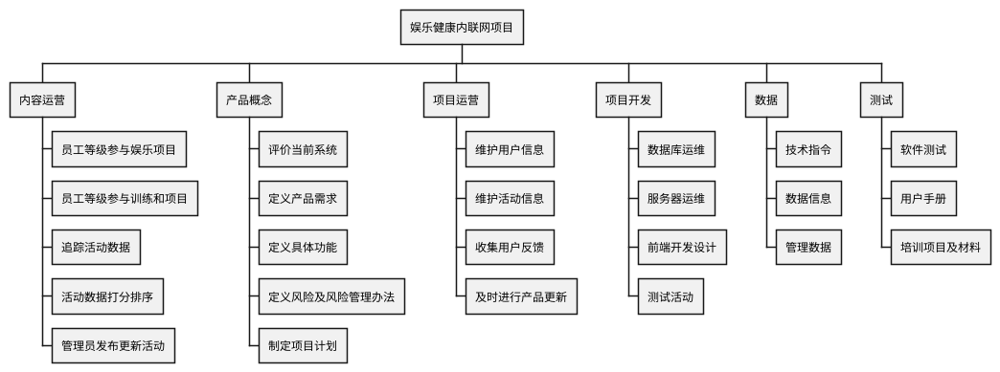
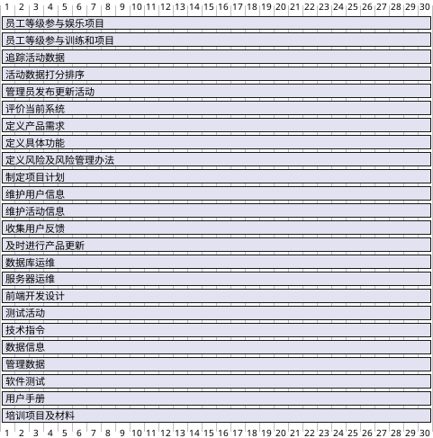

## 快速测验
1. c
2. a
3. b
4. d
5. c
6. d
7. c
8. b
9. d
10. c

## 讨论题

### 2.项目收集需求包括哪些？为什么收集需求很难做？
收集需求的方法：
- 头脑风暴
- 干系人访谈
- 焦点小组会议、引导式研讨会
- 群体创新和决策技术
- 问卷和调查
- 观察法
- 原型法和文档分析法
- 基准比较法

业务、干系人、解决方案、过渡和准备、项目、质量

需求说明书：
1. 描述当前局面的不足以及项目启动的原因
2. 可跟踪的业务目标和项目目标
3. 功能要求（需求清单或模型）
4. 非功能要求（如服务水平、绩效、安全、合规等）
5. 质量要求
6. 验收标准
7. 体现组织指导原则和业务规则
8. 对组织其他领域的影响
9. 对执行组织内部或外部团体的影响
10. 对支持和培训的需求
11. 对需求有关的假设条和制约因素

记录需求的步骤：
1. 阅读项目章程，参考项目范围和需求管理计划。
2. 查阅干系人记录与干系人管理计划。

需求文档通常由软件生成，可以是文档、图像、程序、录像和其他媒介。

对于需求方：
- 如果是软件产品，需求方是可确定的一小群人，并且可以接触到，他们通常在描述需求时会有以下问题：描述不完整，比如只考虑正常情况没考虑异常情况、对一些自认为是常识的忽略不提；用语不准确，可能内心清楚但是表达能力欠缺；把解决方案当成需求提出来，基于自己认知水平提出的解决方案往往不完善，但又容易被当作需求混淆在一起。
- 如果是互联网产品，需求方是一个群体，这时候获取的难度不仅在于需求方的表达，还在于沟通本身就很困难，不能一个个访谈，但是采用大批量的调研方法，又会存在信息噪音。

对于需求获取方：
- 这个就是专业能力的问题了，要了解需求获取的N种方法，比如访谈，比如问卷调研，比如模拟情境观察等等，并且熟练地运用在不同的情况，很多时候还需要组合运用，并且会感觉到没有哪一种会完美地获取需求，只能在约束规则（时间、成本）下做到尽量。

归纳起来：
1. 需求获取范围大（人太多、类型太多、分布太广）
2. 需求方表达能力有限（说不清楚、想不明白、各种信息噪音混淆在一起）
3. 需求获取方能力（因为前两点，所以发展出的方法很多，要熟练掌握和运用不容易）

### 4.描述开发WBS的不同方法以及解释为什么总是很难进行开发。
制定工作分解结构（WBS）的方法包括：使用指南、类比法、自上而下和自下而上的方法、思维导图法。

1. 使用指南
   - 一些组织，例如美国国防部（DOD）为特定项目定制了WBS的格式和内容。
2. 类比法
   - 使用一个相似项目的WBS作为出发点。
3. 自上而下和自下而上的方法
   - 自上而下法（top-down approach）：从项目最大的条目开始，将它们分解为次一级的条目。这个过程实际上就是对于工作的进一步细分。
   - 自下而上法（bottom-up approach）：首先识别尽可能多的与项目有关的具体任务。随后，将这些具体的任务集中并组织成概要任务或WBS中的较高层次。
4. 思维导图法
   - 一种从核心思想向外辐射出分支的技术，将思想和想法结构化。

难点：
1. 不知道怎么分解。
   - 这点是在需求确认和讲解后，是很多项目管理者和开发人员经常抱怨的。因为很多人估算时间是很简单粗暴的，需求在脑子里过了一下，然后随口报出一个时间，但往往这个时间是不靠谱的。
   - 为什么会出现这个问题，就是任务分解没有做，或者没有做好。
   - 对于需求没有理解透彻，相关业务逻辑还根本没有去思考;只关注主流程，而对分支不重视;学习新的技术没有预留缓冲时间;开发完毕没有考虑自测时间等等不一而足。
   - 一般以上情况出现，都会把任务的颗粒度做得很大;原因很简单，很多东西没有考虑或者考虑不足的情况下，颗粒度无法继续分解。
   - 最后就是交出来的任务列表很粗糙，甚至有的任务预计一周。这种分解对项目的跟踪管理毫无意义。
2. 懒得去分解。
   - 这点就是态度问题了，觉得这个东西太难了，也懒得去深究。反正做到哪里是哪里，随便估算个时间交差。
   - 往往造成这种情况的，基本都是经历了很多次第一种困难之后，已经对任务分解失去信心，导致恶性循环。

具体来说，在分解的过程中，应该注意以下8个方面。
1. WBS必须是面向可交付成果的。项目的目标是提供产品或服务，仅仅是一连串特别的活动。WBS中的各项工作是为提供可交付的成果服务的。WBS并没有明确地要求重复循环的工作，但为了达到里程碑，有些工作可能要进行多次。最明显的例子是软件测试，软件必须经过多次测试后才能作为可交付成果。
2. WBS必须符合项目的范围。WBS必须包括，也仅包括为了完成项目的可交付成果的活动。100%原则（包含原则）认为，在WBS中，所有下一级的元素之和必须100%的代表上一级元素。如果WBS没有覆盖全部的项目可交付成果，那么最后提交的产品或服务是无法让用户满意的。
3. WBS的底层应该支持计划和控制。WBS是项目管理计划和项目范围之间的桥梁，WBS的底层不但要支持项目管理计划，而且要让管理层能够监视和控制项目的进度和预算。如果将WBS分解得过于徉细，那么容易让人掉进细节中，同时可能会忽略更重要的事情，对于项目的控制成本也不利。另外，WBS如果变成了每小时的工作单，那么对于项目团队成员而言，谁也不愿意每时每刻都受到监控，而且，组织可能还需要雇佣相应的人员来完成如此之多的监控。
4. WBS中的元素必须有人负责，而且只由一个人负责，尽管实际上可能需要多个人参与。如果没有个人负责的内容，那么WBS发布后，也很少有项目团队成员能够意识到自己和其中内容上的联系。WBS和责任人可以使用工作责任矩阵来描述。在一些参考文献中，这个规定又称为独立责任原则。
5. WBS的指导。作为指导而不是原则，WBS应控制在4～6层。如果项目规模比较大，以至于WBS要超过6层，此时，可以使用项目分解结构将大项目分解成子项目，然后针对子项目来做WBS。每个级别的WBS将上一级的一个元素分为4～7个新的元素，同一级的元素的大小应该相似。一个工作单元只能从属于某个上层单元，避免交叉从属。
6. WBS应包括项目管理工作（因为管理是项目具体工作的一部分），也要包括分包出去的工作。
7. WBS的编制需要所有（主要）项目干系人的参与，需要项目团队成员的参与。各项目干系人站在白己的立场上，对同一个项目可能编制出差别较大的WBS。项目经理应该组织他们进行讨论，以便编制出一份大家都能接受的WBS。
8. WBS并非是一成不变的。在完成了WBS之后的工作中，仍然有可能需要对WBS进行修改。如果没有合理的范围控制，仅仅依靠WBS会使得后面的工作僵化。在一些参考文献中，这个问题被称为滚动分解原则。

## 5.14 运行案例
健康管理公司（MYH）的经理选择Tony Prince作为娱乐与健康内网项目的项目经理。项目预定时间是6个月，预算开支是20万美元。Toy有项目管理和系统分析的经验，同时他也是一个体育运动的狂热爱好者。
Toy开始将项目团队集合在一起，他明白他必须写一个调查问卷请求所有的员工对于他的新系统给出输入信息，同时确定系统是用户友好的。
回忆第4章的内容，这个案例应该包括如下的功能：
- 允许员工登记公司资助的健康节目，比如足球、垒球、保龄球、慢跑、散步。
- 允许员工登记公司投资的课程和项目以帮助他们控制他们的体重、减压、戒烟以及控制其他与健康有关的事项。
- 跟踪员工参加这些娱乐和健康管理项目的数据。
- 为加入项目并且表现良好的人提供微励机制（例如，为实现体重目标、在体育比赛中获胜的团队等提供奖励）。

假设MYH不用再为该项目购买其他的额外硬件和软件了。

## 5.15 任务

### 1.对于运行案例中描述的项目，写出你收集需求的方法。需求跟踪矩阵中至少包含5个需求。
收集需求的方法：
- 头脑风暴：召开项目组内会议，邀请与会人员发表自己的意见和想法，讨论如何进行数据收集的办法并进行难易度划分，选出最合理高效的一个。进一步探讨实现步骤，实现计划，实施方法和人员分工等。讨论范围包括系统功能，人员信息，办法收集等。最后请记录人员记录好会议内容。
- 干系人访谈：“一对一访问”，对公司内不同阶层和不通健康状况的人进行访谈，包括管理办法，实施办法和对系统的期望需求等。
- 焦点小组会议、引导式研讨会：邀请健康专家和员工代表进行小组讨论，了解他们对娱乐健康内联网项目的期望和态度，从专业人士那里得到建议和点播，以科学的态度对收集到的需求进行讨论或调整。
- 问卷和调查：面向娱乐健康内联网项目的所有受众发布问卷，收集用户需求，用户对公司现有状况的态度，用户满意度和修改意见等，并对问卷进行统计分析。

| 项目名称 | 娱乐健康内联网项目                                                                                                                                                         |
| -------- | -------------------------------------------------------------------------------------------------------------------------------------------------------------------------- |
| 成本中心 | 该项目的事前开发成本，事后维护成本，以及长期运营成本。                                                                                                                     |
| 项目描述 | 名为“管理你的健康”的公司（MYH）的经理Tony Prince作为娱乐健康内联网项目的项目经理。要求该项目设计一个新的系统，并确保这个系统方便可用。进度目标为6个月，预算为200 000美元。 |

| 标识 | 关联标识 | 需求描述       | 业务需要、机会、目的和目标                                                           | 项目目标                                                   | WBS可交付成果          | 产品设计                                           | 产品开发                       | 测试案例                                      |
| ---- | -------- | -------------- | ------------------------------------------------------------------------------------ | ---------------------------------------------------------- | ---------------------- | -------------------------------------------------- | ------------------------------ | --------------------------------------------- |
| 001  | 1.0      | 参与娱乐项目   | 允许员工登记参加公司赞助的娱乐项目，如足球、垒球、保龄球、慢跑、行走及其他运动。     | 帮助员工更好地进行娱乐放松，调整身体和心理状态。           | 各娱乐项目的展示主页。 | 设计娱乐项目列表以及参与机制。                     | 使用本公司内部云端数据库存储。 | 项目经理Tony Prince和焦点小组成员进行内部测试 |
| 001  | 1.1      | 参与训练班项目 | 允许员工登记参加公司赞助的训练班项目。                                               | 帮助员工保持体重、减轻压力、戒烟及管理其他健康相关的事宜。 | 各训练班的展示主页。   | 设计训练班列表以及参与机制。                       | 使用本公司内部云端数据库存储。 | 项目经理Tony Prince和焦点小组成员进行内部测试 |
| 002  | 2.0      | 追踪机制       | 追踪员工参与这些娱乐及健康管理项目/活动的数据。                                      | 更好地管理员工，便于根据需求调整不同的娱乐项目及训练班。   | 暂无                   | 设计为后台可见，只有该项目的运营维护人员可以查看。 | 使用本公司内部云端数据库存储。 | 项目经理Tony Prince和焦点小组成员进行内部测试 |
| 003  | 3.0      | 奖励机制       | 对参与活动并且表现优秀的人予以奖励（如奖励达到体重目标的和赢得团体运动比赛的人等）。 | 鼓励员工更加积极踊跃地参与到这个项目中来。                 | 暂无                   | 公开奖励信息，设立列表便于全体员工查看。           | 使用本公司内部云端数据库存储。 | 项目经理Tony Prince和焦点小组成员进行内部测试 |
| 004  | 4.0      | 反馈机制       | 鼓励员工将自己参与该项目时遇到的问题及困难向运营维护人员反馈。                       | 更好地调整该项目的有关机制，不断完善该项目。               | 暂无                   | 设计为后台可见，只有该项目的运营维护人员可以查看。 | 使用本公司内部云端数据库存储。 | 项目经理Tony Prince和焦点小组成员进行内部测试 |

### 2.创建项目的范围说明书的第一个版本。用本书配套网站上的模板和第3章示例的指导进行撰写。
在描述产品以及项目其他可交付成果的特性和需求的时候，尽量具体。确保将测试和训练作为项目范围的一部分考虑。

项目名：娱乐与健康内网项目
日期：2022年10月27日
创作者：xxx
项目论证：
1. 能计算时间：WBS的每个任务的预期完成时间都在一星期左右，因此时间上是可计算的
2. 能赋予资源：开发人员负责开发设计，维护人员负责产品维护，项目经历进行项目安排等
3. 能给出成本预算模型：人力资源成本，时间成本服务器费用
4. 有明确的任务或活动和相关成果：任务和活动即为项目管理，设计和开发;相关成果是界面美观，功能完整，便于用户交互的应用成果

产品特性
- 项目是封闭性的，只对公司内员工开放。
- 项目是非盈利性质的，不对员工进行收费，甚至会奖励员工。
- 项目相对简单可实施。

要求：
- 允许员工登记公司资助的健康节目，比如足球、垒球、保龄球、慢跑、散步。
- 允许员工登记公司投资的课程和项目以帮助他们控制他们的体重、减压、戒烟以及控制其他与健康有关的事项。
- 跟踪员工参加这些娱乐和健康管理项目的数据。
- 为加入项目并且表现良好的人提供微励机制（例如，为实现体重目标、在体育比赛中获胜的团队等提供奖励）。

项目管理相关交付件：业务案例、章程、团队合同、范围声明、WBS、时间表、成本基线、状态报告、最终项目演示、最终项目报告、经验教训报告以及管理项目所需的任何其他文档。与产品相关的交付成果：研究报告、设计文件、软件代码、硬件等。

项目成功标准：
- 在预定时间、预算开支内，用预期的项目团队，顺利完成该项目的所有预定功能，
- 且不需要付出额外成本用于购买硬件、软件等。
- 能够满足员工在日常运动健身方面的需求。
- 有利于提高员工工作效率和减少公司医疗支出。
- 项目产品的完成符合质量、成本、进度的要求。
- 项目通过公司验收和团队审核。

### 3.为项目开发一个WBS，将项目恰当地分解至第3层或第4层。
用配套网站上的模板和本章章示例的指导撰写。将WBS保存为列表格式并打印。确保WBS是基于项目章程（见第4章中的运行案例）、任务2创建的项目范围说明书以及其他相关的信息。

- 娱乐健康内联网项目
  - 内容运营
    - 员工等级参与娱乐项目
    - 员工等级参与训练和项目
    - 追踪活动数据
    - 活动数据打分排序
    - 管理员发布更新活动
  - 产品概念
    - 评价当前系统
    - 定义产品需求
    - 定义具体功能
    - 定义风险及风险管理办法
    - 制定项目计划
  - 项目运营
    - 维护用户信息
    - 维护活动信息
    - 收集用户反馈
    - 及时进行产品更新
  - 项目开发
    - 数据库运维
    - 服务器运维
    - 前端开发设计
    - 测试活动
  - 数据
    - 技术指令
    - 数据信息
    - 管理数据
  - 测试
    - 软件测试
    - 用户手册
    - 培训项目及材料

### 4.用任务3中创建的WBS开始在你选择的软件中绘制甘特图。
不要输人任何持续时间和依存关系。在一页纸上打印甘特图，注意要显示整个任务名称列。

### 5.为本项目开发一个范围确认和变更控制的策略。写一个短文总结该策略的关键点。
发起人审查从控制质量过程输出的核实的可交付成果，确认这些可交付成果已经圆满完成并通过正式验收。本过程对可交付成果的确认和最终验收。依据从项目范围管理知识领域的各规划过程获得输出，以及从其他知识领域的各执行过程获得的工作绩效数据。
制定并执行确认程序
1. 确定需要进行确认范围的时间；
2. 识别确认范围需要哪些投入；
3. 确定范围正式被接受的标准和要素；
4. 确定确认范围会议的组织步骤；
5. 组织确认范围会议。

项目干系人对项目范围的正式承认在每个阶段中，有必要说明最重要的活动，但没必要过分强调涉及细节。除非项目干系人特别提到，而且要有详细讨论每个细节的准备。项目干系人进行确认范围时，一般需要检查以下6个方面的问题：
1. 可交付成果是否确实的、可确认的或者说可核实的；
2. 每个交付成果是否有明确的里程碑，里程碑是否明确可辨别的。例如：客户的书面认可书等。
3. 是否有明确的质量标准；
4. 审核或承诺是否表达清晰。项目投资人必须正式同意项目的边界、项目完成的产品或服务、以及项目相关的可交付成果。项目团队必须清楚了解并取得一致的意见。
5. 项目范围是否覆盖了需要完成的产品或服务进行的所有活动；
6. 项目范围的风险发生概率，管理层是否能够降低可预见性的风险对项目的影响（尤其重要）

确定需求跟踪矩阵。（前面已经做了）
项目范围确认的输出
验收的可交付成果，应该由客户或发起人以书面的形式正式签字批准。没有被客户接受的交付物也应该被记录下来，同时还要记录未被客户接受的原因。应该从客户或发起人那里获得正式文件，证明干系人对项目可交付成果的正式验收。这些文件将提交给结束项目或阶段过程。由于范围的确认可以是阶段性的，所以此处所讲的交付物可能是中间交付物。这涉及到系统集成项目的验收问题，即可先分批验收，最后再终验，但是每一次验收都需要客户的书面确认。

变更请求：对未被客户接受的可交付成果，可能需要针对这些可交付成果提出变更请求以进行缺陷补救。变更请求应该由实施整体变更控制过程进行审查与处理。
确定工作绩效文件并且持续更新信息；
在变更控制中，该项目管理者需要的是从全局角度对变更请求进行综合分析，并且对于任何添加功能的请求进行谨慎考虑。在变更控制请求得到通过之后，按照变更控制流程进行后续操作。

- [百度知道-为什么需求获取很困难](https://zhidao.baidu.com/question/511042775.html)
- [CSDN-WBS的概念分解策略、作用、用途、分解原则、分解方法...](https://blog.csdn.net/kingmax54212008/article/details/45531331)
- [中公教育-工作分解结构怎么做](https://www.offcn.com/pmp/2021/0514/840.html)
- [CSDN-IT项目管理作业五](https://blog.csdn.net/liym0706/article/details/106796869)
- [CSDN-IT项目管理个人作业05](https://blog.csdn.net/qiao_zhang/article/details/106761571)
- [CSDN-IT项目管理个人作业5](https://blog.csdn.net/Zqz983944/article/details/106791828)
- [知乎-项目管理 | 判断项目成功的标准](https://zhuanlan.zhihu.com/p/138424268)
