## 快速测验
1. a
2. d
3. c
4. a
5. b
6. d
7. c
8. c
9. d
10. d

## 讨论题

### 4.活动资源估算是如何影响活动工期估算的？
活动资源估算就是确定在实施项目活动时要使用何种资源（人员、设备或物资），每一种使用的数量，以及何时用于项目计划活动。活动资源估算过程和成本估算过程紧密结合。
而这些依据都被项目资源估算直接影响，以此影响工期估算。

### 7.你是如何在单个任务估算中添加时差的（有时也称填充估算）？
你是如何为整个项目添加项目缓冲区的，如关键链调度？
使用时差和缓冲区时，有哪些伦理方面的考虑？

使用关键路径法在单个任务估算中添加时差。首先我们要找出一个项目的关键路径，为了找出一个项目的关键路径，需要首先开发一个符合标准的网格图，其需要符合工作分解结构的标准，即AOA网络图。
在创建好网络图之后，对活动的工期进行准确的估计，计算项目活动的关键路径，之后在关键路径上使用正推法和逆推法来分别计算项目中每个活动的最早开始时间、最早结束时间、最晚开始时间和最晚结束时间。
关键路径上的活动的最早结束时间和最晚结束时间相同，这些活动被称为关键活动，除关键活动之外的活动可以用最晚结束时间减去最早结束时间来计算时差。

关键链方法里边最有价值的是缓冲区管理。项目过程中进度落后的时候，如果不采取措施追赶进度，可能会导致整个项目延期，如果采取措施追赶进度，加入加班，通常会增加成本，降低质量，可能还会影响公司的其他项目。
而缓冲区管理可以帮助我们做出更准确的判断。缓冲区管理根据两个指标来判断是否应该采取追赶进度的措施。
项目缓冲区是指考虑到延迟，障碍和其他未预测到的问题，将额外的时间添加到项目末期，来帮助预测准确的项目完工日期。
可以使用平方和的开方，关键链项目管理（CCPM），二等分50%估计值（最可能估计值）为整个项目添加项目缓冲区。

项目管理中的伦理风险，就是由于项目参与人员的伦理道德问题造成项目发生损失的可能性。近年我国发生的多起重大安全事故，相当数量是由工程项目质量引起的。究其原因有多方面，如建设程序不规范、承建单位有法不依、建设主管单位执法不严、少数主管基建项目的领导滥用职权等。
项目管理中伦理风险的表现形式有决策不合理、评价不伦理，为了避免项目管理中的不伦理事情的发生，使用时差和缓冲区就是从制度方面来解决这一问题。

## 练习题

### 2.考虑表6-2。所有的工期估算或者估算的时间的单位是天；网络是从节点1到节点9。（注意，你可以很容易地改变这个表去创建多个练习。）
- a. 画一个AOA网络图来表示项目。把节点号放到圆圈中，在节点之间画箭线，在箭线上标活动字母和工期。
- b. 确定网络图上的所有路径，标出它们有多长，使用图6-8作为表示每条路径的指南。
- c. 这个项目的关键路径是什么，有多长？
- d. 完成这个项目需要的最短的可能时间是多少？

一个小项目的网络图数据
| 活动 | 开始节点 | 结束节点 | 估算工期 |
| ---- | -------- | -------- | -------- |
| A    | 1        | 2        | 2        |
| B    | 2        | 3        | 2        |
| C    | 2        | 4        | 3        |
| D    | 2        | 5        | 4        |
| E    | 3        | 6        | 2        |
| F    | 4        | 6        | 3        |
| G    | 5        | 7        | 6        |
| H    | 6        | 8        | 2        |
| I    | 6        | 7        | 5        |
| J    | 7        | 8        | 1        |
| K    | 8        | 9        | 2        |

| 路径编号 | 路径        | 长度                | 关键路径 |
| -------- | ----------- | ------------------- | -------- |
| 路径1    | A-B-E-H-K   | 长度=2+2+2+2+2=10   |          |
| 路径2    | A-B-E-I-J-K | 长度=2+2+2+5+1+2=14 |          |
| 路径3    | A-C-F-H-K   | 长度=2+3+3+2+2=12   |          |
| 路径4    | A-C-F-I-J-K | 长度=2+3+3+5+1+2=16 | √        |
| 路径5    | A-D-G-J-K   | 长度=2+4+6+1+2=15   |          |

完成这个项目需要的最短的可能时间是16.

### 3.考虑表6-3。所有的工期估算或者估算的时间的单位是周；网络是从节点1到节点8。（注意，你可以很容易地改变这个表去创建多个练习。）
- a. 画一个AOA网络图来表示项目。把节点号放到圆圈中，在节点之间画箭线，在箭线上标活动字母和工期。
- b. 确定网络图上的所有路径，标出它们的长度，使用图6-8作为表示每条路径的指南。
- c. 这个项目的关键路径是什么，有多长？
- d. 完成这个项目需要的最短的可能时间是多少？

一个小项目的网络图数据
| 活动 | 开始节点 | 结束节点 | 估算工期 |
| ---- | -------- | -------- | -------- |
| A    | 1        | 2        | 10       |
| B    | 1        | 3        | 12       |
| C    | 1        | 4        | 8        |
| D    | 2        | 3        | 4        |
| E    | 2        | 5        | 8        |
| F    | 3        | 4        | 6        |
| G    | 4        | 5        | 4        |
| H    | 4        | 6        | 8        |
| I    | 5        | 6        | 6        |
| J    | 5        | 8        | 12       |
| K    | 6        | 7        | 8        |
| L    | 7        | 8        | 10       |

| 路径编号 | 路径          | 长度                    | 关键路径 |
| -------- | ------------- | ----------------------- | -------- |
| 路径1    | A-E-J         | 长度=10+8+12=30         |          |
| 路径2    | A-E-I-K-L     | 长度=10+8+6+8+10=42     |          |
| 路径3    | A-D-F-G-I-K-L | 长度=10+4+6+4+6+8+10=48 | √        |
| 路径4    | A-D-F-G-J     | 长度=10+4+6+4+12=36     |          |
| 路径5    | A-D-F-H-K-L   | 长度=10+4+6+8+8+10=46   |          |
| 路径6    | B-F-G-I-K-L   | 长度=12+6+4+6+8+10=46   |          |
| 路径7    | B-F-G-J       | 长度=12+6+4+12=34       |          |
| 路径8    | B-F-H-K-L     | 长度=12+6+8+8+10=44     |          |
| 路径9    | C-G-I-K-L     | 长度=8+4+6+8+10=36      |          |
| 路径10   | C-G-J         | 长度=8+4+12=24          |          |
| 路径11   | C-H-K-L       | 长度=8+8+8+10=34        |          |

完成这个项目需要的最短的可能时间是48.

- [百度百科-帕金森定律](https://baike.baidu.com/item/%E5%B8%95%E9%87%91%E6%A3%AE%E5%AE%9A%E5%BE%8B/751627)
- [x-mol学术期刊-项目管理伦理中的美德与恶习](https://www.x-mol.com/paper/1340451565657047040/t?recommendPaper=1347277425177939968)
