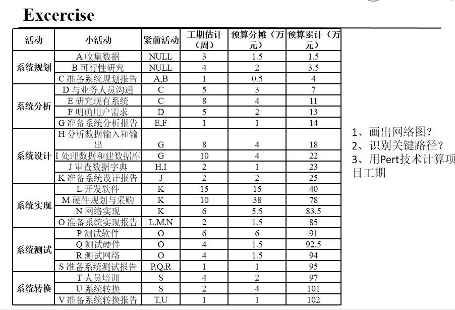

## 1、画出网络图

## 2、识别关键路径
关键路径：B可行性研究（4）+C准备系统规划报告（1）+D与业务人员沟通（5）+F明确用户需求（5）+G准备系统分析报告（1）+I处理数据和建数据库（10）+J审查数据字典（2）+K准备系统设计报告（2）+L开发软件（15）+O准备系统实验报告（2）+P测试软件（6）+S准备系统测试报告（1）+T人员培训（4）+V准备系统转换报告（1）

关键路径长度为59

## 3、用Pert技术计算项目工期
假设如下：
<!-- 悲观逻辑，加1，大于6再加1 -->
<!-- 乐观逻辑：大于8减1 -->
| 小活动              | 乐观估计 | 最可能估计 | 悲观估计 | pert        |
| ------------------- | -------- | ---------- | -------- | ----------- |
| A收集数据           | 3        | 3          | 4        | 3.166666667 |
| B可行性研究         | 4        | 4          | 5        | 4.166666667 |
| C准备系统规划报告   | 1        | 1          | 2        | 1.166666667 |
| D与业务人员沟通     | 5        | 5          | 6        | 5.166666667 |
| E研究现有系统       | 8        | 8          | 10       | 8.333333333 |
| F明确用户需求       | 5        | 5          | 6        | 5.166666667 |
| G准备系统分析报告   | 1        | 1          | 2        | 1.166666667 |
| H分析数据输入和输出 | 8        | 8          | 10       | 8.333333333 |
| I处理数据和建数据库 | 9        | 10         | 12       | 10.16666667 |
| J审查数据字典       | 2        | 2          | 3        | 2.166666667 |
| K准备系统设计报告   | 2        | 2          | 3        | 2.166666667 |
| L开发软件           | 14       | 15         | 17       | 15.16666667 |
| M硬件规划与采购     | 9        | 10         | 12       | 10.16666667 |
| N网络实现           | 6        | 6          | 8        | 6.333333333 |
| O准备系统实现报告   | 2        | 2          | 3        | 2.166666667 |
| P测试软件           | 6        | 6          | 8        | 6.333333333 |
| Q测试硬件           | 4        | 4          | 5        | 4.166666667 |
| R测试网络           | 4        | 4          | 5        | 4.166666667 |
| S准备系统测试报告   | 1        | 1          | 2        | 1.166666667 |
| T人员培训           | 4        | 4          | 5        | 4.166666667 |
| U系统转换           | 2        | 2          | 3        | 2.166666667 |
| V准备系统转换报告   | 1        | 1          | 2        | 1.166666667 |

由2）关键路径，经PERT计算，项目工期为：61.50000001
