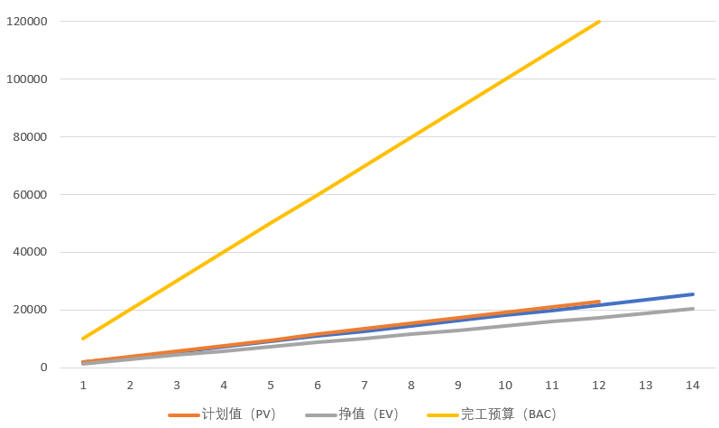
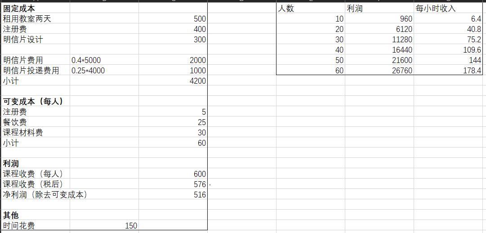

## 1、ppt第46页练习
Given the following information for a one-year project, answer the following questions.
PV = 23000 EV = 20000
AC = 25000 BAC = 120000
a. What is the cost variance, schedule variance, cost performance index, and schedule performance index for the project.
b. How is the project doing? Is it ahead of schedule or behind schedule? Is it under budget or over budget.
c. Use the CPI to calculate the estimate at completion for this project. Is the project performing better or worse than planned?
d. Use the SPI to estimate how long it will take to finish this project.
e. Sketch the earned value chart for this project, using Figure 7-5 as a guide.

给定一年期项目的以下信息，请回答以下问题。
- PV（计划值） = 23000
- EV（挣值，实际完成工作的估算值） = 20000
- AC（实际成本） = 25000
- BAC（完工预算，项目的原始总预算） = 120000

### a. 项目的成本差异、进度差异、成本绩效指标、进度绩效指标是什么？
成本偏差=EV-AC=20000-25000=-5000

进度偏差=EV-PV=20000-23000=-3000

成本绩效指标CPI=EV/AC=20000/25000=0.8

进度绩效指标SPI=EV/PV=20000/23000=0.87

### b. 项目做得怎么样？是提前还是落后？是预算不足还是超出预算。
<!-- 如何评价：CPI如果小于100则超出预算，进度绩效指标SPI小于100则落后 -->
通过成本绩效指标和进度绩效指标可以看出，项目超出了预算并且进度落后。

### c. 使用CPI计算此项目竣工时的估计值。项目表现比计划好还是差？
EAC = BAC - CV = BAC + AC - EV = 120000 + 25000 - 20000 = 125000

通过计算EAC，比较BAC发现，EAC大于BAC，即花费超出预期。
由此推断，项目表现得比计划要差。

### d. 使用SPI估计完成此项目所需的时间。
完工工期估算=预算工期/SPI = 12/0.87 = 13.8 （月）

### e. 以图7-5为指导，绘制本项目的挣值图表。

## 2、教材216页，快速测验
1. d
2. b
3. b
4. a
5. c
6. a
7. c
8. d
9. d
10. b

## 3、教材217页，练习题（1）、（5）

### 练习题（1）
见1、

### 练习题（5）
假如你将要筹划开办一个成本估算的研修班，制作一个电子表格，计算此项目的总成本、总收入和 总利润。以下是一些你的假设：
- 两天的课程，每人收费600美元。
- 预计有30人会申请该课程，但这是可变的。
- 固定成本包括：租用教室两天共500美元，开班需上缴的注册费400美元，用于广告的明信片设 计费用300美元。
- 自己的劳动成本不计算在内，但你估计将至少花费150个小时制作课程材料、管理项目和实际授 课。你想知道花这些时间给出多少种方案是值得的。
- 你将定制5000张明信片，其中4000张邮寄出去，其余的发给朋友和同事。
- 可变成本包括：
  - a.注册费每人5美元，加上4%的信用卡手续费（假设所有人使用信用卡交费）。
  - b.如果定制5000张或更多的明信片，每张明信片0.4美元。
  - c.明信片的投递费用和邮资每张0.25美元。
  - d.饮料和午餐费每人25美元。
  - e.课程材料费每人30美元。

在电子表格中，确保每一个变量都要有相应单元格来输入数据，比如邮资、课程材料费用。根据下面给出的参加人数计算利润情况：10、20、30、40、50和60。同时计算不同参加人数时你的时间价值。尝试使用Excel数据表格属性进行基于不同人数的利润值计算。如果你对数据表的功能不是很熟悉，只按原先的方法计算并录入10、20、30、40、50和60个参与人数的情况即可。将结果打印在一张纸上，高亮显示6中方案的利润情况和你的时间是否值得。

## 4、教材219页，运行案例
托尼和他的团队正计划建立娱乐与健康内网项目，他们需要推敲、润色这个项目的成本估算来对供应商的投标情况进行评估，并以可靠的成本基线来评价项目的执行情况。这个项目要求在6个月内完成，总预算不超过200000美元。

已知信息：
- 计划时间：6个月
- 计划成本：200000美元

| 承包方对开支进行详细描述 | 1   | 2   | 3   | 4   | 5   | 6   | -      |
| ------------------------ | --- | --- | --- | --- | --- | --- | ------ |
| 项目经理                 |     |     |     |     |     |     |        |
| 项目组成员               |     |     |     |     |     |     |        |
| 分包方                   |     |     |     |     |     |     |        |
| 硬件                     |     |     |     |     |     |     |        |
| 手持设备                 |     |     |     |     |     |     |        |
| 服务器租金               |     |     |     |     |     |     |        |
| 软件（总计）             |     |     |     |     |     |     |        |
| 软件开发                 |     |     |     |     |     |     |        |
| 软件测试                 |     |     |     |     |     |     |        |
| 培训成本                 |     |     |     |     |     |     |        |
| 储备金                   |     |     |     |     |     |     |        |
| 总计                     |     |     |     |     |     |     | 200000 |

计划对该项目派遣监管人员，进行严格的挣值管理。每月跟进计算挣值、计划值、实际成本、成本偏差、进度偏差、成本绩效指数、进度执行指数、完工预算和完工估算，并评估投标方能否按要求完成该项目。
<!-- END -->

---
- [CSDN-关于PV、EV、AC、CV、SV、CPI、SPI、BAC、ETC、EAC的解析及计算](https://blog.csdn.net/lijingxiaov5/article/details/124459850)
- [CSDN-IT项目管理个人作业05](https://blog.csdn.net/qiao_zhang/article/details/106761571)
