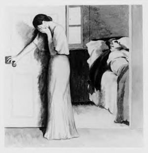

# TAT心理测试
主题统觉测验Thematic Apperception Test（简称TAT）属于投射法个人测验，是美国心理学家亨利默瑞于1935年发明的。TAT通过素描图像激发测试者投射出内心的幻想和精神活动，无意中成为呈现测试者内心和自我的X光片。下面这个测试就是利用TAT的原理进得心理测试，请凭第一感觉回答问题。

1、
图中的女人为何掩面？她的情绪是怎样的？
情景解释：一个女人在门掩面而泣，屋内一个男人躺在床上。
- 悲伤，女人发现丈夫的婚外情
- 忧虑，丈夫酒醉在床上
- 关心，丈夫病重躺在床上，可能即将死去

2、
床上女子状态怎样？
情景解释：一个女人躺在床上，一只胳臂垂落床沿，一个人背对着她掩着面。
- 身患重病
- 沉睡
- 已死去

3、
图中戴领结的男子是女子的什么人？
情景解释：有两副画面，第一副是一个秃顶男人弯着腰从窗缝向屋内看，第二副是一个女人头靠在男人胸前，仰面看着男人，男人也低头看着她。
- 秘密情人
- 老板或者顶头上司
- 可以帮助她的有权有势的人

4、
图中老妇人的眼神流露出怎样的情绪？
情景解释：一个中年妇女面朝前方面无表情，一个满脸皱纹的老人一脸凝重，托着下巴，眼神古怪在中年妇女背后。
- 邪恶，她们之间可能隐藏着冲突
- 同情
- 焦虑，关心

5、
图中的女子正在打开房门，她打算做什么？
情景解释：一个女子刚打开房门，还没进房，探出半个身子。房间里有一支插花，一只闹钟，一把椅子，还有一面可能是镜子。
- 男友的房间，她一直很想看看房间里的布局陈设
- 下班，刚刚回家
- 拿东西，然后回厨房做饭

6、
图中这个人物打扮成这样是为什么？
情景解释：图中的人物打扮得很怪，也很抽像，描绘不出是什么样子。
- 打扮成别人认不出来的样子去袭击仇人
- 抢劫商店
- 参加万圣节假面舞会

7、
图中这个女子化妆是为什么？
情景解释：图中有位女子坐有镜前化妆，但看不到她的正面。
- 遮掩已经衰老的面容，并希望能够挽救婚姻危机
- 以更加饱满的精神状态去见大客户
- 去和男朋友约会

---
计分法：A1分 B2分 C3分

7分-11分：
你非常善于隐藏自己，没人知道你心里到底在想什么。同时你防御心理较强，对事物怀着消极的态度，不愿意轻易相信别人，大多时候宁愿自己独处也不愿意和其他人在一起。也许你的魅力就在于神秘吧，很多人都想接近你，但你内心与外界的距离感始终存在。你只有摆正对生活的态度，才能过上正常的快乐生活。朋友的建议对你影响很大，你需要对这些建议进行过滤，有选择地采用，不要被这些建议搞得焦头烂额。

12分-16分：
能想到就能做到，恐怕是你的人生信条。你属于现实主义者，浪漫色彩非常淡薄，对金钱有一定的执着心。头脑清晰，有很强的独创能力。踏实、勤奋是你的一惯风格，但缺乏挑战新事务的勇气，对人情世故不太清通，再加上你平时比较少言，给人感觉比较冷漠，往往需要一段时间才能融到团体中。建议不要凡事都顾及眼前,要学会规划人生。过分谨慎也会错过很多机会。

17-21分：
你性格开朗、乐观、平易近人，和朋友交往中能设身处地地为他人着想，另外善于在公众面前提升自己的形象，因此深受大家的信任，在群体中是个受欢迎的中心人物。你做事很慎重，谦恭有礼,即使再棘手的事情也能处理得恰倒好处。诚信是你重要的处事原则，你具有压抑自己为别人着想的品质。不过此类型的人难以做出特别大的成就。建议适当学会拒绝，会让你更快乐。
