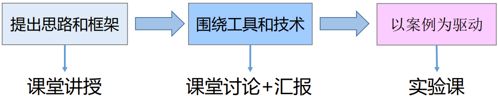

## 课程开设背景
- 汤姆·彼得斯（Tom Peters） “所有的白领工作都是项目工作”。
- 专家认为：人类的活动有1/2是通过项目的形式来开展的。
- 美国著名《财富》杂志：项目管理将成为21世纪年轻人首选职业！
- 英国PRINCE 2调查：76%认为项目管理将成为一项商业基本技能。
- 华为任正非：项目管理是公司管理进度的细胞，要把项目管理作为华为公司最重要的一项管理往前推。项目管理是个细胞，懂了项目管理，你其实当“军长”都够用的。
- 华为、阿里、中移动、网易、腾讯、吉利、中船重工等众多智能制造企业都把《项目管理》作为管理人员的必修课。

你未来职业的可能发展方向
- 大公司：
  - 打下手(1-3月)
  - 代码工(3-8月)
  - 程序员(1年到？)
  - 项目组长(4年半以上 看机遇)
  - 项目经理(6年以上 看机遇)
- 小公司：
  - 代码工(1-3月)
  - 程序员(3月到8月)
  - 项目组长(2年左右 优秀的)
  - 项目经理(3年以上)
  - 技术总监（5年以上）

> 在大公司学做人，在小公司学技术。

- 第一阶段初级在他人帮助下工作；
- 第二阶段能独立完成工作；
- 第三阶段能够独挡一面完成具有挑战性的工作；
- 第四阶段是能够带领几个人工作；
- 第五阶段能够带领一群人工作。

> 测试工程师、软件工程师、算法工程师、系统分析师、软件架构师、需求分析工程师

本课程介绍项目管理的基本概念、过程和方法。通过本课程的学习，使学生在掌握与 IT 项目相关的概念、技巧、工具和技术的前提下，学会用项目管理的基本理论、方法、技术来分析和解决 IT 项目管理实践中碰到的问题，并能用项目管理的理念和方法来面对和管理自己的生活和工作，为毕业后走上技术管理岗位成功进行管理实践打下扎实的理论和实践基础。

## 课程主要任务
- 掌握基本的项目管理理论、项目管理方法与项目管理技术，并能够将所掌握的知识、技能灵活应用于实际的、复杂的IT项目中。
- 有能力对实际的项目进行有效分析，根据项目自身的特点（包括复杂度、领域等）选择有效地项目管理方法和项目管理技术对问题进行分析与诊断。
- 了解和掌握常见的项目管理工具，以提高项目管理的效率和准确性，并且有能力通过网络及其它途径快速学习和掌握新工具。
- 能够清晰的陈述自己的思想，能够有效地与他人进行沟通和交流，清晰准确的书写常用的项目管理相关文档。
- 以真实项目为案例，匹配相应教学资源，模拟真实项目实施环境，能够认知企业项目管理岗位需求、业务流程，提升就业竞争力。

## 教学方法&目标

- 掌握基本原则: 加深理解项目管理的基本知识
- 学到一些方法: 熟悉和使用相关工具
- 实践某些环节: 通过实际案例进行演练

> 学会理论、掌握工具、灵活应用、学以致用

> 概念多、繁杂、涉及很多学科，但都是比较浅显表面的概念

## 评价考核
| 考核要求                                                           | 平时+作业 | 期中考试 | 实验 | 期末考试 | 成绩比例 |
| ------------------------------------------------------------------ | --------- | -------- | ---- | -------- | -------- |
| 掌握项目管理理论、方法与技术，应用于实际的、复杂的IT项目中。       | 4         | 5        | 4    | 16       | 29       |
| 根据项目自身的特点项目管理方法，对问题进行分析与诊断               | 4         | 5        | 4    | 12       | 25       |
| 掌握常见的项目管理工具，能力通过网络及其它途径快速学习和掌握新工具 | 4         |          | 4    | 4        | 12       |  |
| 掌握工程影响分析与评价的基本方法，能根据评估结果改进项目           | 4         | 5        | 4    |          | 13       |
| 有效地与他人进行沟通和交流，清晰准确的书写常用的项目管理相关文档   | 4         | 5        | 4    | 8        | 21       |
| 合计                                                               | 20        | 20       | 20   | 40       | 100      |

## 课程背景知识
1. 软件开发过程
2. 软件开发模型
3. 需求分析方法
4. 系统建模方法
5. 软件测试基础
6. 软件开发方法

参与过至少一次软件项目的开发，最好有以下经历
1. 需求分析
2. 软件结构设计
3. 有团队合作
4. 编写过文档
5. 多种语言混合开发
6. 代码管理

## 课程内容概述
理论：BCWS、BCWP、PV、EV、SV、EAC、VAC、BAC、CPI、 SPI、WBS、PERT、RAM、CPM

案例分析
- 公司内部网站项目；
- DNA测序仪项目；
- 如何跟程序员沟通不要迟到；
- 常见互联网/软件公司的一些工作风格；
- 创业的时候组建什么类型的团队；

工具：甘特图、鱼骨图、项目计划、风险登记表...

## 如何学好这门课
- 从技术思维转变到管理思维
  - 思维方式转换
  - 职业能力转换
  - 工作方式转变
- 熟练掌握项目管理知识领域
- 在实践中锻炼提高

| 管理思维   | 技术思维     |
| ---------- | ------------ |
| 整体       | 局部         |
| 诠释性     | 批判性       |
| 凭直觉顿悟 | 依靠逻辑理性 |
| 先总后分   | 先分后总     |

## 系统思维
- 所谓系统思维，是指把认识对象作为系统，从系统和要素、要素和要素、系统和环境的相互联系、相互作用中综合地考察认识对象的一种思维方法。
- 系统思维其实就是我们平常讲的全局观，这是个知易行难的东西。

> 跳出本位 站高一步

系统思维的培养办法
1. 深入思考：从专注个别事件到洞悉系统的潜在结构
2. 动态思考：从线性思考走向环形思考
3. 全面思考：从局限于本位到关照全局一个项目过程
4. 整体思考：从机械还原论到整体生成论

## 项目管理过程组

## 项目管理知识领域

