## 10.0 学习目标
- 理解项目中良好沟通的重要性和发展软技能的必要性，对于IT项目经理和他们的团队来说更是如此。
- 回顾沟通相关的关键概念。
- 解释项目沟通计划的每一要素和如何创建一个沟通管理计划。
- 描述怎样管理沟通，包括沟通的技术、媒介和绩效报告。
- 讨论用于控制沟通的方法，以确保信息在项目的整个生命周期的需求得到满足。
- 列举改善项目沟通的不同方法，比如召开有效会议、有效地使用不同的技术以及使用模板。
- 描述软件如何增强项目沟通管理。

> 开篇案例
> Peter 兢兢业业地工作，成为了一家大型电信公司的领导。他是一个有才华、有能力、强硬的领导者，但是新的海底光纤通信项目比他以前参与过的任何一个项目大得多、复杂得多。这个海底通信项目分为几个截然不同的项目，Peter是负责监督所有这些项目的经理。由于海底通信系统的市场不断变化，包括的项目又多，因此，沟通和灵活性对于Peter来说关系重大。如果错过里程碑和完成日期，他的公司将遭受巨大的资金损失，小项目每天损失数千美元，大项目每天损失将超过25万美元。这个项目中的许多子项目都依赖其他项目的成功，因此，彼得必须积极了解和管理这些重要的关系。
> Peter与向他汇报的项目经理们进行过几次正式的和非正式的讨论。他与他们以及项目实施助理Christine一起为该项目编制了一个沟通计划。然而，他还是不能确定发送信息和管理所有不可避免的变化的最佳方法。他还想给项目经理制订统一的编制计划和跟踪执行的方法，又不扼杀他们的创造性、和自主性。Christine建议他们考虑使用一些新的通信技术，使一些重要的项目信息及时更新、保持同步。尽管Peter对通信和光纤铺设知道很多，但是他不是使用IT改善沟通过程的专家。事实上，这也是为什么他要Christine做他的助手的部分原因。他们能够编制一个灵活而且容易使用的沟通程序吗？


## 10.1 项目沟通管理的重要性
沟通
1. 用户参与
2. 行政支助
3. 明确的业务目标
4. 项目管理专业知识
5. ...

Q：
1. 你能分别列出一些技术技能和软技能吗？
2. 智商和情商，哪一个更重要，为什么？
3. 技术技能和软技能，哪个更重要，为什么？

技术技能 or 软技能：
- 在从事IT项目时，你不能完全把技术技能和软技能分开。
- 项目要想取得成功，每个项目团队成员都需要这两种技能，并需要通过正规教育和在职培训不断发展。

项目沟通管理的重要性
- 许多项目的最大威胁是沟通的失败。
- 我们的文化并没有把IT专业人士描绘成好的沟通者。
- 研究表明，IT专业人士必须能够有效地沟通，才能在他们的岗位上取得成功。
- 强大的语言和非技术技能是IT专业人士职业发展的一个关键因素。

项目沟通管理的目标是确保项目信息能够及时且适当地生成、收集、发送、存储和部署。
主要过程包括：
- 计划沟通管理：确定干系人的信息和沟通需求——谁需要什么信息，何时需要以及如何把信息发送给他们。
- 管理沟通：创建、分发、存储、检索和处置建立在上述沟通管理计划的项目沟通。
- 控制沟通：监控项目沟通，以确保干系人进行沟通的需求得到满足。

项目沟通管理概括
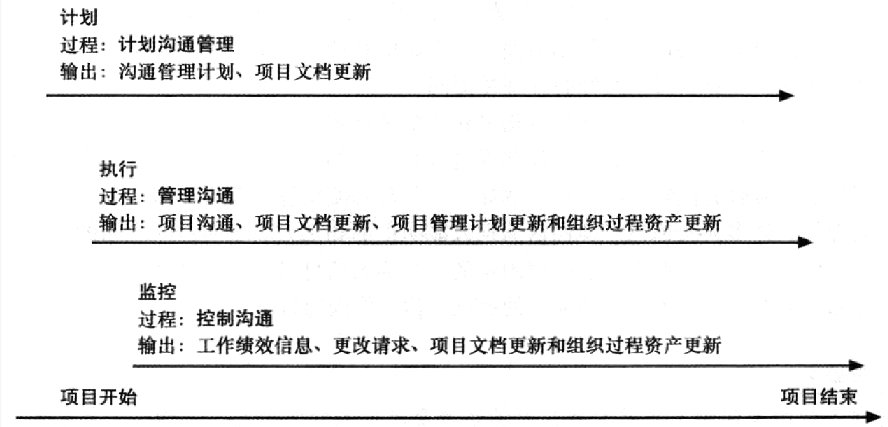


## 10.2 良好沟通的关键要素
信息交换的方法
- 书面形式
- 口头形式
- 正式
- 非正式
- 手势动作
- 媒体
- 措辞和短语

传播活动的分类
- 内部（项目内）和外部（客户、供应商、其他项目、组织、公众）
- 正式（报告、会议记录、简报）和非正式（电子邮件、备忘录、即兴讨论）
- 分层沟通：向上沟通；下行通信；横向沟通
- 官方（通讯、年度报告）和非官方（私人通讯）
- 书面和口头，以及口头语言（声调变化）和非口头语言（肢体语言）

### 10.2.1 专注于个人和团体的沟通需求
《人月神话》
- 人是不能互换的零件。
- 你不能假定计划由一人花费两个月的任务可以在一个月内由两个人来完成。
- 一个流行的比喻是，你不能让9名妇女在一个月内生出宝宝！

个人偏好影响沟通需求
- 大多数性格内向的人更愿意私下接受赞美，而大多数外向的人希望每个人都听到他们工作做得好。
- 一个直觉型的人想了解一些东西是如何融入大环境的，而一个敏感型的人更希望得到更多专注的、一步一步的详细信息。
- 理性的人想知道信息背后的逻辑，而感性的人想知道信息是如何影响他们以及其他人的。
- 有判断力的人只需要很少的提示就能满足期限，而感性的人会在制定和执行计划时需要更多帮助。

其他沟通注意事项
- 信息的接收者很少能按照发送者希望的那样解释信息。
- 地理位置和文化背景也影响了项目的沟通复杂性。
  - 不同的工作时间
  - 语言障碍
  - 不同的文化规范

### 10.2.2 正规和非正规的沟通方法
研究表明，在面对面的互动中：
- 有58%的沟通是通过肢体语言，有35%是通过说话的方式，只有7%是通过实际的说话内容。
- 重要的是不仅仅要关注某一个人实际说的话。一个人的语音语调和身体语言更能说明他们的感受。

短而频繁的会议在IT项目中通常是非常有效的。
单口会议迫使人们把注意力集中在他们真正需要交流的东西上。
一些公司制定了政策，禁止在一周的特定时间甚至是一整天使用电子邮件。

### 10.2.3 以有效和及时的方式提供重要信息
- 不要隐瞒重要信息
- 不要害怕报告不良信息
- 会议和非正式会谈的口头沟通有助于把重要的积极或消极的信息公开化。

### 10.2.4 为传达坏消息设置阶段
```
    亲爱的爸爸妈妈，或者我应该叫外公外婆：
    使得，我怀孕了。不，我还没有结婚，因为我的男朋友拉里失业了。拉里的雇主似乎
并不欣赏他自从高中退学以来学会的技能。爸爸，拉里看起来比您更年轻，尽管他比您还大
三岁。我从大学退学了，找了一份工作，以便在宝宝出生之前，我们可以有一间公寓。我找
到了一个漂亮的公寓，公寓在24小时自动汽车维修车库上面，车库很好并且配备隔离设施，
这样产生的废气和噪声不会影响我们。
    我很开心。我想你们也是。
                                                    爱你们的Ashley
    p.s. 没有拉里，我没有怀孕，没有结婚。我也没有从学校退学，只是化学得了个
“D”。我只是希望你们对这件事有正确认识。
```

### 10.2.5 确定沟通渠道的数目
人数对于沟通渠道数的影响
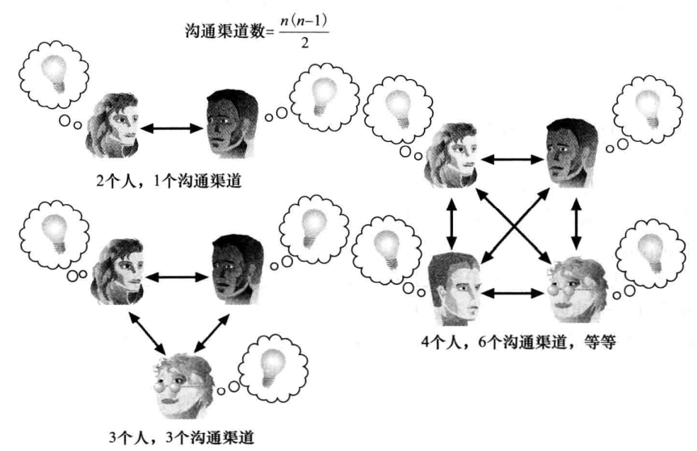


## 10.3 计划沟通管理
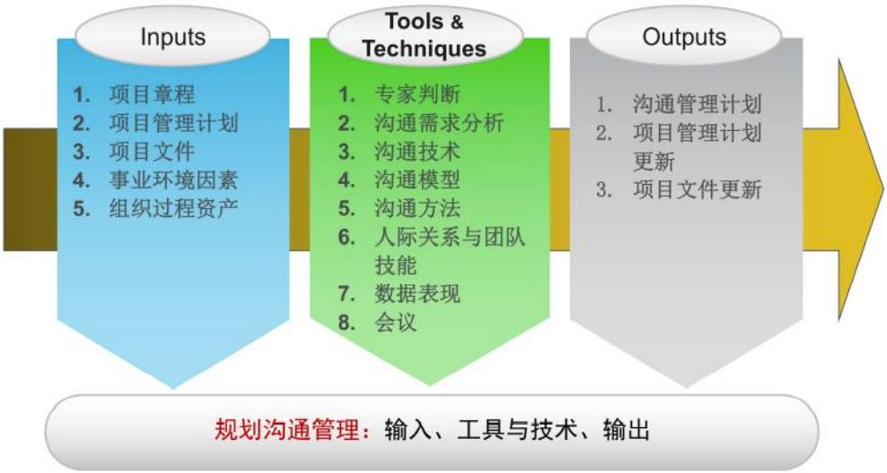

沟通管理计划是用来指导项目沟通的文档。
- 对于小型项目，沟通管理计划可以是团队合同的一部分。
- 对于大型项目，它应该是一个单独的文档。
- 项目经理应在沟通计划中记录与利益相关者进行有效和高效沟通的方法。

沟通管理计划应当涉及以下部分：
1. 干系人沟通需求。
2. 用于沟通的信息，包括格式、内容和各部分细节。
3. 谁接收信息，谁产生信息。
4. 传送信息的可能方法或技术。
5. 沟通频率。
6. 增加解决问题的过程。
7. 用于更新沟通管理计划的修订过程。
8. 常用术语表。

干系人沟通分析实例
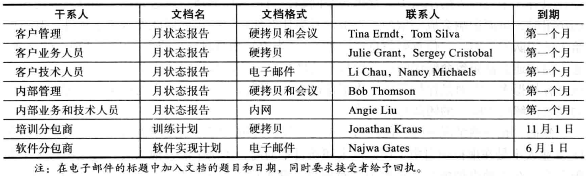

- 知道什么信息分发给哪一个干系人是很重要的。
- 让干系人评审和批准所有与干系人沟通的分析材料能确保这些信息的正确性和有用性。
- 使用已经存在的沟通渠道的问题在于各个组和其他干系人都有不同的沟通需求。
- 与基本的项目沟通内容有关的信息可从工作分解结构（WBS）中获得。


## 10.4 管理沟通
- 管理沟通是一个项目经理的主要工作。
- 过去项目信息，以有用的格式在正确的时间提供给正确的人，跟最初产生这些信息一样重要。
- 重要的考虑因素包括技术的应用以及使用适当的方法、媒介和绩效报告。

### 10.4.1 用技术手段加强信息的创建和分配
使用技术可以促进创建和分发信息的过程。

### 10.4.2 选择适当的沟通方法和媒介
1. 互动沟通（interactive communication）：两人或多人通过会议、电话或视频会议互动来交换信息。
2. 推送沟通（push communication）：不管是否需要，都将信息发送或推送给接受者。
3. 拉式沟通（pull communication）：信息应要求发送给接收者。

媒介选择表
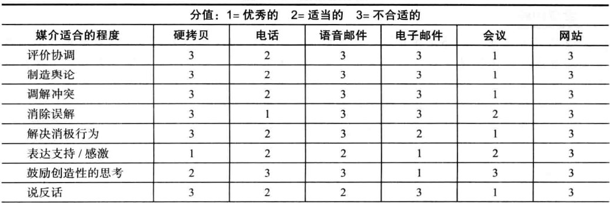
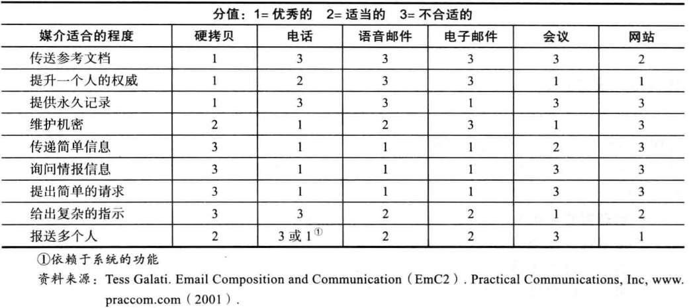

### 10.4.3 报告绩效
- 状态报告（status report）描述在一个特定的时间点项目所处的位置。
- 进度报告（progress report）描述了在一定时间内项目团队所完成的工作。
- 基于过去信息和发展趋势可预测（forecast）未来项目的状态和进展。

问题
- 噪声是任何可能干扰或阻碍信息传输的因素。
- 沟通障碍是信息的延迟或误解。
- 过滤是自上而下或自下而上通信过程中信息的丢失。


## 10.5 控制沟通
控制沟通的主要目标是在整个项目生命周期中确保最佳的信息流。
- 输入：项目管理计划、项目沟通、问题日志、工作绩效、组织过程资产
- 输出：工作绩效信息、变更请求、项目文档更新、组织过程资产更新

项目经理和项目团队应该使用各种报告系统、专家判断以及会议来评估沟通进行的状况。
如果存在问题，项目经理和团队需要采取行动，这往往需要改动计划和管理项目沟通的早期流程。
有一个项目团队之外的协调人来评估沟通的进展情况往往是有好处的。


## 10.6 改进项目沟通的建议

### 10.6.1 培养更好的沟通技能
- 许多公司为他们的员工花费许多钱进行技术培训，即使员工可能从沟通培训获益更多。
- 员工本人也可能更愿意参加最新的技术培训，而不是那些发展软技能的培训。
- 由于组织变得越来越全球化，很多组织都意识到必须采取某些方式促进来自不同国家、不同文化背景下的人员之间的沟通。
- 领导阶层需要帮助改善沟通。

### 10.6.2 召开有效的会议
- 终止不必开的会议。
- 明确会议的目的和预期的结果。
- 确定谁应该参加会议。
- 在开会之前向参加者提供议程。
- 事先准备分发的印制品、多媒体辅助设施和后勤安排。
- 使会议专业化。
- 设置会议的基本规则。
- 建立关系。

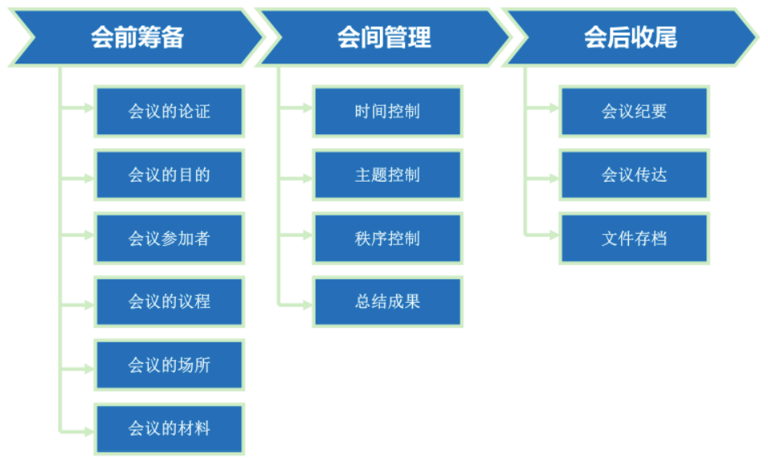

### 10.6.3 有效使用电子邮件、即时信息、文本和协作工具
协作工具示例
- SharePoint门户（Share Point Portal）网站允许用户创建自定义Web站点访问存储在共享设备上的文档和应用程序。
- 谷歌文档（Google Docs）允许用户创建、共享和编辑文档、电子表格和在线演示。
- 维基（wiki）是一个可是使任何人都能访问并添加或修改网页内容的网站。

有效使用电子邮件、即时信息、文本和协作工具的指导方案（部分）：
- 通过电子邮件、即时信息、文本和协作工具发送信息应该成为适宜的方式。
- 使用有意义的主题行从而读者可以很快地明白邮件包含哪些信息。
- 每封邮件的内容应该只包含一个主题，如果有不同的主题，就写在另一封邮件中。
- 邮件内容应该尽可能清晰和简洁，发送前总是应该再阅读一下，并且一定要使用拼写检查功能来检查邮件的拼写是否有误。
- 协作工具不断推进，确保你的团队使用的是一个很好的工具。
- 请务必授权合适的人来分享协作文档。
- 确保合适的人可以授权更改共享文档，并确保你备份了文件。
- 为组织和归档共享文件开发一个逻辑架构。

维基给项目管理带来的好处主要包括：
- 更好地存档
- 增进信任和信息共享
- 持续增长

沟通5C原则：
1. 目的明确（Clear Purpose）
2. 表达正确（Correct Expression）
3. 表达简洁（Conise Expression）
4. 逻辑连贯（Coherent Logic）
5. 思路掌控（Controlling Ideas）

### 10.6.4 使用项目沟通模板
- 很多技术人员都不敢寻求帮助。
- 为项目沟通提供示例和模板可以节省时间和金钱。
- 组织可以开发自己的模板，使用一些外部组织提供的模板，或者使用教科书中的样本。
- 回想一下，研究表明，在项目管理方面表现出色的公司会有效地使用模板。

项目描述模板例子
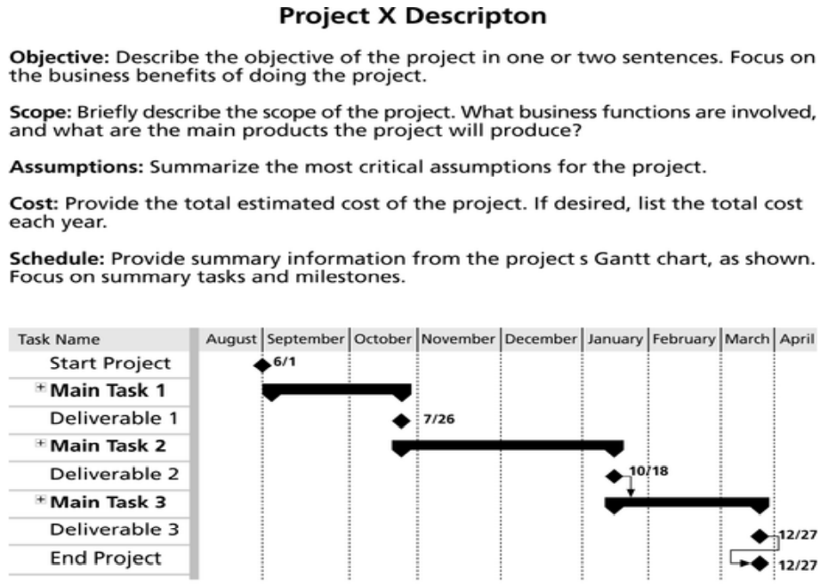

月度进展报告模板范例
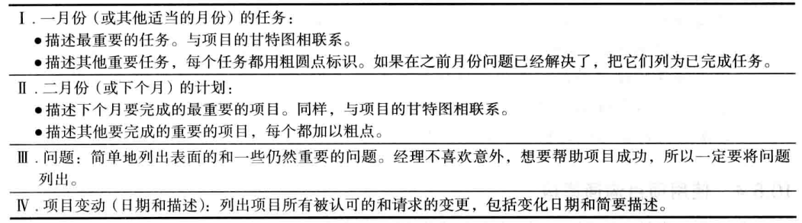

最终项目文档列表
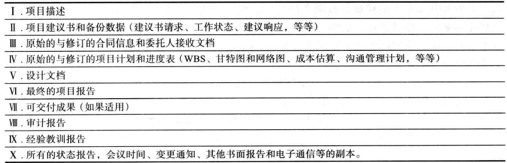

**经验训诫报告**
- 项目经理和项目组成员都应该准备经验教训报告（lessons-learned report）
  - 一个反馈性的陈述文档，用来记录他们在项目工作过程中总结得到的重要内容。
- 项目经理经常从经验教训报告中组合相关信息形成总结报告。


**项目档案**
- 组织和准备项目档案也很重要。
- 项目档案（project archive）是一整套有组织的项目记录，它可以提供项目的准确历史。
- 这些档案可以为将来的项目提供有价值的信息。

**项目Web站点**
- 许多项目团队创建一个项目网站来存储重要的产品文档和其他信息。
- 可以使用各种类型的软件创建网站，如企业项目管理软件。

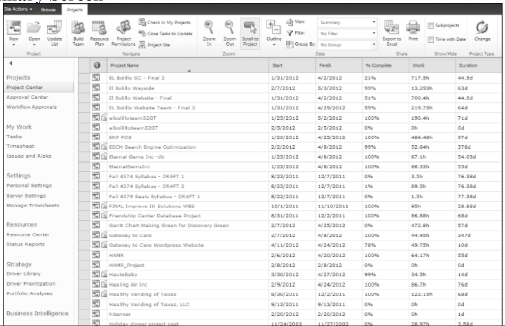


## 10.7 使用软件辅助沟通
许多组织发现项目管理软件可以在整个组织交流项目信息中发挥非常宝贵的作用。
今天，许多人远程办公或远程工作。来自乔治华盛顿大学的最新消息预测，到2019年，30%的美国私营部门的工人可以在家里工作。
为了实现更多功能和集成化沟通，企业项目管理软件提供工作组（workgroup）功能，允许在不同地方的项目成员协同工作和共享信息。
尽管技术对沟通过程有帮助作用，是沟通过程里最容易处理的方面，但不是沟通过程里最重要的方面。最重要的应是提高一个组织的沟通能力。沟通能力的提高通常要求组织的文化发生变化，这需要花费许多时间、艰苦的工作和耐心。


## 10.8 本章小结
项目沟通管理的目标是确保项目信息能够及时且适当地生成、收集、发送、存储和部署。
主要过程包括：
- 计划沟通管理
- 管理沟通
- 控制沟通
