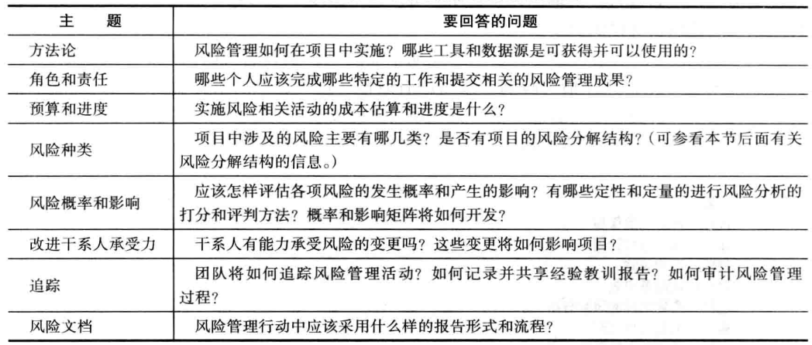

## 11.0 学习目标
- 理解什么是风险以及好的项目风险管理的重要性。
- 讨论计划风险管理所包含的要素及风险管理计划的具体内容。
- 列举IT项目风险的一般来源。
- 描述风险识别过程并创建风险登记表。
- 讨论风险定性分析过程并解释如何计算风险因素，构建概率/影响矩阵，应用十大风险事项跟踪技术进行风险定级。
- 解释定量风险分析过程，以及如何应用决策树、模拟和灵敏度分析来量化风险。
- 举例说明针对正面和负面的风险使用不同的风险响应计划策略。
- 讨论如何控制风险。
- 描述如何使用软件辅助进行项目风险管理。

> 开篇案例
> Cliff 是一个小的信息技术咨询公司的总经理，该公司从事因特网应用程序开发和全方位的服务支持。公司总共有 50人，由程序员、商务分析师、数据库专家、网页设计者、项目经理等组成。公司在过去的几年中绩效非常好，计划在下一年至少再雇10人，但近来在赢得合同方面遇到了困难。花时间与资源来对潜在客户的每个建议邀请书做出反应，正变得越来越昂贵。许多客户开始要求，在签订合同之前做些展示，甚至开发一些原型。在对待风险的事情上，克里夫采取的是一个积极进取的方法，喜欢投标盈利最高的项目。在投标这些项目之前，他没有使用系统化的方法来评价各种项目所涉及的风险。他的战略给公司带来了许多问题，因为他们在准备建议书方面投了大量的钱，却没有赢得几个合同。许多咨询室目前并没有承担项目工作，但工资单上却还有他们的名字。为了更好的理解项目风险，克里夫和他的公司应该做些什么？克里夫是否应该调整他在决定向哪种项目投标的战略？如何调整？
> 克里夫和他的两位高级经理出席了一个关于风险管理的专题研讨会，在那里，演讲者讨论了几项技术问题，如估计项目的期望货币值、蒙特卡罗模拟等。克里夫问演讲者，如何使用这些技术帮助公司决定投标什么项目？因为投标项目经常需要前期的投资，并有可能没有回报。演讲者通过一个EMV的例子回答了他的问题，然后进行了一次快速的蒙特卡罗模拟。克里夫的数学基础很薄弱，他很难理解 EMV，认为该模拟太复杂了，对他来说没有实际用处。比起任何数学计算的输出，他更相信直觉。演讲者感觉到克里夫并没有被打动，于是她说明了赢得项目合同的重要性，而不能仅仅看到潜在的利润。她建议对于公司有机会赢取(50%左右)合同的项目，以及有利润潜力的项目，应该使用风险中型的投标策略，而不要把精力放在那种赢取机会很小、潜在利润巨大的项目上。克里夫不同意这一建议，他继续投标那些高风险项目。另两位出席研讨会的经理现在终于明白了为什么公司存在问题，他们不久后在更具竞争力的公司找到了新的工作，许多其他人跟着跳槽了。

1. 如何正确评估项目风险？
2. 项目风险管理流程？每个过程的工具和技术是什么？
3. 布朗克斯失败的原因是什么？它给我们带来了什么启示？

## 11.1 项目风险管理的重要性
项目风险管理是关于识别、分析、响应项目全生命周期内的风险，并最好地满足项目目标的科学与艺术。
风险管理是一个经常被忽略的项目管理领域，却常常能够在通往项目最终成功的道路上取得重大的进展。
风险管理对选择项目、确定项目范围和编制现实的进度计划和成本估算有着积极的影响。

按照行业组和知识领域对项目管理成熟度分组

Ibbs和Kwak的研究显示，风险在所有知识领域中的成熟度评级最低。
2003年，南非毛里求斯的一个软件开发公司完成了一个类似的调查，成熟度风险管理的成熟度也最低。

从软件风险管理实践中得到的收益

**讨论**
- 您认为风险是什么？
- 风险必须对项目产生负面影响。正确的为什么？
- 风险与危机相同。正确的为什么？
- 风险管理的功能或效果是什么？
- 风险管理应在开始前、整个生命周期或结束后进行？

风险（risk）是损失或损害的可能性。该定义强调了常见的、与风险相关的消极方面，以及所涉及的不确定性。
对于项目风险更为一般的定义是：可能对项目目标产生负面或者正面影响的不确定性。

危机表明一个项目的成功面临着明显的危险。
与危机管理不同，良好的项目风险管理往往不为人所注意。
风险是危机的倾向，不是所有的风险都会引发危机。
只有当风险造成的伤害达到一定程度时，才会演变成危机。

项目风险管理包括要理解项目中可能发生的潜在问题以及它们如何妨碍项目的成功。
- 消极风险管理包含了一系列的可能的行动，项目经理在项目中应该避免、减少、改变或接收风险的潜在的影响。
- 积极的风险管理就像是在投资机会。记住重要的一点：风险管理是一种投资，会产生相关的成本。

对于风险的态度基于两个主题：
- 风险偏好（risk appetite），是指实体为了获得期望的回报愿意承担的不确定性程度。
- 风险承受力（risk tolerance），是指在项目或业务目标的潜在影响中实体能够接受的最大的偏差。
- 风险效用（risk utility）是指从潜在回报中得到的满意度。

风险效用函数和风险偏好

项目风险管理的目标可以被视为使潜在的负面风险最小化的同时又要使潜在的正面风险最大化。
- 已知风险：用于描述项目团队已经识别和分析的风险。
- 未知风险：是一些没有被识别和分析，无法管理的东西。

风险管理涉及的6个主要过程包括：
1. 计划风险管理
2. 识别风险
3. 实施定性风险分析
4. 实施定量风险分析
5. 计划风险响应
6. 控制风险

项目风险管理概述

## 11.2 计划风险管理
风险管理计划（risk management plan）记录了项目全过程中的风险管理的流程。
- 工具：举行几次计划会议
- 输入：项目文档、共同的风险管理政策、风险种类、以往项目的经验教训报告，创建风险管理计划的模板。

风险管理计划中所着重强调的主题

很多项目除了编制了风险管理计划以外，还有应急计划、退路计划和应急储备金。
- 应急计划（contingency plan）是指如果所识别的风险事件发生，项目团队将会采取的预先规定的措施。
- 退路计划（fallback plan）是对项目目标的完成具有很大影响的风险编制的计划，如果降低风险的措施无效将实施这个计划。
- 应急储备金（contingency reserve）或应急津贴（contingency allowance）是指由项目发起人或组织所提供的储备，用于将项目成本或进度超出预期的风险降低到可接受的程度。应急储备金是已知的风险，而管理储备金是用来承担未知风险的基金。

## 11.3 IT项目风险的一般来源
多项研究表明，IT项目有着一些共同的风险来源。

斯坦迪什集团的成功的潜在的打分表，并给出了判断项目是否成功的标准，其权重表明这些标准的相对重要性。

一些常见的风险：
- 市场风险
- 财务风险
- 技术风险
- 人力风险
- 结构/过程风险

风险分解结构是一个很有用的工具，可以用来帮助项目经理较好地考虑各类潜在风险。
和WBS的结构相同，风险分解结构（risk breakdown structure）是针对一个项目潜在风险的分级分类架构。

除了依据项目或产品的特性识别风险外，同样需要根据项目管理知识领域，例如范围、时间、成本和质量，来识别潜在的风险。

每个知识领域的潜在的负面风险条件

## 11.4 识别风险
识别风险是理解哪些潜在事件可能损害或增强某个特定项目的过程。

不能事先识别风险，你就不能管理风险。通过了解风险的一般来源和查阅项目风险管理计划（风险、成本、进度、质量和人力资源管理）、活动成本和持续时间的估计、范围基准、干系人登记表、项目文档、采购文档、企业环境因素、组织过程资产、项目经理和团队成员经常可以识别出很多潜在风险。

识别风险：
- 输入：项目管理计划、项目文件、协议、采购文件、企业环境因素、组织过程资产
- 工具：专家判断、数据汇集、数据分析、人际关系和团队技巧、列表提示、会议
- 输出：风险登记表

### 11.4.1 对于风险识别的建议
- 头脑风暴（brainstorming）是一项识别风险的技术。
- 德尔菲技术（Delphi technique）的基本概念是从一组预测未来发展的专家中得到一致的意见。
- 访谈（interviewing）是通过面对面、电话、电子邮件、即时通信讨论，收集信息、寻求事实的一种技术。
- 根源分析法（root cause analysis）：...
- 优势、劣势、机会和威胁（SWOT）分析经常用于战略规划，也可以通过使项目团队专注于某些特定项目的潜在风险，从而帮助识别风险。
- 检查表（checklists）基于以前项目中所遇到的风险，给出了了解当前项目风险的模板
- 假设分析（analysis of assumptions）分析项目的假设以确保它们的有效性也非常重要。
- 图表（diagrams）
  - 系统或过程的流程图（flowchart）反映了系统内部各要素之间是如何互相联系的。
  - 影响图（influence diagram）通过显示一些关键要素来表达决策问题，包括决策、不确定性、因果关系和目标以及它们之间如何相互影响。

### 11.4.2 风险登记表
风险登记表（risk register）是一份包含了各个风险管理过程结果的文档，通常用表格或者电子表格形式展现。
风险事件（risk event）指特定但又不确定的事件，并且可能对项目造成危害或加强。

风险登记表
- 每个风险事件的标号：唯一标识
- 风险事件的级别：通常用数字表示，1表示最高级别的风险。
- 风险事件的名称
- 风险事件的描述
- 风险事件的分类
- 风险根源
- 每个风险的触发器：触发器（trigger）是实际风险事件的指标或征兆。
- 每个风险的潜在响应
- 风险负责人（risk owner）或对风险负责的个人
- 风险发生概率
- 风险影响
- 风险状态

风险登记表的示例

- 编号：R44
- 级别：1
- 风险：新客户
- 描述：我们以前未做过该组织的项目，而且对该组织也不是特别了解。我们公司的优势之一在于建立良好的客户关系，这样可进一步地实施更多合作项目。由于该组织是新客户，因此我们可能与新客户在合作上遇到问题。
- 分类：人力风险
- 根源：我们中标了一个项目，但是却对该客户不甚了解。
- 触发器：项目经理和更高层的经理意识到我们对于该客户的认识较少，从而可能会误解客户的需求或期望。
- 潜在响应：项目经理需要重视新客户，并且花时间了解该客户。项目经理需要组织一次研讨会来认识并了解客户，明确用户期望。Cliff也应该参加此次会议。
- 风险责任人：项目经理
- 发生概率：中
- 影响：高
- 状态：项目经理将在本周内组织研讨会。

## 11.5 风险定性分析
风险定性分析包括评估已识别风险的可能性和概率，确定其大小和优先级。

风险量化工具和技术：
- 概率/影响矩阵
- 十大风险事项跟踪
- 专家评判

### 11.5.1 使用概率/影响矩阵计算风险因子
一个概率/影响矩阵或图表（probability/impact matrix or chart），在矩阵的一边或图表的一个轴列出风险发生的相对概率，另一边或另一个轴列出风险发生的相对影响。

为了使用这个方法，项目干系人需要首先列举他们认为可能发生的项目风险，然后还要对每个风险根据其发生的概率和产生的影响分别标以高、中、低。

概率/影响矩阵示例

通常，为负面和正面的风险各创建一个概率/影响矩阵或图表是非常有用的，也能确保两种类型的风险被充分分析。

计算风险因子（riskfactor）的技术——基于具体事件的发生概率和事件发生时对项目的影响，得到表征特定事件总体风险的数字。这种技术利用了表示风险发生概率和风险影响或后果的概率/影响矩阵。

$风险评分 = 概率 \times 影响$

高、中、低风险技术示意图

### 11.5.2 十大风险事项跟踪
十大风险事项跟踪是一种风险定性分析工具，除了可以识别风险之外，还能够通过监控风险在整个项目生命周期内保持风险意识。
它使管理部门或客户定期审查项目最重大的风险事项。
对项目十大风险来源的状况进行汇总，从而开始这种审查。这种汇总包括：各风险事件目前的级别、以前的级别、在一段时间内出现在列表上的次数以及自从上次审查以来解决这一风险事项所取得的进展。

十大风险事项追踪示例

观察名单（watch list）
- 观察名单是指那些优先级低，但是仍然被认为是有潜在风险的风险列表。
- 定性风险也可能识别那些应被定量评价基础上的风险。

## 11.6 风险定量分析
风险定量分析经常是在风险定性分析之后进行的，当然这两个过程可以一同或分开进行。
包含前沿技术的大型复杂项目通常需要较为深入的风险定量分析。
- 战略重要性
- 合同条款
- 利益相关者法规

风险定量分析的主要技术：
- 数据收集
- 风险定量分析和建模技术
  - 决策树分析建模
  - 模拟
  - 灵敏度分析
- 专家判定

### 11.6.1 决策树和预期货币值
- 决策树（decision tree）是一种图形方法，可以帮助在未来结果不确定的情况下选择最好的行动路径。
- 预期货币值（expected monetary Value，EMV）是风险事件概率和风险事件货币值的乘积。
- 您可以绘制决策树以帮助找到EMV。

预期货币值示例

### 11.6.2 模拟
模拟是指用系统的模型或表示法来分析系统的预期行为或绩效。
大多数模拟都以某些形式的蒙特卡罗分析为基础。
蒙特卡罗分析（Monte Carlo analysis）通过多次模拟一个模型的结果，来提供计算结果的统计分布。

要使用蒙特卡罗模拟，您必须具有三个估计值（最有可能、悲观和乐观）以及估计值介于最有可能值和乐观值之间的可能性估计值。

蒙特卡罗分析的基本步骤如下：
1. 评估所考虑变量的范围。
2. 决定每个变量的概率分布。
3. 为每个变量，例如一个任务的时间估算，根据概率分布选择一个随机值。
4. 利用为每个变量选定的数值组合，进行确定性分析，或一次通过模型。
5. 多次重复步骤3）和步骤4），获得各模型结果的概率分布。

基于Monte Carle的项目进度模拟计算结果

### 11.6.3 灵敏度分析
- 灵敏度分析（sensitivity analysis）是一种用来显示改变一个或多个变量对结果的影响的技术。
- 例如，在给定贷款利率和贷款期限情况下，很多人会使用灵敏度分析决定他们的月供。
- 很多专家借助灵敏度分析辅助做一些常用的商业决策，比如基于不同的假设决定收支平衡点。
- 电子表格软件（如Excel）是进行灵敏度分析的常用工具。

## 11.7 风险响应计划
编制一项响应风险的计划，包括减少负面风险、增加正面风险的因素和策略。

在识别和量化风险之后，谁必须决定如何应对？
| 名称               | 特点                       | 情景                                    |
| ------------------ | -------------------------- | --------------------------------------- |
| 回避Avoid          | 改变计划或范围             | 去掉WBS中有风险的工作包或由第三方来消除 |
| 缓解Mitigate       | 降低概率或后果             | 雇佣有经验的雇员                        |
| 转移Transference   | 转给第三方                 | 购买保险或第三方担保                    |
| 积极接受Acceptance | 准备备用计划准备应急储备金 | 有风险不能回避和减轻，准备备用计划      |
| 被动接受Acceptance | 什么都不作                 |

技术、成本和进度风险的一般风险缓解策略

应对负面风险的4项基本措施是：
- 风险规避（risk avoidance）或消除某一具体的威胁，通常采用消除其原因的方法。
- 风险承担（risk acceptance）或当风险发生接受其带来的后果。
- 风险转移（risk transference）或将风险的结果及其管理责任转移到第三方。
- 风险缓解（risk mitigation）或通过减少风险事件发生的概率来缓解风险事件的影响。
- 报告风险（reporting risk）

应对正面风险的4项策略如下：
- 风险共享（risk exploitation）或采取措施确保积极的风险发生。
- 风险共享（risk sharing）或把风险所有权分配给另外一方。
- 风险增强（risk enhancement）或通过识别和最大化正面风险的关键驱动因素来增大机会。
- 风险承担（risk acceptance）
- 报告风险（reporting risk）

主要成果：与风险相关的合同条款、项目管理计划、其他项目文档的更新、风险登记表的更新。
残余风险（residual risk）是指实施风险响应策略后剩余的风险。
二次风险（secondary risk）是实施风险响应策略后的直接结果。

## 11.8 控制风险
控制风险包括执行风险管理过程以应对风险事件。
执行风险管理过程是指确保风险意识是一项在整个项目过程中，全部由项目团队成员执行的不间断的活动。

权变措施（workaround）：对风险事件的未经计划的响应措施。

实施风险监测和控制的工具和技术
- 风险再评估
- 风险审计
- 变量和趋势分析
- 技术性能测量
- 储量分析
- 状态要求和定期的风险评审（比如十大风险事件追踪方法）

输出：工作绩效信息、变更请求，以及对项目管理计划、其他项目文档和组织过程资产的更新。

## 11.9 使用软件辅助项目风险管理
...

## 11.10 本章小结
项目风险管理是关于识别、分析、响应项目全生命周期内的风险，并最好地满足项目目标的科学与艺术。

风险管理涉及的6个主要过程包括：
1. 计划风险管理
2. 识别风险
3. 实施定性风险分析
4. 实施定量风险分析
5. 计划风险响应
6. 控制风险
