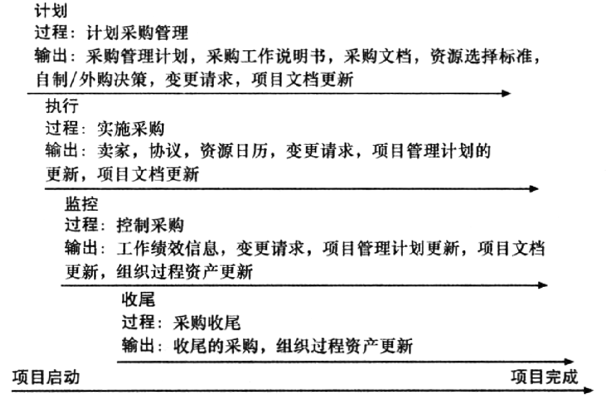

## 12.0 学习目标
- 理解项目采购管理以及在T项目中越来越多的使用外包的重要性。
- 描述项目采购计划所涉及的工作，包括确定合同使用的适当类型和准备采购管理计划、工作说明书、资源标准以及“自制或外购”分析。
- 讨论如何进行采购和获取卖方应答、卖方选择和授予合同的策略。
- 通过管理采购关系和监督合同履行来了解控制采购的过程。
- 描述采购收尾的过程。
- 讨论能够辅助项目采购管理的各种软件。

> 开篇案例
> Maric对公司聘请协助完成一项重要的操作系统移植项目的外部咨询师的成本感到难以置信。这个咨询公司的建议书上说他们会提供有经验的、完成过类似项目的专家，如果4名咨询师全职工作，那么就可以在不超过6个月的时间内完成。9个月过去了，公司仍旧在付着高额的咨询费，而且半数咨询师也由新人代替了。其中一名新的咨询师刚从学校毕业两个月而且有相当糟糕的沟通能力。Maric的同事们抱怨说他们在浪费时间来培训这些所谓的“有经验的专家”。Maric同公司的采购经理就有关他们现在所面临问题的合同、费用和特别条款的事项进行了会谈。
> 使Maric感到沮丧的是合同解释起来困难重重。合同很长而且很显然是一个有法律背景的人撰写的。当她问到由于咨询公司没有遵循建议书，他们公司能采取什么措施时，采购经理书说建议书不是正式合同的一部分。Maric的公司付费是按服务时间和原料，不是按特定的可交付成果。没有任何条款规定咨询师的最低经验水平，也没有关于工作不能按时完成的任何惩罚条款。有一条终止条款，然而也只是意味着公司可以终止合同。Maric很奇怪为什么公司会签下这么一份拙劣的合同。是否有一个更好的方式来处理从外部公司的采购服务？

【案例心得】
- 需要法律专业人士的参与
- 复杂的法律关系（例：往窗外扔瓶子，砸死人）
  - 故意：直接故意、间接故意
  - 过失：过于自信、疏忽大意
  - 不必负责：意外事件、不可抗力
- 定金、订金？

## 12.1 项目采购管理的重要性
采购（procurement）的意思是从外部资源获得商品和服务。
- 政府部门：采购
- 私营公司：购买
- 软件行业：外包

那些提供采购服务的组织或个人泛指为供应商、卖主、承包方、分包方或卖方，最广泛使用的是供应商。
专家预测，全球在计算机软件和服务方面的支出将继续增长。

关于外包的争论
- 许多公司意识到他们能够使用海外外包而且给国内创造更多的工作机会。
- 沃尔玛，成功地把大多数的IT项目控制在公司内部，很少使用商业软件，更没有外包。
- 通用汽车公司计划将IT运营和检修开关的外包服务从90%减至10%。

IT外包市场持续增长
- 美国公司把更多的业务转移到海外，特别是IT基础设施、应用开发和维护以及创新流程。
- 印度、中国和菲律宾是外包的首选地，拉丁美洲的增长也很快。
- 合格人才的短缺是T外包的首要原因，而不是节省成本。

许多组织正转向外包，从而：
- 获得技能和技术。
- 降低固定和周期性成本。
- 使客户组织集中在自己的核心业务上。
- 提供灵活性。
- 提高可追责性。

缺点
- 对供应商所开展的项目的那些方面不能很好地控制。
- 组织可能会变得对某个供应商太过于依赖。
- 安全性，包括知识产权的保护、数据完整性和境外站点基础设施的可靠性等。

项目采购管理（project procurement management）包括为一个项目从外部组织获得商品或服务所需要的过程。在一个合同或其他协议里，组织可能是一个产品/服务的买方或者卖方。

项目采购管理有4个主要的过程：
1. 计划采购管理，涉及决定采购什么、何时采购和如何采购。
   - 卖方（seller）就是提供商、承包商或向其他组织提供商品或服务的供应商。
2. 实施采购，涉及获得卖家的响应、选择卖方并授予合同。
3. 控制采购，涉及管理与卖家的关系、合同履约监管并进行必要的修改。
4. 采购收尾，涉及每个合同或协议的完成和结算，包括任何未决项的解决方案。

项目采购管理总结

## 12.2 计划采购管理
计划采购涉及的是识别哪个项目能够通过使用外部组织的产品或服务最好地满足项目的需求。
包括确定是否要采购、如何采购和采购什么，采购多少和什么时候采购。

- 输出：自制/外购决策（make-or-buy decision）指组织决定是在组织内部制作某些产品或完成某种服务好，还是从组织外部购买这些产品或服务更加符合组织的最大利益。
- 输入：项目管理计划、需求文档、风险登记表、活动资源需求、项目的日程安排、活动的成本估算、干系人登记表、企业环境因素、组织过程资产（如合同类型）。

### 12.2.1 合同类型
合同类型是采购管理的一个重要的考虑内容。
三个主要的合同类型是：固定价格合同或总付合同、成本补偿合同和时间与材料合同。

固定价格合同（fixed-price contract）或总付合同（lump-sum contract）是对明确定义的产品或服务规定固定价格的合同。
- 严格固定价格（firm-fixed-price，FFP）合同
- 经济价格调整的固定价格（fixed-price with economic price adjustment，FP-EPA）合同
- 有奖励的固定价格（fixed-price incentive fee，FPIF）合同
  - 固定价格激励合同可以包括总假设点（point of total assumption，PTA），这是承包商承担在固定价格合同成本每增加额外的一美元成本的点。
  - $PTA = (最高限价 - 目标价) / 政府份额 + 目标成本$

成本补偿合同（cost-reimbursable contracts）包含向供应商支付直接与间接实际成本的合同。
- 成本加激励合同（cost plus incentive fee (CPIF) contract）中，买方付给供应商正常的绩效成本、预订费和激励金。
- 成本加固定费合同（cost plus fixed fee (CPFF) contract）里，买方付给供应商正常的绩效成本加上一笔固定费用，该费用通常是估计成本的一个百分比。
- 成本加奖励费合同（cost plus award fee (CPAF) contract）里，买方付给供应商正常的绩效成本加上基于主观绩效条件的满意程度的奖金。
- 成本加百分比合同（cost plus percentage of costs (CPPC) contract）里，买方付给供应商正常的绩效成本，以及基于总成本的一个预定的百分比。

时间与材料合同（time and material contracts）是固定价格合同和成本补偿合同的混合。
- 单位定价（unit pricing）也能用在各种要求买方按产品或服务的单位付钱给供应商的合同。

合同类型与风险

任何类型的合同都应该包括针对项目独特问题的特别条款。例如，一个公司为咨询签订服务时间与材料合同，合同应该基于承包方的经验水平来支付不同的单位时间费用。

终止条款（termination clause）——允许买方或供应商终止合同的一项合同条款。

### 12.2.2 制订采购管理计划的工具和技术

#### 1. 自制/外购分析
自制/外购分析是用于决定一个组织是应该在内部生产某种产品或服务还是外购的常规管理方法。

自制的理由
- 生产成本低
- 无适合的供应商
- 保证充足的供应
- 利用过剩的劳动力、发挥边际效用
- 获得需求的数量
- 排除供应商间的勾结
- 在不对供应商作禁止性许诺的情况下获得特殊的产品
- 维持组织的才能
- 保护专利，保证质量
- 增加/维持公司的规模

外购的理由
- 外购成本低
- 保留供应商的许诺
- 获得技术和管理能力
- 生产能力不足
- 降低存货成本
- 保证供应商的灵活性和可替代性
- 互惠性
- 产品收到专利或商业秘密的保护
- 在重要的商业环节中享有免费管理

#### 2. 专家评判
#### 3. 市场调研

### 12.2.3 采购管理计划
采购管理计划是一个描述采购过程如何管理的文档，从制订外部采购的文档到合同收尾。

采购管理计划中涉及的主题：
- 使用何种类型合同的指南
- 标准采购文档或模板
- 生成合同工作分解结构、工作说明书和其他采购文档指南
- 项目组和相关部门的角色和职责
- 评估卖方的指南
- 管理多供方的建议
- 协调采购决策的过程
- 采购相关的约束和假设条件
- 采购提前期
- 采购的风险减缓策略
- 确认符合条件和有意向卖方的清单
- 辅助评估卖方和管理合同的采购准则

### 12.2.4 工作说明书
工作说明书（statement of work，SOW）是采购所需工作的描述。
如果一个SOW是用来作为合同的一部分来描述特定合同需要的工作，就称为合同工作说明书。
合同SOW是一种工作范围说明书。
一个好的合同SOW使竞标方更好地了解买方的期望。

工作说明书（SOW）模板

### 12.2.5 采购文档
项目团队通常使用标准表格和专家评判作为工具来帮助他们创建相关采购文档和评估标准。
采购文档包括建议书邀请函（RFP）和报价邀请函（RFQ）。

建议书邀请函（request for proposal，RFP）是用于从可能的供应商那里征求方案的文件。
- 建议书（proposal）是卖方准备的、可以满足买方需要的不同方案的文档。

报价邀请函（request for quote，RFQ）是用来从预期供应商那里征求报价或者投标的文件。
- 投标（bid），也称为标书或报价，是卖方准备的文件，针对买方所清晰定义的各项条款所提供的价格文档。

建议书邀请函（RFP）模板

### 12.2.6 渠道的选择标准
组织最好是在发出一个正式的RFP之前准备一些评价准则，使用这些准测来给建议书分级或者打分，通常给每个标准赋以权重以表明其重要性。
常用的评价准则和权重包括：
- 技术方法（30%）
- 管理方法（30%）
- 过去的业绩（20%）
- 报价（20%）

## 12.3 实施采购
在采购管理计划之后，下一个过程是：决定要谁来做，把适当的文档发送给潜在的卖方，以及获得建议书或者标书，选择一个卖方，签订合同。

工具
- 投标人咨询会
- 渠道选择

组织可以通过多种方式进行广告采购商品和服务：
- 接近首选供应商
- 与几个潜在供应商接洽
- 向任何感兴趣的人发布广告

投标人会议有助于澄清买方的期望。

建议书评价表示例

渠道选择
- 组织通常会对所有提案和标书进行初步评估，然后制定一份简短的潜在卖家名单，以供进一步评估。
- 候选列表上的卖方通常会被要求给出一个最好的最终报价（BAFO）。
- 最终输出是由买方和选定的卖方签订的合同。

## 12.4 控制采购
控制采购确保卖家的性能符合合同要求。
- 合同关系是一种法律关系，在撰写和管理合同的时候，非常重要的一点是要借助法律和合同方面的专业人员。
- 至关重要的一点是，项目经理和团队成员应当关注建设性变更单。

建设性变更单（constructive change order）指具有实际或明显权力的人，以口头或非正式的书面形式提出的意见，可以认为与书面变更命令有同样的效力。

要遵循与项目采购相关的其他好的实践，如下所示：
- 项目任何部分的变更需要被同一个人，以计划的原始部分被批准的相同方式进行评审、批准和存档。
- 任何变更的评估应该包括影响分析。变更是如何影响范围、时间、成本，以及被提供的货物或者服务的质量的？必须有一个基线来理解和分析变更。
- 变更必须被书面存档。项目组成员应当对所有重要的会议和电话存档。
- 当采购复杂的信息系统的时候，项目经理及其团队必须密切参与以保证新的系统满足业务需求，并且能够工作在运行环境中。不要认为雇用了一个著名的卖方就万事大吉了。买方组织也需要具备专业知识。
- 当实际运行的时候，如果新系统没有按计划工作，是否有备份计划。
- 一些工具和技术能够帮助合同管理。例如，正式的合同变更控制系统，来自买方的绩效评审、检查和审计、绩效报告、支付系统、索赔管理、记录管理系统。

## 12.5 采购收尾
合同收尾包括每个合同的完成和结算，包括未决项的解决方案。

项目组应当
- 确定是否每个合同中的工作都正确完成并符合要求。
- 更新记录反映最后的结果。
- 归档信息，以备将来使用。

合同本身应当包括正式验收和收尾的必要条件。

- 工具：采购评审、协商解决、记录管理系统
- 输出：收尾的采购、组织过程资产的更新

## 12.6 使用软件辅助项目采购管理
文字处理软件来书写建议书或合同，电子制表软件来创建建议书评价表，数据库来跟踪卖方，演示软件来演示采购相关的信息。

“电子采购”通常描述了现在以电子方式完成的各种采购功能。
- 基于Web的电子资源规划（electronic resource planning，ERP）
- E-MRO（维护（maintenance），修理（repair）和大修（overhaul））
- 电子渠道选择
- 电子投标
- 电子反向拍卖
- 电子邮件通知
- 电子市场

组织也能利用如网络、工业出版物或者论坛上的信息给选择卖方提供建议。

> 案例结局
> - Marie 阅读合同后发现有一款提前终止合同的条款
> - 由于项目仍然需要咨询，Marie重新进行采购
> - 新合同要求
>   - 工作说明书
>   - 特定产出物
>   - 顾问经验水平的最低要求
> - 激励奖金

## 12.7 本章小结
项目采购管理（project procurement management）包括为一个项目从外部组织获得商品或服务所需要的过程。
项目采购管理有4个主要的过程：
- 计划采购管理
- 实施采购
- 控制采购
- 采购收尾
