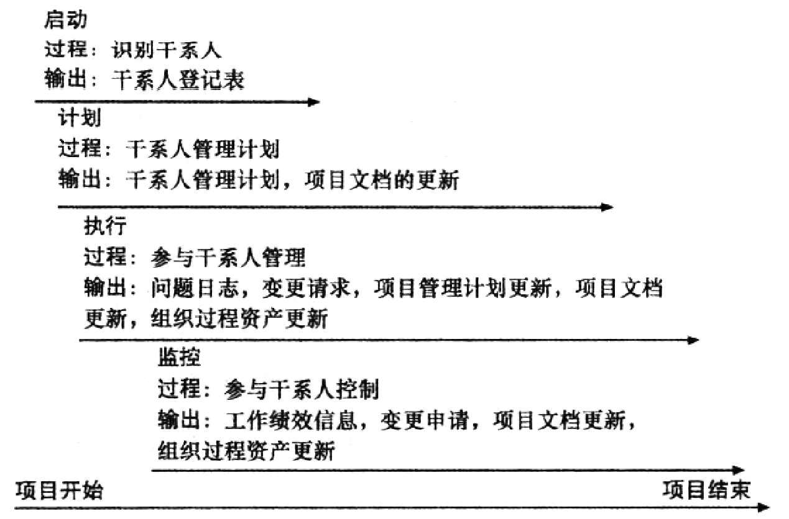

## 13.0 学习目标
- 理解项目干系人管理在整个项目生命周期中的重要性。
- 讨论确定干系人的过程，如何创建干系人登记表，如何分析干系人。
- 描述干系人管理计划的内容。
- 理解干系人管理的过程并了解如何有效使用问题日志。
- 解释控制干系人约定的方法。
- 讨论能够辅助项目干系人管理的软件。

> 开篇案例
> Debra的上一个公司裁员和削减她所在的整个战略IT咨询部门，公司给了她一个岗位调整，要求她大约80%的时间用于出差。由于有两个小孩，不想出差，就出来单干。她的同事认识一位当地石油公司的IT主管，跟她签订了合同并给她三倍的报酬。她成功地管理第一个项目，证明了她的价值，公司给她越来越大的项目来管理。她现在的项目是评估并实施一个项目管理软件解决方案，使新业务的副总裁Stephen能够监督几个国家的炼油厂的升级。炼油厂的升级成本估计超过2000万美元。Debra与内部分析师Ryan和Stephen一起讨论，来确定需求，选择新的软件解决方案。他们需要在两个月内与供应商签订合同，然后尽快将新系统与他们的其他系统集成，尤其是会计系统。
> 糟糕的是，公司的IT主管Chien对她的推荐非常不满意。他把Debra叫到办公室，对她大喊大叫：“你怎么能提出这样的建议？这违背了我所认为对公司IT部门来说最好的看法，Ryan跟你的推荐完全不同，你们这些咨询师提出意见完全不用担心离开后会发生的事情。在我发火之前赶快给我出去！”Debra安静的离开了Chien的办公室，很担心接下来会发生什么。尽管Chien和Ryan并不愿意这样，她知道她的推荐符合Stephen的要求，而且是整个公司的最佳利益。

## 13.1 项目干系人管理的重要性
什么是干系人？

- 小明和小红
- 小明的父母
- 小红的父母
- 小红的闺蜜
- 小红的哥哥
- 小明的妈妈的爷爷
- 小明的前女友的闺蜜
- 小明的表姨的同学的侄子的女儿

干系人是指参与项目或受项目活动影响的人。

干系人管理的目的是识别项目中的所有人员和组织、分析干系人的期望，并在项目整个生命周期的项目决策里有效地吸引项目干系人的参与。

项目干系人管理的4个过程如下：
1. 千系人识别：包括识别项目中或受项目影响的所有人，确定最好的方法管理他们。
2. 干系人管理计划：包括在项目决策和活动中有效吸引干系人的策略，要基于他们的需求、兴趣和潜在的影响。
3. 参与干系人管理：包括和项目干系人交流和工作，来满足他们的需求和期望、解决问题并培养参与项目决策和活动。
4. 参与千系人控制：包含对干系人进行监察，根据干系人需要调整计划和策略。

项目组织结构经常会改变，一个项目完成后，有些人可能会失去工作。受到负面影响的干系人可能会仇视项目经理。相反，一部分干系人会认为项目经理是盟友，因为他们领导的项目帮助干系人盈利、产生新岗位或提高薪酬。
任何情况下，项目经理都必须学会识别、理解各种干系人，并和他们一同工作。

项目干系人管理概述

## 13.2 识别干系人
识别干系人是指识别干系人，分析和记录他们的利益、参与、相互依赖、影响以及对项目成功的潜在影响的过程。

项目干系人，是可能影响项目或被项目影响，或感觉自己会被项目的决定、活动或结果影响的个人、小组或组织。

干系人可以分为内部或外部。
- 内部干系人包含项目发起人、项目团队、支持人员以及项目的内在客户。其他的内部干系人包含高层管理人员、其他职能经理和项目经理（因为组织的资源是有限的）。
- 外部干系人包含项目的客户（如果他们是在组织外部），可能包含在项目中或可能被项目影响的竞争对手、供应商和其他外部小组，就像政府官员和有关公民。

[www.projectstakeholder.com](http://www.projectstakeholder.com)就项目潜在的干系人提供了一个更详细的列表：
- 项目群主管
- 项目群经理
- 项目经理
- 项目经理的家庭
- 发起人
- 客户
- 执行组织
- 组织的其他员工
- 工会
- 项目团队成员
- 项目管理办公室
- 治理委员会
- 供应商
- 政府监管机构
- 竞争对手
- 对项目感兴趣的潜在客户
- 代表消费者、环境或其他利益的组织
- 竞争有限资源的团队或个人
- 追求的目标与本项目不同的团队或个人

干系人也可能会由于项目员工流动、伙伴关系和其他事件发生改变。用正式的和非正式的沟通网络来确保识别出所有的关键干系人是很重要的。
关注项目最直接的干系人也很必要。如果一个供应商提供的产品或服务是影响项目成功的关键因素，那他就值得更多的关注。

干系人登记表（stakeholder register）记录了项目干系人基本信息：
- 识别信息：干系人的名字、职位、工作地点、在项目中的角色和联系信息。
- 评估信息：干系人的主要需求和期望、潜在的影响和干系人最感兴趣的项目阶段。
- 干系人分类：干系人是组织内部或外部的？干系人支持项目还是反对项目？

干系人登记表例子

干系人分析（stakeholder analysis）是一种技术，通过分析信息来确定干系人关注什么，以及如何提高干系人对项目的支持。
识别了项目关键干系人之后，可以使用不同的分类模式来选定管理干系人关系的方法。

权力/兴趣网格（power/interest grid）可以用来根据小组中干系人的权威（权力）等级和他们对项目成果的关注度（兴趣）来分组。

衡量参与整个项目的干系人水平同样重要。你可以将干系人分为如下几类：
- 无意识：没有意识到项目及其潜在影响。
- 抗拒：意识到，但拒绝改变。
- 中性：意识到，但是不支持也不拒绝。
- 支持：意识到，并且支持改变。
- 领导：意识到这个项目和它的潜在影响，并积极参与，以帮助项目成功。

## 13.3 干系人管理计划

干系人管理计划还包括以下内容：
- 当前水平和期望水平
- 干系人之前的相互关系
- 沟通需求
- 每个干系人的潜在管理策略
- 干系人管理计划更新方法

因为干系人管理计划通常包括敏感信息，它不应成为正式项目文件的一部分，而正式项目文件通常用于所有干系人审查。
在许多情况下，只有项目经理和团队部分成员准备干系人管理计划。
多数情况下，部分干系人管理计划并不写下来，如果写下来，是有严格限制的。

干系人分析实例

## 13.4 参与干系人管理
许多参与者，将项目的成功定义为客户或发起人的满意。
管理干系人参与包括：获得持续的承诺，管理干系人的期望，处理关注点，解决问题。
重点：了解项目的目的、目标、收益和风险，获得干系人的支持，减少负面影响，并减少项目启动阶段的影响。

项目发起人通常将范围、时间和成本目标按其重要性排序，对于如何平衡三项约束提供指导。这个排序可以显示在期望管理矩阵（expectations management matrix）中，这可以帮助明确期望。

期望管理矩阵

问题日志（issue log）
- 了解干系人的期望可以帮助管理问题。
- 问题应该记录在一个问题日志中，用来记录、监控和跟踪需要解决问题的一种工具。
- 未解决的问题可能是一个主要的冲突，导致干系人的期望没有得到满足。
- 问题日志还可以解决相关的其他知识领域的问题。

问题日志示例

> **最佳实践**
> 项目经理往往面临着挑战，特别是在管理干系人时。
> 有时他们根本不能满足来自重要干系人的要求。
> 为处理这些情况，提出以下建议：
> - 从开始就清楚
> - 解释后果
> - 有一个应急计划
> - 避免意外
> - 表明立场

## 13.5 参与干系人控制

管理干系人参与 vs 控制干系人参与
- 共性：
  - 都是为了确保干系人实际参与项目的程度符合所需的参与程度；
  - 都可能对干系人管理工作提出变更请求；
- 联系：
  - 管理干系人参与过程的输出“问题日志”，是控制干系人参与过程的输入；
  - 在项目管理中，管理干系人参与和控制干系人参与这两个工作，往往无法截然分开；
- 区别：
  - 管理干系人参与是项目执行过程组的一个过程，控制干系人参与是监控过程组的一个过程；
  - 管理干系人参与，是基于对什么做法有利于提升和维持干系人参与程度的预期，而采取这些做法来提升和维持干系人的参与程度；
  - 控制干系人参与，是基于对干系人实际参与程度与所需参与程度之间的差距的回顾，而采取措施把干系人的实际参与程度拉回到所需参与程度。

你不能控制干系人，但你可以控制他们参与的程度。
这涉及人们之间的对话，包括寻求理解和对共同关心的问题寻求解决方案。
许多老师用各种技巧来吸引学生。在课程或项目开始时设置一个合适的基调是很重要的。

> 例如，一个老师在开学第一天就训诫学生，或者批评第一个发表评论的学生，学生将很快决定，最好的策略就是保持安静，甚至不去上课。
> 另一方面，如果老师开展很多的活动让所有的学生讨论，或使用技巧来使学生积极参与，在接下来的课程中，学生将会踊跃参与其中。

我们应该在什么时候为项目干系人的参与奠定基础？
- 尽早
- 随时
- 项目启动后
- 在项目执行期间
- 在收尾阶段

## 13.6 使用软件辅助项目干系人管理
生产力软件、通信软件和协作工具可以促进干系人参与项目。
社交媒体也有助于吸引干系人。例如，许多专业人士使用LinkedIn与他人联系。
有几个项目管理软件工具包括类似Facebook的功能，鼓励在项目中建立关系。

## 13.7 本章小结
干系人管理的目的是识别项目中的所有人员和组织、分析干系人的期望，并在项目整个生命周期的项目决策里有效地吸引项目干系人的参与。

项目干系人管理的4个过程如下：
1. 千系人识别
2. 干系人管理计划
3. 参与干系人管理
4. 参与千系人控制
