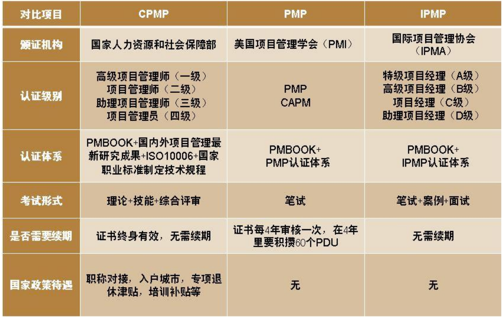

## 1.0 学习目标
- 体会到对更好的项目管理（特别是IT项目管理）不断增长的需求。
- 解释什么是项目，举出一些IT项目的例子，列出项目的各种特征，并且描述什么是项目管理的三项约束。
- 描述什么是项目管理，论述项目管理框架中的关键因素，包括项目的千系人、项目管理知识领域、常用工具和技术、项目的成功要素等。
- 了解项目、项目群以及项目组合管理相互之间的关系，以及他们各自对项目整体成功的贡献。
- 描述项目经理应该做些什么、需要什么样的技能，IT项目经理的就业机会是怎样的，通过这些来了解项目经理的作用。
- 描述项目管理专业，包括它的历史、PMI等专业组织在其中扮演的角色、项目管理资格认证和相应职业道德规范的重要性以及项目管理软件的增长情况。

## 1.1 引言
- 信息和通讯技术市场每年以6%的速度增长。
- 2008年，在美国，IT从业人员首次达到400万，IT专业的失业率是美国劳动力市场失业率的一半。
- 项目管理是一个受欢迎的专业，每年获得项目管理职业认证（PMP）的人数持续增加。
- 失败项目造成的全球经济损失每年约6.2万亿美元。

> 1995年，斯坦迪什集团公布了一项被经常引用的题为“混沌”的研究报告。这家咨询公司在美国调查了365位IT高级经理人员，他们管理超过8380个不同的IT应用项目。正如题目所含的意思那样，这些IT项目正处在一个混沌的状态。在20世纪90年代初期，美国公司每年要在大约17.5万多个IT 应用开发项目上花费2500多亿美元。研究表明，所有IT项目的平均成功率只有16.2%。
> 他们把成功定义为在计划的时间和预算内实现项目目标。研究还发现，有超过31%的IT项目在完工之前就被取消了，这花掉了美国公司和政府有关部门810亿美元。报告的作者坚持认为IT项目管理有改进的必要。他们说：“软件开发项目正处于混沌状态，我们再也不能效仿这三个愚蠢的行为了：听不到失败、看不见失败、说不出失败。”
> 最新研究表明，普华永道会计事务所调查来自30个不同国家的200家公司的项目管理成熟度并发现超过一半的项目都失败了。该研究还发现只有2.5%的公司始终在所有类型的项目中满足了范围、时间和成本目标。

运用项目管理带来的好处（使用项目管理的优势）
- 更好地控制财力、物力和人力资源。
- 改进客户关系
- 缩短开发时间。
- 降低成本和提高生产率。
- 提高质量和可靠性。
- 更大的边际利润空间。
- 更好的内部协调。
- 积极影响实现战略目标。
- 更高的员工士气。

## 1.2 什么是项目
- 项目（project）：为创造一个特定的产品、服务或者成果而采取的临时性的努力。
- 运营（operation）：在组织中为了维持业务而进行的工作。

项目和运营的不同之处在于，当项目的预期已经达到或者项目被终止时项目就结束了。

### 1.2.1 IT项目的例子
- 一个学生团队开发一个智能手机应用程序并在网上销售。
- 某公司开发无人驾驶汽车。
- 一个小的软件开发团队为财务部门的一个内部的软件应用程序添加一个新的功能。
- 某大学校园升级它的基础技术设施来提供无线网络访问。
- ...

| 比较项   | 项目             | 运营       |
| -------- | ---------------- | ---------- |
| 负责人   | 项目经理         | 职能经理   |
| 实施组织 | 项目组           | 部门       |
| 工作性质 | 独特、创新       | 常规、重复 |
| 工作环境 | 开放、风险       | 封闭、确定 |
| 管理组织 | 临时、变化       | 稳定、持久 |
| 时限性   | 一次性           | 持续不断   |
| 目标     | 独特性           | 重复性     |
| 目的     | 实现目标结束项目 | 维持运营   |
| 管理追求 | 效果             | 效率       |

### 1.2.2 项目属性
- 项目有一个特定的目的。
- 项目是临时性的。
- 项目是通过不断完善细节而逐步展开的。
- 项目通常需要来自不同领域的资源。
- 项目应有一个主要客户或发起人。
- 项目含有不确定性。

### 1.2.3 项目约束（范围、时间、成本、质量、资源、风险）
每一个项目都会在不同程度上受到范围目标、时间目标和成本目标的约束。这些限制条件在项目管理中通常被称为三项约束。
要想取得项目的成功，项目经理必须同时考虑范围、时间、成本这三个因素，由于这三个目标通常存在冲突，所以还要平衡这三者之间的关系。
- 范围：项目的每一部分都有哪些工作？客户或发起人要通过这个项目获得什么样的产品、服务或成果？如何确认范围？
- 时间：完成这个项目需要多长时间？项目的进度安排是怎样的？团队如何跟踪实际进程？谁有权批准进度的变更？
- 成本：完成这个项目需要花费多少成本？这个项目预算是多少？如何跟踪控制成本？谁能授权改变预算？

管理这三项约束，就要在一个项目的范围、时间和成本三者之间进行权衡。

质量与范围、时间、成本合称为项目管理的四项约束。

优先事项应基于项目发展战略。
权衡矩阵是促进与利益相关者沟通的有用工具。
- 确定利益相关者愿意妥协的领域
- 表面假设、限制和风险

按优先级顺序排列的标准。
- optimize - 对利益相关者来说最重要的是什么
- constrain - 必须满足哪些条件
- accept - 取舍

矩阵中的块表示产品开发战略。
规则：每行和每列必须有一个复选标记。

产品开发策略示例1：
- 优化时间表以尽早上市
- 限制成本/资源以管理预算
- 接受在多个版本中增量交付功能

| Project Dimension | Optimize | Constrain | Accept |
| ----------------- | -------- | --------- | ------ |
| Cost/Resources    |          | X         |        |
| Time/Schedule     | X        |           |        |
| Scope             |          |           | X      |

产品开发策略示例2：
- 优化功能
- 限制进度以实现目标
- 接受开发功能所需的成本/资源

| Project Dimension | Optimize | Constrain | Accept |
| ----------------- | -------- | --------- | ------ |
| Cost/Resources    |          |           | X      |
| Time/Schedule     |          | X         |        |
| Scope             | X        |           |        |

## 1.3 什么是项目管理
项目管理（project management）：在项目活动中运用专门的知识、技能、工具和技术，以满足项目需求。
项目经理不仅仅要努力实现项目的范围、时间、成本和质量目标，还必须协调整个项目过程，以满足项目参与者或受到项目活动影响的人们的需求和预期。

项目管理框架

### 1.3.1 项目干系人
干系人（stakeholder）是指参与项目或受项目活动影响的人，
包括项目发起人、项目团队、支持人员、客户、使用者、供应商，甚至是项目的反对者。

### 1.3.2 项目管理知识领域
项目管理知识领域（project management knowledge area）指的是项目经理必须具备的一些重要知识和能力。

项目管理的十大知识领域。
1. 项目范围管理：确定和管理成功完成项目所要做的全部工作。
2. 项目时间管理：包括项目所需总时间的估算，编写一个可以接受的项目日程进度计划，并确保项目按时完工。
3. 项目成本管理：包括项目预算的制定和管理工作。
4. 项目质量管理：是确保项目满足立项所明示或暗示的需求。
5. 项目人力资源：管理关注的是如何有效地利用参与项目的人员。
6. 项目沟通管理：包括产生、收集、发布和保存项目信息。
7. 项目风险管理：包括对项目相关的风险进行辨识、分析和应对。
8. 项目采购管理：是指根据项目的需要，从项目实施组织外部获取和购进产品和服务。
9. 项目干系人管理：包括识别和分析干系人的需求，同时在整个项目生命周期内管理和控制他们的接触。
10. 项目综合管理：是一个首要的功能，影响着所有其他知识领域，也被所有其他知识领域所影响。

### 1.3.3 项目管理工具和技术
项目管理工具和技术（project management tool and technique）用来帮助项目经理和他们的团队进行十大知识领域的项目管理从而完成工作。
1. 数据收集技术
2. 数据分析技术
3. 数据表现技术
4. 决策技术
5. 沟通技巧
6. 人际关系与团队技能
7. 未分组的工具与技术

各知识领域常用项目管理工具和技术
| 知识领域/种类 | 工具和技术                                                                                                                                         |
| ------------- | -------------------------------------------------------------------------------------------------------------------------------------------------- |
| 综合管理      | 项目挑选方法、项目管理方法论、项目干系人分析、工作请求、项目章程、项目管理计划、项目管理软件、变更请求、变更控制委员会、项目评审会议、经验教训报告 |
| 范围管理      | 项目范围说明书、工作分解结构、工作说明书、需求分析、范围管理计划、范围验证技术、范围变更控制                                                       |
| 时间管理      | 甘特图、项目网络图、关键路径分析、赶工、快速跟踪、进度绩效测量                                                                                     |
| 成本管理      | 项目预算、净现值、投资回报率、回收分析、挣值管理、项目组合管理、成本估算、成本管理计划、成本基线                                                   |
| 质量管理      | 质量度量、核减清单、质量控制图、帕累托图、鱼骨图、成熟度模型、统计方法、测试计划                                                                   |
| 人力资源管理  | 激励技术、共鸣式聆听、责任分配矩阵、项目组织图、资源直方图、团队建设训练                                                                           |
| 沟通管理      | 沟通管理计划、启动会议、冲突管理、沟通介质选择、状态和进程报告、虚拟沟通、模板、项目Web站点                                                        |
| 风险管理      | 风险管理计划、风险登记册、概率/影响矩阵、风险分级                                                                                                  |
| 采购管理      | 自制或外购分析、合同、建议书或者报价邀请函、资源选择、供应商评价矩阵                                                                               |

### 1.3.4 项目成功
1. 项目达到了范围、时间和成本目标。
2. 项目使客户/项目发起人感到满意。
3. 项目的结果达到了主要目标。

注：
- 项目的目标必须明确界定。
- 每个项目都必须有一个权威机构，通常称为项目指导委员会。
- 有效的目标必须是可衡量的，这保证了项目的成功可以被判断。

什么会使项目成功
1. 用户参与
2. 管理层支持
3. 明确的业务目标
4. 情绪成熟
5. 优化范围
6. 敏捷过程
7. 项目管理专业知识
8. 技术资源
9. 执行
10. 工具和基础设施

联邦技术项目成功的三大原因：
1. 充足的资金
2. 员工专业知识
3. 所有项目干系人参与

> 由于文化环境的不同，原因是多种多样的。

项目成功交付的实践要素：
1. 使用一个综合的“工具箱”。
2. 培养项目领导者。
3. 开发一个流线型的项目交付过程。
4. 对项目的健康度进行量化。

## 1.4 项目群和项目组合管理

### 1.4.1 项目群
项目群是指“一组相互联系的项目，宜使用协同方法进行管理来获得收益和进行控制，而这种收益和控制在单独管理这些项目时是不易获得的”。

> 项目群是以协调方式管理的一组相关项目，以获得单独管理所无法获得的利益和控制。

项目群经理：
- 对领导项目群内项目的项目经理进行领导并指明方向。
- 协调项目团队、职能部门、供应商和运营员工的努力，以支持项目并保证项目产品和过程达到最大的收益。
- 负责项目成果的交付。
- 软件可重用性。

### 1.4.2 项目组合管理
项目组合管理（project portfolio management，也称为组合管理）是一种新兴的商业战略。
在项目组合管理中，组织将项目以及项目群组合并进行管理，使其作为一个投资组合，从而促成整个企业的成功。

主要区别：
- 项目管理：战术目标
- 项目组合管理：战略目标

| 项目组合                       | 项目集                               | 项目                       |
| ------------------------------ | ------------------------------------ | -------------------------- |
| 战略目标                       | 管理多个目标                         | 某个具体目标               |
| 管理项目优先级                 | 管理相互关联的项目                   | 实现具体目标的创临时性工作 |
| 指导层面                       | 执行层面                             | 交付层面                   |
| 根据战略目标，管理项目优先级。 | 管理相互关联、协调的项目，产生收益。 | 实现具体目标的临时性工作。 |

项目管理与项目组合管理的比较

属性：
- 选择和管理项目的持续过程
- 查看和管理企业级的所有项目
- 高级管理人员而不是项目经理

最佳实践：最佳实践是指“为产业公认的达到确定目标或目的的最佳方法。”
Robert Butrick认为组织应遵循项目管理的一些基本原则，这些原则包括前面提到的两条：
- 确保项目是战略驱动的。要能证明，你所承担的每个项目如何适合你的商业战略，并立即筛选出不必要的项目。
- 促使项目干系人参与进来。忽视项目干系人常常会导致项目失败。确保项目干系人参与项目的每个阶段，并随时随地地鼓舞团队合作和做出承诺。

项目组合法示例

组织项目管理

## 1.5 项目经理的作用

### 1.5.1 项目经理的工作描述
工作描述各不相同，但大多数包括计划、安排、协调和与人员合作以实现项目目标等职责。
绝大部分的成功项目是由经验丰富的项目经理领导的，他们通常可以帮助影响成功因素。

### 1.5.2 项目经理应具备的技能

项目管理团队应具备的技能：
- 项目管理知识体系。
- 应用领域的知识、标准和规则。
- 项目环境知识。
- 普通管理知识和技能。
- 软技能或人际关系能力。

项目经理应具备的技能：
- 项目管理知识、
- 执行能力（掌握项目管理知识且能够运用知识管理项目）
- 以及个人能力（态度和个人特征）

### 1.5.3 人际关系技能和领导技能的重要性
对于项目经理最重要的技能和能力
1. 人际关系技能
2. 领导能力
3. 倾听能力
4. 正直、行为道德、坚定
5. 善于建立信任关系
6. 口头沟通
7. 善于创建团队
8. 解决冲突、冲突管理
9. 批判式思考，解决问题
10. 理解，权衡优先

不同情况下需要的不同技能：
- 大型项目：领导能力、相关的主要经历、计划、人际关系技能、口头沟通和团队建设技能是最重要的。
- 高不确定性项目：风险管理、期望管理、领导能力、人际关系技能和计划能力是最重要的。
- 非常新颖的/具有挑战的项目：领导能力、人际关系技能、有远见和目标、自信、期望管理和倾听技能是最重要的。

领导者：制定长远的、宏大的目标，同时激励员工去实现那些目标；
管理者：处理日常的细致工作，完成具体的目标。

管理者负责把事情做好，而领导者决定该做什么。

| 管理                         | 领导力                         |
| ---------------------------- | ------------------------------ |
| 直接利用职位权力             | 利用关系的力量指导、影响与合作 |
| 维护                         | 建设                           |
| 管理                         | 创新                           |
| 关注系统和架构               | 关注人际关系                   |
| 依赖控制                     | 激发信任                       |
| 关注近期目标                 | 关注长期愿景                   |
| 了解方式和时间               | 了解情况和原因                 |
| 关注赢利                     | 关注范围                       |
| 接受现状                     | 挑战现状                       |
| 做正确的事                   | 做正确的事情                   |
| 关注可操作的问题和问题的解决 | 关注愿景、一致性、动力和激励   |

项目经理往往兼任领导者和管理者的角色，项目经理领导人，管理事情。

### 1.5.4 IT项目经理职业
九大热门IT技能（资料来源：Rick Saia, “9 Hot IT Skills for 2012,” Computerworld, September 26, 2011.）
| 技能             | 受访者比例 |
| ---------------- | ---------- |
| 编程以及应用开发 | 60%        |
| 项目管理         | 44%        |
| 帮助台/技术支持  | 35%        |
| 网络技术         | 35%        |
| 商业智慧         | 23%        |
| 数据中心         | 18%        |
| Web 2.0          | 18%        |
| 安全             | 17%        |
| 通信             | 9%         |

## 1.6 项目管理专业

### 1.6.1 项目管理的历史
- 古时，建造埃及金字塔，建造中国长城
- 大多数人认为曼哈顿计划是第一个使用“现代”项目管理的项目
- 这个为期三年、价值20亿美元（以1946年美元计算）的项目有一个单独的项目经理和一个技术经理

二十世纪，现代项目管理从“萌芽”到“成熟”到广泛传播的发展过程。

如今，许多企业开始建立项目管理办公室来帮助处理越来越多、越来越复杂的项目。
项目管理办公室（Project Management Office，PMO）是一个有组织的团队，负责协调整个组织中的项目管理功能。

项目管理办公室增长数量（资料来源：PM Solutions，“The State of the PMO 2010”（2010））

### 1.6.2 项目管理协会
- 项目管理协会（PMI）是一个国际项目经理专业协会，成立于1969年
- PMI继续吸引和留住会员，截至2012年，全球会员人数超过38万
- 在信息系统、金融服务和医疗保健等许多领域都有实践社区
- 项目管理研究和认证计划继续增长
- 学生可以以较低的费用加入PMI，并获得项目管理认证助理（CAPM）认证（详情见www.pmi.org）

### 1.6.3 项目管理认证
- PMI提供项目管理师（Project Management Professional，PMP）认证
- PMP需要有足够的项目经验和培训记录，同意遵守道德规范，并通过了PMP考试。
- 获得PMP认证的人数正在迅速增加。
- PMI也提供了一些其他的认证，比如敏捷技术、进度、风险和项目群管理方面的认证。

1993～2011年获得PMP证书的人数增长情况

专业发展单元
- PDU（Professional Development Units，PDU）是一个考核单位。
- 在取得PMP证书后，为加强PMP的专业持续发展，鼓励和认可个人学习机会，维持PMP的国际证书品质，PMP必须满足PMI制定的专业发展计划的要求，以保持其资格的有效性。
- PMP每三年必须重新进行认证
- 至少60个PDU；
- 保证继续遵守PMI的职业道德标准。
- PDU的积累方式
- 院校的项目管理课程；
- 专业活动和自我指导的学习；
- 注册教育提供者提供的培训；
- 非PMI注册教育提供者提供的教育活动；
- 专业组织或社团的志愿者

中国项目管理师（CPMP）：
中国项目管理师是由中华人民共和国劳动和社会保障部在全国范围内推行的国家职业资格认证体系，具有广泛的代表性和权威性，代表了当今国内项目管理专业资质认证的最高水平。

该职业共设四个等级
- 项目管理员（国家职业资格四级）；
- 助理项目管理师（国家职业资格三级）；
- 项目管理师（国家职业资格二级）
- 高级项目管理师（国家职业资格一级。

### 1.6.4 项目管理的职业道德规范（略）

### 1.6.5 项目管理软件
有数百种不同的产品可以帮助执行项目管理。
工具主要有三类：
- 低端工具：提供了基本的项目管理功能，推荐给小项目和单个用户。
- 中端工具：为大型项目、多用户和多项目而设计，Project 2010最受欢迎。
- 高端工具：也称为企业项目管理软件，通常按用户发放许可，如微软企业项目管理解决方案。

## 1.7 本章小结
- 项目是为了创造一种特定的产品、服务或者成果而进行的临时性努力。
- 项目管理是指在项目活动中运用专门的知识、技能、工具和技术，以满足项目需求。
- 项目群是适合于通过协调方式进行管理以获得收益，并且不适合分别进行管理的一组项目。
- 项目组合管理是把项目和项目群视作能够促使整个企业获得成功的投资组合来进行组织和管理。
- 项目经理在帮助项目和企业取得成功的过程中起到了非常重要的作用。
- 项目管理专业正在不断成长和成熟。
