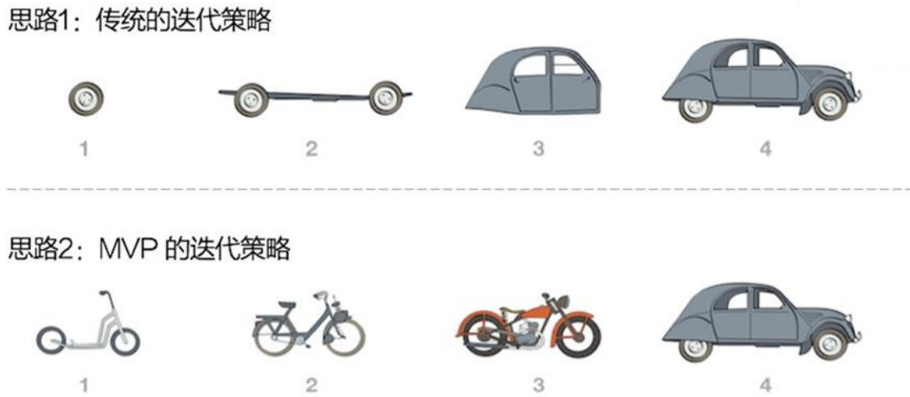

## 2.0 学习目标
- 从系统的观点来描述项目管理，了解如何将项目管理应用于IT项目之中。
- 了解组织，包括4个框架、组织结构和组织文化。
- 解释为什么干系人管理和高层管理的承诺对于一个项目的成功至关重要。
- 了解项目阶段和项目生命周期的概念，区分项目开发和产品开发。
- 讨论IT项目独特的属性和多样化的本质。
- 描述影响IT项目管理的最新趋势，包括全球化、外包、虚拟团队以及敏捷项目管理。

> 开篇案例
> Tom Walters最近担任了学院的IT部主任这个新职位。过去15年，Tom一直在这里当老师，同事都很敬重他。这是一所位于美国西南部的私立大学，规模不大，设有文学和专业技术的许多课程，普通全日制在校生有1500人，上夜校的成人教育学生有1000人。就像大多数学校一样，其IT的应用在过去5年里得到了迅猛增长。校园里的一些教室配有电脑供教师和学生使用，另外，还有一些配有配套的教学工作站和投影系统。Tom得知全美已经有很多大学很多课程都结合了技术内容，要求所有学生租借便携式电脑学习，这个做法让他感到很新奇。他和IT部的另外两个人跑了一趟当地的一所大学，该校在过去3年中都要求所有学生租借便携式电脑，所见所闻让他们印象非常深。Tom和他的同事也编制计划，开始要求他们学校的学生从下一年开始都要租借便携式电脑学习。
> Tom在9月份给全体教职工发了一个电子邮件，简要描述了这个计划和其他一些计划，结果是几乎没有什么响应。直到在第二年2月份的教师会议上，他又向大家解释了这个计划的细节，结果遭到历史系、英语系、哲学系和经济系等系主任的反对。他们慷慨陈词，认为这所大学不是技术培训学校，Tom的这种想法简直荒唐可笑。而计算机系的人表示他们的学生都已经拥有最好的台式机了，也不会乐意为租用一台功能更低的便携式电脑支付那些强制收取的费用。成人教育部的主任也担心那些成人班的学生恐怕不会再愿意增加学费了。听了他们的反映之后，Tom觉得很吃惊。现在他该怎么办呢？
> 听了教工会上一些人对便携式电脑计划的意见之后，校长指示成立一个委员会，正式评价要求学生在将来使用便携式电脑这一建议。由于学校也在处理其他一些与招生有关的重要事宜，校长就指定管理招生的副校长来领导这个委员会的工作。被安排进委员会的和其他一些自愿参与的人主要有IT部主任Tom Walters、成人教育部主任、计算机系主任和历史系主任等。校长还要求委员会中要包括至少两个来自学生社团的人员。校长知道大家都很忙，并觉得便携式电脑并不是最要紧的事情。因此，他要求委员会在一个月后的教务会上提交一份计划书，由他们提出有关建议，决定是否为此设立正式的项目团队来全面研究便携式电脑的使用事宜，或放弃这一想法。
> 结果是什么呢？在第二次教务会上，大家提出终止这一方案。

## 2.1 项目管理的系统观点
- 必须在广阔的组织环境中操作项目，项目经理需要在更大的组织背景中考虑项目。
- 为了有效地处理复杂的环境，项目经理需要采用整体的观点，理解项目是如何与更大的组织进行关联的。
- 系统思维（system thinking）描述了在组织的背景中执行项目的整体观点。

> - 高级管理人员必须确保项目继续支持当前的业务需求。
> - 一些利益相关者来自组织，但不是团队。
> - 该项目可能会影响其他项目。

### 2.1.1 什么是系统方法
- 系统方法（system approach）这一术语出现于20世纪50年代，是指采用整体的和分析的方法来解决复杂问题，包括使用系统哲学、系统分析和系统管理等方法。
- 系统哲学（system philosophy）是一整套系统地思考事物的思维模式。
- 系统（system）是为达到某些目的而在一个环境中运行的、由相互作用的要素组成的集合。
- 系统分析（system analysis）是解决问题的一种方法，需要定义所研究系统的范围，然后将它分解成各个部分来确认与评估相应的问题、机会、约束和需求。
- 系统管理（system management）处理与系统的创建、维护和改变相关的业务、技术和组织问题。

### 2.1.2 系统管理的三球模型
系统管理的三球模型可以用“业务、组织和技术”这三个简单的理念来概括，对成功地选择和管理项目产生巨大的影响。

## 2.2 了解组织

### 2.2.1 组织的4个框架
组织可以被视为4个不同的框架：结构、人力资源、政治和符号。
- 结构框架：角色和责任，合作，控制。组织图表有助于描述中这个框架。
- 人力资源框架：在组织需要和人力需求之间进行协调。
- 政治框架：由不同个人和利益集团联合组成。冲突和权利是关键问题。
- 符号框架：事件相关的符号和意义。文化、语言、传统以及形象是这个框架的所有部分。

> “吾兄系本公司发起人之一，现公司生意兴隆，望速前来参与经营……”
> ——毛泽东

### 2.2.2 组织结构
一种系统，概述了如何指导某些活动，以实现组织的目标。

职能型、项目型和矩阵型组织结构：

项目组织结构及其影响：

| 组织结构 | 适用范围                                 |
| -------- | ---------------------------------------- |
| 职能型   | 适用于生产和销售标准产品的公司。         |
| 项目型   | 适合做项目，不生产标准产品的企业。       |
| 矩阵型   | 适合拥有多个不同规模和复杂度项目的公司。 |

### 2.2.3 组织文化
组织文化（organization culture)：是一系列共同的能够刻画组织职能的设想、价值和行为。

组织文化的10个特点：
1. 成员认同度
2. 团队专注度
3. 人员聚集度
4. 单元集成度
5. 控制力
6. 抗风险能力
7. 奖励标准
8. 抗冲突能力
9. 结果导向度
10. 开放系统聚集度

## 2.3 干系人管理
项目干系人指的是项目活动所涉及的或者受其影响的人。
干系人既可以来自组织内部，也可以来自组织外部，可能直接参与到项目当中，也可能只是受其影响。

内部的项目干系人：
- 项目发起人
- 项目团队
- 辅助人员
- 内部用户
- 其他内部干系人
  - 高层管理
  - 其他职能经理
  - 其他项目经理等。

外部项目干系人
- 项目的客户（在组织外部）
- 竞争对手
- 供应商
- 其他参与项目或者为项目所影响的外部团体。

### 2.3.1 高层管理承诺的重要性
高层管理承诺对于项目经理来说是至关重要的，原因如下：
- 项目经理需要足够的资源。
- 项目经理经常需要及时得到对于特定项目需求的认可。
- 项目经理必须与组织内其他部门的人进行合作。
- 项目经理通常需要在领导力方面获得指导和帮助。

### 2.3.2 组织对信息技术投入的需求
- 如果组织本身并不重视IT，那么一个大的IT项目要成功是非常困难的。
- 为IT主管设立副总裁或者相当的职位，通常称为首席信息官（CIO）。
- 任命非IT领域的人全职参与大型项目以增加最终用户对系统的参与度。

### 2.3.3 组织对标准的需求
- 另一个问题是没有标准或准则辅助项目管理。
- 软件工程

项目公共文档模板
1. 项目人员管理表模板
2. 项目策划/里程碑表模板
3. 项目WBS分解任务表模板
4. 项目进度计划表模板
5. 项目风险管理表模板
6. 项目沟通计划表模板
7. 项目会议纪要表模板
8. 项目状态报告表模板
9. 项目变更管理表模板
10. 项目总结表模板

## 2.4 项目阶段和项目生命周期
项目生命周期（project life cycle）是一系列项目阶段的集合。
通常定义了在每个阶段中要进行的工作，包括什么时候给出什么样的可交付成果，每个阶段涉及的人员和时间，以及管理层将如何控制和验证每个阶段中产生的工作。

一个可交付成果（deliverable）是一个产品或者服务，例如报告、培训课程、硬件模块或者软件代码片段，这些是作为项目的一部分而生产或提供的。

- 在项目生命周期的早期阶段，对资源的需求是最低的，而不确定性的程度是最高的。项目的干系人最能够影响项目的产品、服务和结果的最终特征。
- 在项目生命周期的中期，随着项目的推进，完成项目的确定性也随之提高，有关项目需求和目标的信息更加丰富，并且比项目初始或最后阶段需要更多的资源。
- 项目的最后阶段关注点在于保证满足项目需求，以及项目发起人对项目完成情况的认可。

传统的项目生命周期的阶段

### 2.4.1 产品生命周期
产品生命周期包括产品的设计、生产和使用。

系统开发生命周期（systems development life cycle，SDLC）是一个描述开发信息系统不同阶段的框架。
系统开发生命周期的一些通用模型包括瀑布模型、螺旋模型、渐增式构建模型、原型模型和快速应用开发模型（RAD）等。
这些生命周期模型都是可预测生命周期（predictive life cycle）的模式，意味着可以很明确地表达项目的范围，并且可以精确预测进度和成本。
与可预测的生命周期模型相比，自适应软件开发（adaptive software development，ASD）生命周期模型假定软件开发是遵循一种自适应的方法的，因为在生命周期的早期需求不能被清晰地描述。

### 2.4.2 项目阶段和管理评审的重要性
高层管理的评审通常称为阶段出口（phase exit）或者检查点（kill point），对于保持项目的进度以及决定是否应该继续、改变方向或者终止项目是非常重要的。

项目只是整个组织系统的一部分，组织其他部分的改变可能影响项目的状态，一个项目的状态也可能影响组织的其他部分。
通过把项目分解为阶段，高层管理可以保证项目仍然与组织的其他需求相一致。

## 2.5 IT项目的环境
IT项目特点：
- 逻辑产品——不可见
- 复杂——需求灵活
- 被动——应适应人员或组织

### 2.5.1 IT项目的本质
IT项目在规模、复杂性、生产的产品、应用领域和资源需求方面可能非常多样化。

### 2.5.2 IT项目团队成员的特征
IT项目团队成员通常具有不同的背景和技能组合。

### 2.5.3 多样的技术
IT项目使用的技术多种多样，变化很快。即使在一个技术领域内，人们也必须高度专业化。

## 2.6 影响IT项目管理的最新趋势

### 2.6.1 全球化
关键问题（Issues）
- 沟通
- 信任
- 共同的工作方式
- 工具

建议：
- 对国际项目采用更优的项目规范，否则在国际项目中，那些在传统的项目规范中显现出的问题会因为地理位置的差异而更加严重。
- 全球化思考，但本地化行动，目的是在所有项目级别上与项目干系人取得一致、相互融合。
- 在标准化的基础上考虑合作，以实现目标和项目方法的平衡。
- 确保项目保持冲力，并且通常能够持续较长时间。
- 考虑使用较新的可能更有创新性的工具和技术。

### 2.6.2 外包
外包（outsourcing）就是一个组织从外部寻找来源以获取需要的产品和服务。
海外外包（offshoring）这一术语用来描述安排在另外一个国家的外包（跨国完成的外包工作）。

- 组织通过利用外包发挥其优势，例如寻找降低成本的方法来保持竞争力。
- 他们的下一个挑战是通过改善企业架构，确保IT基础设施和业务流程的整合和标准化，从而利用外包进行战略性IT投资。
- 项目经理应该更熟悉全球化和采购问题，包括运营和管理虚拟团队。

> 全球问题
> 外包也有缺点。例如，苹果公司获益于在中国制造产品，但同时存在巨大的问题，在iPhone 4S于2012年1月推出后，一些受雇于黄牛的民工在排队买手机时发生了争斗。
> 当苹果公司表示不会在北京开放专卖店时，导致人们发生骚乱并攻击保安。
> 北京苹果专卖店之前就存在过类似问题。2011年5月，在一群人抓狂等待购买iPad 2的过程中，4个人受了伤。

### 2.6.3 虚拟团队
虚拟团队（virtual team）是指运用通信技术实现跨时间和跨地域工作的个人组成的团队。

优点：
- 很多虚拟团队的成员在家工作，不需要除了家庭办公室之外的办公场地和支持，因而成本得以节省。
- 提供更多的专业知识和灵活性或通过团队成员在全球各地日夜不停地工作来增加竞争力和响应能力。
- 不用再花费固定的工作时间和上下班时间，使团队成员的工作和生活更加和谐。

缺点：
- 那些不适应在虚拟的环境中工作的团队成员可能会受到孤立。
- 因为团队成员不能够运用身体语言和其他沟通方式来彼此理解、建立关系和信任，所以沟通更容易出现问题。
- 减少了团队成员以非正式的方式沟通和传递信息的能力。
- 增加了完成工作所需技术的依赖性。

一些研究试图找出对虚拟团队效率产生正面影响的因素。研究表明，团队过程、信任关系、领导风格、团队成员选择都与团队业绩和团队成员满意度有着密切的关系。

### 2.6.4 敏捷项目管理
敏捷意味着迅速和容易地前进，但是一些人认为，虽然经常看到它被用在项目管理中，却没使工作变得更迅速或容易。
今天的敏捷方法意味着使用基于迭代和增量开发的方法，通过合作解决需求和方案。
敏捷方法设置时间和成本目标，但是没有设置范围目标，从而使其具有灵活性。

#### 1. 敏捷软件开发宣言
我们一直在实践中探寻更好的软件开发方法，身体力行的同时也帮助他人。
由此我们建立了如下价值观：
- 个体和互动 高于 流程和工具
- 工作的软件 高于 详尽的文档
- 客户合作 高于 合同谈判
- 响应变化 高于 遵循计划

也就是说，尽管右项有其价值，我们更重视左项的价值。

#### 2. Scrum
根据Scrum联盟的定义，Scrum是为了完成具有复杂的、创新的工作范围项目的一种领先的敏捷开发方法。
这个术语是在1986年哈佛商业评论的研究中被创造的，这项研究比较了高性能、跨职能团队和使用Scrum编队的橄榄球球队。

Scum框架

#### 3. 敏捷方法、《PMBOK指南》以及新认证
PMBOK指南描述了管理项目应该做什么的最佳实践。
敏捷是一种描述如何管理项目的方法论。
项目管理协会（PMI）意识到人们对敏捷方法兴趣的不断增加，并在2011年引入了一种新认证——敏捷从业认证（ACP）。

## 2.7 本章小结
- 项目经理需要采用系统的方法来执行项目，还需要在更宽广的项目背景中考虑项目。
- 组织有4种不同的框架：结构、人力资源、政治和符号。
- 组织的结构和文化对项目经理有很强的影响。
- 为了能够继续下一个阶段的工作，项目必须要成功地通过项目的每个阶段。
- 由于IT项目的独特环境，项目经理需要考虑多个方面的因素。
- 最近的一些趋势也在影响IT项目管理。不断增长的全球化、外包、虚拟团队和敏捷项目管理已经改变了许多IT项目人员和管理方式。
