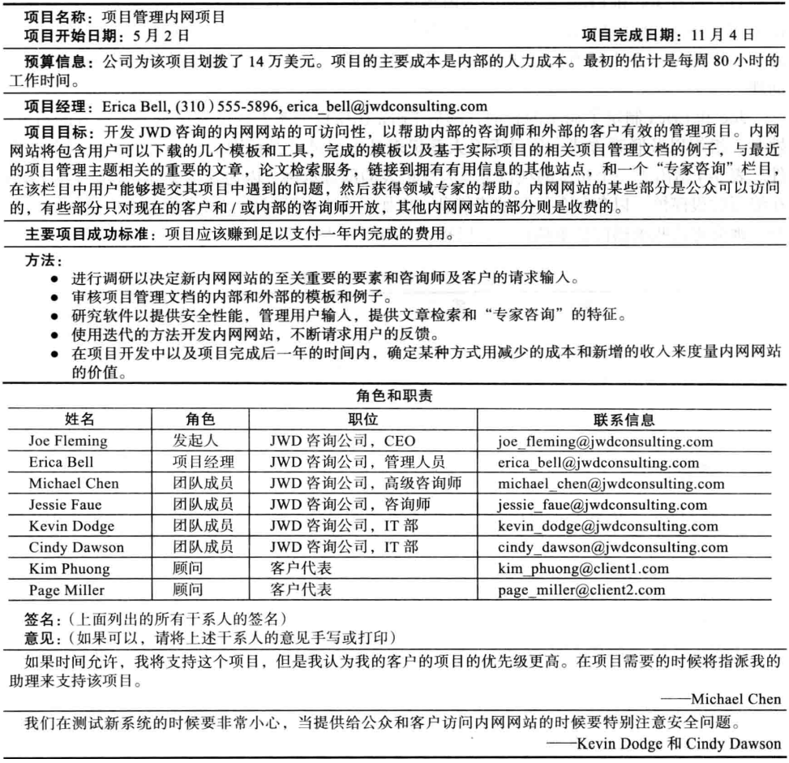
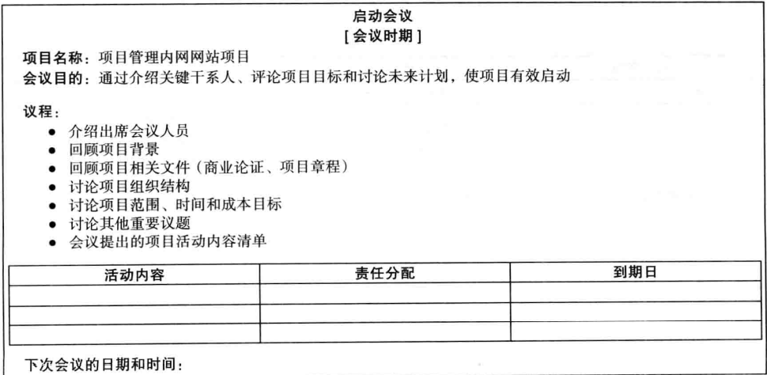

## 1.0 学习目标
- 描述5种项目管理过程组，每个过程组的典型活动层次以及它们之间的相互关系。
- 了解项目管理过程组是如何与项目管理知识领域关联的。
- 讨论组织是如何开发IT项目管理方法学来满足他们的需求的。
- 评审一个组织应用项目管理过程组来管理IT项目的案例研究，理解有效的项目启动、项目计划、项目执行、项目监控和项目收尾对项目成功的贡献。
- 回顾应用敏捷项目管理的同一个案例，注重于举例说明方法上的关键不同。
- 描述每个过程组创建文档的几个模板。

## 3.1 项目管理过程组
项目管理可以看作是一系列相互关联的过程。
过程（process）是针对某一特定结果的一系列行动。

一个项目管理过程组（project management process）包括：
- 启动过程（initiating processes）
- 计划过程（planning processes）
- 执行过程（executing processes）
- 监控过程（monitoring and controlling processes）
- 收尾过程（closing processes）

随时间推移进程组的活动级别和重叠

每个过程组所花费的时间比例

> 计划的时间永远不会浪费。

## 3.2 把过程组映射到知识领域
你可以把每个项目管理过程组的主要活动映射到10个项目管理知识领域。

## 3.3 开发IT项目管理方法学（制定一个IT项目管理方法）
正如项目是独一无二的，项目管理方法也是独一无二的。
许多组织开发了自己的项目管理方法，特别是对于IT项目。

《PMBOK指南》是一个标准，用来描述什么是管理项目的最好的实践。
方法学（methodology）描述应该如何去做事情，不同的组织通常有不同做事方式。

一些其他的方法：
### 1. 受控环境下的项目管理（Project IN Controlled Environment，PRINCE2）
1996年，英国政府商务办公室（OCG）为IT项日开发出这一项目管理的通用方法论。
它是英国的事实标准，被50多个国家采用。

### 2. 敏捷方法
敏捷开发是自适应软件开发的一种形式。全部的敏捷方法包括一个迭代的工作流程和迭代式增量软件交付。
一些流行的敏捷方法包括XP（Extreme programming）、Scrum、FDD（feature-driven development）、LSD、AUP、Crystal、DSDM（Dynamic Systems Development Method）。

### 3. 统一软件开发过程（Rational Unified Process framework，RUP）框架
RUP是一个迭代的软件开发过程，它关注团队的生产率以及向所有团队成员提供软件的最佳实践。

### 4. 六西格玛方法论
- DMAIC：定义、度量、分析、改进、控制，用于改进已有业务流程；
- DMADV：定义、度量、分析、设计、验证，用于创造新产品或过程设计，以取得可预测且无缺陷的业绩。

## 3.4 案例研究1：JWD咨询公司的项目管理内网网站项目（预测方法）
- 本案例研究提供了一个例子，说明了启动、计划、执行、监控和收尾一个IT项目的内容。
- 艾丽卡-贝尔负责她的咨询公司JWD咨询公司的项目管理办公室（PMO），该公司已经发展到包括200多名全职顾问和更多的兼职顾问。JWD咨询公司提供各种 咨询公司提供各种咨询服务，协助企业选择和管理IT项目。管理IT项目。
- 乔-弗莱明，首席执行官，希望他的公司继续发展，成为一个世界级的咨询机构。因为业务的核心是帮助其他组织进行项目管理，他希望能有一个标准化的程序来管理他的项目。
- 他要求艾丽卡与她的团队合作开发内联网网站。
- 提供一个友好、标准化的客户沟通平台。
- 提供内部员工培训平台。
- 存储客户和项目记录。
- 提供公司的宣传平台。

### 3.4.1 项目的预启动和启动

#### 1. 预启动任务
在正式启动项目之前，为项目奠定良好的基础非常重要。为此，高级经理经常先完成一些任务，称为预启动任务，包括一些方面：
- 决定项目的范围、时间和成本的制约因素；
- 识别项目发起人；
- 选择项目经理：
- 为项目开发一个业务案例；
- 与项目经理开会讨论项目管理过程及预期成果；
- 决定项目是否需要被分为两个或更多子项目。

业务案例（商业论证）
- 引言/背景（Introduction）
- 业务目标（Business Objective）
- 当前的形势和问题/机会说明（Current situation and problem/opportunity statement）
- 关键的假设条件和制约因素（Critical assumption and constraints）
- 选择和建议分析（Analysis of options and recommendation）
- 项目的初步需求（Preliminary project requirements）
- 预算评估和财务分析（Budget estimate and financial analysis）
- 进度评估（Schedule estimate）
- 潜在风险（Potential risks）
- 展示（Exhibits）

#### 2. 项目启动
启动项目的主要任务是识别所有项目干系人并指定项目章程。

项目启动知识领域、过程和输出

**识别项目干系人**
- 项目干系人登记表：记录已经识别的干系人的详细细节的文件。
  
- 项目干系人管理策略
  
  > 内容通常是敏感的，因此请勿发布此文档。

**起草项目章程**
章程通常很短，包括关键项目信息和利益相关者签名

**召开项目启动会议**
- 启动会议是指在项目开始时召开的会议，以便于项目干系人见面、评论项目目标、讨论未来的计划。
- 通常项目启动会议在商业论证和项目章程完成后举行，也可以根据需要提前。
- 主要的项目干系人出席的任何项目会议都应该有会议议程。

议程的主要议题如下：
- 会议目的
- 议程（将讨论的主题按顺序列出）
- 记录项目活动内容的部分（每个人的责任分配，每人完成项目活动的时间）
- 记录下次会议召开的日期和时间的部分

### 3.4.2 项目计划
项目计划的主要目的是指导项目的执行。

JWD项目的主要产出包括：
- 团队协议。
- 项目范围说明书。
- 工作分解结构（WBS），范围基线的重要部分。
- 项目时间表，以甘特图的形式，并附有所需要的资源以及人物之间的相关性。
- 风险排序清单（风险登记表的一部分）。

**团队协议**
帮助促进团队合作，澄清团队沟通。
- 行为准则
- 参与
- 沟通
- 解决问题的方式
- 会议指南

**项目范围说明**
1. 列出对你来说项目范围中最不清楚的一项内容。
2. 对于项目的范围，你能够预见到有哪些其他问题和麻烦？
3. 列出你所认为的该项目的主要的可交付成果是什么？
4. 你将会帮助创建或者评审哪些可交付成果？

- 项目标题
- 时间
- 起草人
- 项目起因
- 产品的特征和需求
- 项目可交付成果的概括
  - 与项目管理相关的可交付成果
  - 与产品相关的可交付成果
- 项目成功的准则

**工作分解结构（WBS）**
1. 决定如何做这项工作的基础
2. 创建项目进度的基础
3. 为衡量和预测项目执行情况而进行挣值管理的基础。

Erica和她的团队决定使用项目管理过程组作为WBS（如下）的主要范畴。
- 1 启动
  - 1.1 决定/任命项目经理
  - 1.2 识别关键的干系人
  - 1.3 准备业务案例
  - 1.4 准备项目章程
- 2 计划
  - 2.1 召开项目启动会
  - 2.2 准备团队协议
  - 2.3 准备范围说明书
  - 2.4 准备WBS
  - 2.5 准备进度表和成本基线
  - 2.6 风险的识别，讨论和分级
- 3 执行
  - 3.1 调研
  - 3.2 用户介入
  - 3.3 内部网站内容
  - 3.4 内部网站设计
  - 3.5 内部网站构建
  - 3.6 内部网站测试
  - 3.7 内部网站推广
  - 3.8 内部网站大量使用
  - 3.9 项目收益度量
- 4 控制
  - 4.1 状态报告
- 5 收尾
  - 5.1 准备最终项目报告
  - 5.2 准备最终项目展示
  - 5.3 经验教训

**项目时间表**
在准备好了WBS以后，项目团队召开了另外一个面对面的会议来制定项目的进度表。
1. 确定任务资源
2. 确定任务持续时间
3. 确定任务相关性
4. 创建甘特图草稿
5. 审查并最终确定甘特图

**风险排序清单**
Erica审核了在商业论证中提到的风险，以及在项目章程和团队会议上所给出的意见。
她召开了一个特殊的会议来进行头脑风暴并讨论潜在的风险。
根据所有的信息和结果，Erica和她的团队给出了不同级别的优先级风险列表：

分级风险列表
| 等级 | 潜在风险                                     |
| ---- | -------------------------------------------- |
| 1    | 缺少内部咨询师的参与                         |
| 2    | 缺少客户代表的参与                           |
| 3    | 新系统的安全性                               |
| 4    | 文章检索和“专家咨询”栏目的外包/购买          |
| 5    | 处理在线支付事务的外包/购买                  |
| 6    | 以实用的方式来组织模板和样例                 |
| 7    | 提供有效的搜索栏目                           |
| 8    | 从Michael Chen和其他的高级咨询师获得好的反馈 |
| 9    | 新系统的有效宣传推广                         |
| 10   | 在一年内实现新系统的利润                     |

### 3.4.3 项目执行
项目执行涉及采用必要的行动以确保完成项目计划中的活动，包括根据工作需要将任何新的硬件、软件和过程引人正常操作中。
项目的产品是在项目执行过程中产生的，通常需要最多的资源来完成这个过程。

执行过程和输出

- 项目经理：提供有力的领导和使用好的沟通技巧对于好的项目执行是至关重要的。
- 里程碑报告：首席执行官CEO和项目发起人喜欢通过里程碑报告来查看项目的进展，里程碑报告是项目报告的一种类型。
- 人力资源问题：人力资源问题通常出现在项目执行过程中，特别是冲突问题。Erica调整了沟通方式来满足他的特殊需要。

6月17日的里程碑报告

### 3.4.4 项目监控
项目监控（检测和控制）是一个过程，包括针对项目目标来衡量进展情况、监测计划的偏离状况、采取正确的行动符合计划的进展。
监控贯穿一个项目的生命周期。

监测和控制过程和输出

每周提交周报
- 项目名称 团队成员 日期
- 本周完成的工作
- 下周需要完成的工作
- 进展顺利（较好）的部分和原因
- 进展出错（不好）的部分和原因
- 建议或问题
- 项目变更

使用项目管理软件
- 监控项目的一个重要工具是使用项目管理软件，团队成员可以提交自己的实际工作时间，及时更新任务信息。

### 3.4.5 项目收尾
- 收尾过程包括获得干系人和客户对于最终产品和服务的验收，同时使得项目或者项目阶段实现有序的结束。
- 即使许多IT项目在完成之前就被取消了，正式结束每个项目同时从中吸取经验教训以有利于将来的项目也是重要的。
- 产出包括项目文件和经验教训报告，这是组织过程资产的一部分。
- 大多数项目还包括向赞助商/高级管理层提交的最终报告和演示。

收尾过程和输出

经验教训报告
- 项目名称 项目发起人 项目经理 项目时间 最终预算
1. 项目是否满足范围、时间和成本目标？
2. 在项目范围说明书中列出了哪些成功的准则？
3. 反思你是否满足了项目的成功准则。
4. 从管理项目来说，哪些是你的项目团队从项目中学到的经验教训？
5. 描述项目中做对的一个例子。
6. 描述项目中做错的一个例子。
7. 基于在本项目中获得的经验，你将在下一个项目中有哪些不同的做法？

项目最终报告的目录
1. 项目目标
2. 项目结果总结
3. 计划的和实际的开始和结束时间
4. 原始和实际预算
5. 项目评价（为什么做这个项目？将产生什么？项目是成功的吗？项目中哪些是对的，哪些是错的？）
6. 过渡计划
7. 年度项目利润估算方法

## 3.5 案例研究2：JWD咨询公司的项目管理内网网站项目（敏捷方法）
- 演示了一个更敏捷的方式来管理JWD咨询公司的项目管理内网网站项目。
- 强调在每个过程组中使用敏捷方法的差异。
- 敏捷项目团队通常使用若干次迭代来交付软件，而不是等到项目结束后提供一个产品。

团队通常不会很快决定是否使用敏捷方法管理一个项目，就像旅行中坐飞机还是驾车。
对于项目约束不严格、有经验且合作良好的团队、风险小、需求模糊和进度灵活的项目将更适合使用敏捷方法。

### 3.5.1 Scrum角色、工件和仪式
- Scrum是一个用于开发、交付和持续支持复杂产品的框架。它是一个增量和迭代的开发过程。在这个框架中，整个开发过程由几个短的迭代周期组成，一个短的迭代周期被称为冲刺。
- Scrum起源于软件开发项目，但它适用于任何复杂或创新的项目。

Scrum包括项目参与者的三个主要角色：
- 产品负责人：负责项目的商业价值，决定做什么工作以及以什么顺序记录在产品待办事项列表中。
- 敏捷教练：确保团队的生产力，促进每日例会，使所有角色和职能密切合作，并且移除阻碍团队发挥的障碍。
- Scrum团队或开发团队：由5～9人自发组织的跨职能团队，其工作用来产生每个冲刺所需要的结果。一个冲刺通常持续2～4周，在这期间必须完成特定的工作并可以进行审查。

工件（artifact）是人工创造的有用的对象。
Scrum工件包括：
- 产品待办事项：按照商业价值进行优先级排序的特性列表。
  
- 冲刺待办事项：在产品待办事项中在一个冲刺内完成的优先级最高的条目集合。
  
- 燃尽图：显示了按天计算在一个冲刺中累积工作的剩余量。
  

仪式或会议：
- 冲刺计划会议：在一个冲刺内团队从产品待办事项中选择一系列工作去交付的会议。
  
  - 会议准备
    - 评估完工作量且优先级排列好的各项问题；
    - 项目历史会议纪要；
    - 白板、便利贴
  - 会议进程
    - 介绍会议的目标，议程；
    - 评估尚未被评估的问题；
    - 确定冲刺Sprint的第一天和最后一天；
    - 确定每日例会，评审会议，回顾会议的时间安排；
    - 团队成员相互认可冲刺目标和既定产品Backlog
    - 团队成员从Backlog中的各项问题中分出相应的任务；
    - 考虑工作中的细节：编码、测试，代码评审、会议、新技术应用、文档；
    - 如果任务超出一周，尝试把该任务分割成几个小任务；
    - 删减或增加Backlog中的问题；
    - 团队确认Sprint目标
- 每日例会：开发团队分享进展、挑战和计划一天工作的简单会议。
  
  - 会议进程
    - 把已完成的任务从“处理中”状态转为“已完成”；
    - 确定下次会议之间，你计划完成什么任务？
    - 如果有问题影响了你的开发，把该障碍加入到障碍Backlog中；
    - 团队成员们把注意力集中在回答关键问题上；
    - 最好在每天早上开，时间一般控制在15分钟之内；
    - 会议最好每天都在同一时间同一地点举行；
    - 谁都可以参加这个会议，但只有团队成员发言，其他人员只能旁听；
    - 所有出席者都应站立（有助于保持会议简洁）；
    - 确定更新燃尽图；
    - 会议由SM主持，在会上每个团队成员需要问3个问题
  - 会议结果
    - 得到最新的障碍Backlog；
    - 得到最新的冲刺Backlog；
    - 得到最新的工作进度图
- 冲刺评审：团队向产品负责人展示在一个冲刺内已经完成的会议。
  
  - 会议进程
    - 按Backlog中的问题，逐个介绍这个冲刺的结果，演示新开发的功能；
    - 如果想要改变功能添加一个新问题到产品Backlog中；
    - 如果对功能有一个新的想法，添加一个问题到产品Backlog中；
    - 如果小组报告项目遇到阻碍还没能解决，把问题加入障碍Backlog中。
  - 会议结果
    - 对当前冲刺的结果和整个产品的开发状态达成共识
- 冲刺回顾：基于对开发团队的实际绩效的回顾，帮助团队寻找提高产品和过程的方法的会议。
  
  - 会议进程
    - 介绍会议目标，在白板画一个时间轴，标记出冲刺的开始和结束时间；
    - 花五分钟每个人在贴纸上写上“我们的成功经验是什么”；
    - 花五分钟每个人写上：有什么能够改进的；
    - 询问“谁去负责解决这些改进？”
  - 会议结果
    - 会议纪要含相关改进及负责人名单

Scrum框架以及过程组

过程组独特的Scrum活动
- 启动：
  - 决定角色
  - 决定多少冲刺会组成每个版本以及要交付的软件范围
- 计划：
  - 创建产品待办事项
  - 创建冲刺待办事项
  - 创建释放待办事项
  - 在每日例会中计划每天的工作
  - 在列表中记录绊脚石
- 执行：
  - 在每个冲刺完成每天的任务
  - 在每个冲刺结束时完成一个可交付产品
- 监控：
  - 解决问题和阻碍
  - 创建并更新燃尽图
  - 在冲刺回顾会议上展示完成的产品
- 收尾：
  - 在冲刺反映会议上反映如何改进产品和过程

### 3.5.2 项目预启动和启动
这个案例和第一个案例预启动的主要区别是确定角色，并决定什么功能会交付作为每个版本的一部分，完成一个版本需要多少冲刺，以及有多少软件版本交付，这类似的把项目分为几个小项目。
使用Scrum角色，Joe Fleming会是产品负责人，Erica Bell是敏捷教练，列在项目章程中的其他人会是团队成员。

### 3.5.3 项目计划
与PMBOK指南没有区别：
仍然创建一个范围声明，并可以为整个项目进度使用甘特图；其他规划类似（风险等）。

不同的是：
- 在产品和冲刺积压中确定工作的描述，在技术故事中记录更详细的工作，估计每个冲刺的速度或能力；发布路线图通常用于进度。

使用Scrum方法制作的内网网站项目的基线甘特图

不同的WBS：
- 在传统的软件开发过程中，工作的分解结构是层次性的分解。整个项目被分解为不同的工作，这些工作被分解为活动和任务，而后这些工作条目会进行进一步的详细分解。整个项目的工作分解是自顶向下进行的，越往下越详细，这个层次结构中最低的那层任务被拿来做估算和任务指派。
- Scrum敏捷软件项目将系统特征与功能以用户故事（User Story）的形式归档在索引卡片上作为产品订单（Product Backlog），所有的卡片都按照优先级进行排列。Scrum团队所有工作的焦点就是用户故事卡片，开发团队从高优先级开始执行。价值高的功能得到优先开发。
- 不同于传统项目自顶向下的工作分解结构，Scrum团队的工作分解结构只针对每个迭代要完成的工作，这些工作的就是高优先级的用户故事，用户故事被分解为小时级的任务。在实践上，Scrum团队的工作分解结构比传统项目的工作分解结构更简单有效，而且由于每个迭代开发的都是商业价值最高的功能，系统风险更小。

产品和冲刺待办事项

用户故事是客户简短地描述他们需要系统来为他们做什么。这些描述应该大概有三句话长并且提供了冲刺计划会议的评估时间的基础。用户故事是由技术故事组成的。
技术故事是开发人员用于转化用户需求到技术规范必须创建定义用户功能。技术故事可以包含一个或多个技术任务。

### 3.5.4 项目执行
与PMBOK指南没有区别：生产产品、领导人员等。

不同的是：
- 生产多个版本的软件——新软件的用户可能会对产品的多次迭代而不是一次而感到困惑。
- 沟通方式不同，因为项目团队每天早上都要开会，无论是面对面的还是虚拟的。

### 3.5.5 项目监控
与PMBOK指南没有区别：检查实际工作与计划工作。

不同的是：
- 在Scrum框架下的监控的两个主要条目是每日例会和冲刺评审。
- 用冲刺板代替跟踪甘特图或其他工具，表示一个冲刺内的工作进展。
- 使用燃尽图和挣值图。

### 3.5.6 项目收尾
与PMBOK指南没有区别：重点仍然是交付件的接受和反思。

不同的是：
回顾会议类似于一个经验教训报告，但是它集中在一个更短的时间内。冲刺回顾旨在回答两个基本问题：
- 在上一个冲刺中什么进展很顺利，我们应该继续做？
- 什么样的不同的做法使我们能够改进产品或过程？

### 3.5.7 过程组模板

## 3.6 本章小结
- 5个项目管理过程组是启动、计划、执行、监控和收尾。
- 将每个项目管理过程组的主要活动映射到十个知识领域。
- 一些组织开发了自己的IT项目管理方法论。
- JWD咨询公司的案例研究展示了一个组织从启动到收尾如何管理IT项目。
- 同一案例研究的第二个版本阐述了如何使用Scrum（主流的敏捷方法）来管理项目。最大的区别是提供了三个可用软件版本，而不是只提供一个版本。
