## 4.0 学习目标
- 描述涵盖与其他项目管理知识领域和项目生命周期相关的项目综合管理的整体框架。
- 讨论战略计划过程，并应用不同的项目选择方法。
- 解释创建项目章程对于正式启动项目的重要性。
- 描述项目管理计划的制定，理解计划的内容，复习制定计划的方法。
- 解释项目执行、项目执行和项目计划的关系、成功输出的相关因素以及有助于项目执行和管理项目工作的技术和工具。
- 描述监控项目工作过程。
- 了解综合变更控制过程、对IT项目的计划以及变更管理、开发并使用变更控制系统。
- 解释建立和遵循项目收尾程序的重要性。
- 描述软件在项目综合管理中如何起到辅助作用。

> 开篇案例
> Nick Carson是硅谷一家公司生物科技项目的项目经理。该项目是为用于装配和分析人体染色体的DNA测试仪器而开发的硬件和软件。生物科技项目是该公司最大的项目，并且在未来有着巨大的成长潜力和收益。不幸的是，这个项目已经进行了三年，并且更换了三位不同的经理。在管理层任命Nick为项目经理之前，他是这个项目是软件开发人员。高层管理要求他要在4个月内开发出第一个版本，在9个月内开始投入生产。这时公司正与一家更大的公司谈判双方未来的并购事宜，这也影响到了高层管理对完成这个项目的迫切感。
> Nick精力充沛，非常聪明，并且具有保证项目成功的技术背景。他研究了技术问题，发现了影响DNA测试仪器工作的一些重要缺陷。然而对出任项目经理这一新的角色，他也感到困难重重。虽然Nick和他的团队按时研制出了产品，但由于Nick没有集中处理好项目的所有方面，高层管理还是非常生气。Nick并未给高层管理提供项目的准确进度安排或其他详细计划，只是承担了软件集成和解决纠纷的职责，所以并没有扮演好项目经理的角色。
> 未经与Nick协商，首席执行官聘请了一位新人Jim，作为自己与Nick团队的中间人，公司首席执行官和其他高层经理很喜欢Jim。他经常与他们会面，交流想法。他开始着手制定公司可在未来使用的、帮助管理项目的标准。例如，他为制定规划和进度报告制作样板，并将它们发布在公司的局域网上。然而，Jim和Nick相处得并不好。Jim意外地将一封本要发给公司首席执行官的电子邮件发给了Nick。在这封邮件里，Jim说Nick正忙于他儿子的出生。
> Nick看完邮件后很气愤，他冲到首席执行官的办公室理论。随后行政总裁建议，将Nick调往另一部门，但Nick不同意。最后，首席执行官向Nick提出让他离开公司并给他一笔遣散费。Nick向首席执行官提出，他还没有休完二个月假期以及较高比例的股票期权。在与妻子商议后他发觉，如果辞职他将会得到7万多美元。于是Nick接受了遣散方案。有了这样一次失败的作为项目经理的经验之后，他觉得还是适合做一名技术专家。而Jim呢，在他的位置上干得很起劲，并帮助公司改善了项目管理，确保公司在高度竞争的市场中取得了成功。

Nick的错误
1. 不懂项目的综合管理
   - 不能与所有干系人形成良好的沟通。
     - 与项目团队——沟通好
     - 与DNA项目的重要干系人——他的上级领导沟通不好，对高层管理的需求知之甚少
   - 错误地认为项目综合管理就是软件的集成管理，忽略了项目综合管理的真谛——关注良好的沟通和关系管理
     - 还在做软件开发的老工作，同时承担了软件集成的角色
2. 没有运用整体和系统的思考问题
3. 项目综合管理应在整个组织的环境中进行，而不是在一个项目内部进行
   - Nick所在的公司正与某大公司进行并购谈判，高层管理期望了解的项目工作情况对公司持续运作和未来的影响。

最终结局
- Nick
  - 失去了项目经理的职位
  - 致力于成为技术专家
- Jim
  - 帮助公司改进项目管理实践
  - 它在竞争激烈的市场中获得了更多的机会

怎么办？
- 制定项目章程
- 制定项目管理计划
- 指导和管理项目执行
- 监控和控制项目工作
- 实施综合变更控制
- 关闭项目或阶段

## 4.1 什么是项目综合管理
项目综合管理（project integration management）涉及在整个项目生命周期中协调所有其他项目管理的知识领域。
- 这种综合确保项目所有的组成要素能在正确的时间整合在一起成功地完成项目。
- 项目综合管理需要高层的批准和支持。

> 项目综合不同于软件综合。

1. 制订项目章程：是指与干系人共同工作，制定一个正式批准项目的文件，即章程。
2. 开发项目管理计划：是指协调所有计划努力，制定一个连贯一致的文件一项目管理计划。
3. 指挥并管理项目执行：涉及通过执行项目管理计划中的有关活动，来执行项目管理计划。
4. 监控项目工作：涉及检查项目活力是否符合项目绩效目标。
5. 综合变更控制：涉及识别、评估和管理贯穿项目生命周期的变更。
6. 项目或阶段收尾：涉及完成所有的项目活动，以正式结束项目或项目阶段。

项目综合管理一览
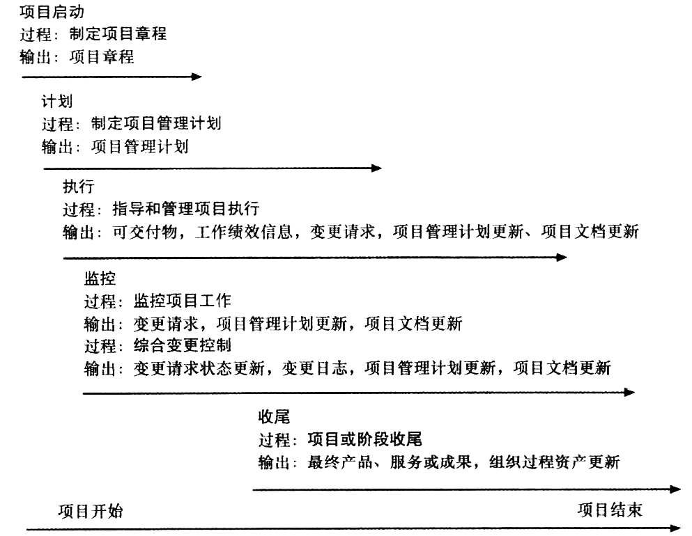

## 4.2 战略计划与项目选择

### 4.2.1 战略计划
战略计划（strategic planning）包括通过分析组织的优势和劣势，研究在商业环境中的机会和威胁，预测未来的趋势，以及预测对新产品和新服务的需求来确定长期目标。
战略计划为组织识别和选择有潜力的项目提供重要信息。

SWOT分析：分析优势（strengths）、劣势（weaknesses）、机会（opportunities）和威胁（threats），这些都可以通过思维导图来执行。

优势：
1. 擅长什么？
2. 组织有什么新技术？
3. 能做什么别人做不到的？
4. 和别人有什么不同的？
5. 顾客为什么亲？
6. 最近因何成功？

劣势：
1. 什么做不来？
2. 缺乏什么技术？
3. 别人有什么比我们好？
4. 不能够满足何种顾客？
5. 最近因何失败？

机会：
1. 市场中有什么适合我们的机会？
2. 可以学什么技术？
3. 可以提供什么新的技术/服务？
4. 可以吸引什么新的顾客？
5. 怎样可以与众不同？
6. 组织在5-10年内的发展？

威胁：
1. 市场最近有什么改变？
2. 竞争者最近在做什么？
3. 是否赶不上顾客需求的改变？
4. 政治环境改变是否会伤害组织？
5. 是否有什么事可能会威胁到组织的生存？

一个由4人组成的团队，准备在电影业开始一项新的业务。他们采用SWOT分析帮助识别有潜力的项目，分析结果如下：
- 优势：
  - 作为有经验的从业者，我们在电影行业有着广泛的人脉。
  - 团队中有两人擅长销售及人际交往。
  - 团队中有两人擅长技术且熟悉一些电影制作的软件工具。
  - 我们成功完成了一些令人印象深刻的项目。
- 劣势：
  - 我们没有会计/财务经验。
  - 我们对产品和服务没有清晰的营销战略。
  - 我们在新项目上缺乏资金。
  - 我们没有公司网站，而且缺少运营方面的技术应用。
- 机会：
  - 目前有一位客户提到一个大型项目，希望我们竞标。
  - 电影业持续发展。
  - 今年有两个重大会议，可以借此推广我们的公司。
- 威胁：
  - 其他个人或公司也可提供同类的服务。
  - 客户可能倾向于和从业时间更长的个人或组织合作。
  - 电影业存在高风险。

通过SWOT分析，4名创业者列出具有潜力的项目如下：
- 请一位外部会计师或者公司协助业务运转。
- 雇用人员开发公司网站，集中展示我们的经验及曾做过的项目。
- 制定营销计划。
- 制定一个有力的方案，从而获得前面提到的大型项目。
- 为今年的两个重大会议制定公司推广计划。

思维导图（mind mapping）是一种结构分解的技术，通过一种核心理念发散出来的方式将想法和概念结构化。
人的大脑不是以线条的方式工作的，很多观点或概念之间通常没有关联性。

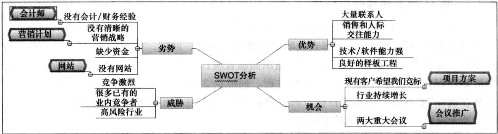

### 4.2.2 识别潜在项目
选择IT项目的计划过程的4个阶段。
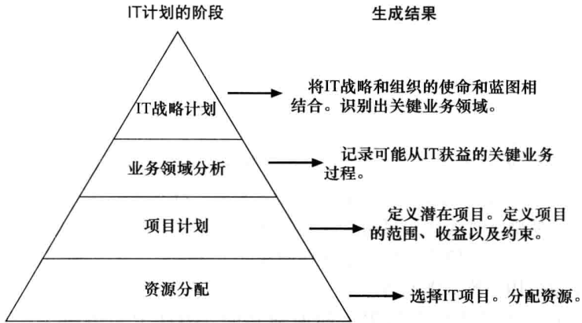

### 4.2.3 将IT与业务战略相结合
组织必须创建一种使用IT技术的战略，以确定IT技术如何支持组织的目标。
信息系统通常是公司战略的核心。
- 作为一个低成本的生产商。
- 提供专门的产品或服务，无论距离远近。
- 在网上提供服务。

### 4.2.4 选择项目的方法

#### 1. 聚焦于广泛的组织需求
通常很难为许多IT项目提供强有力的理由，但每个人都同意它们具有很高的价值。

项目的三个重要标准：需求、资金和意愿。

#### 2. 将IT项目分类
- 问题（problems）
- 机遇（opportunities）
- 指示（directives）

其他一些分类
- 时间
- 优先级

#### 3. 净现值分析
净现值（NPV）分析就是一种计算预期净货币收益或损失的方法，该计算方法将当前时间点之后的所有未来预期现金流入和流出都作折现计算。
$NPV = \sum_{t=0,1,...,n} A_t / (1+t)^t$
如果财务价值是项目选择的关键评判标准，那么组织机构就应该只考虑那些NPV值为正的项目。
在其他因素都一样的情况下，具有较高NPV值的项目比具有较低NPV值的项目更理想。

净现值算例
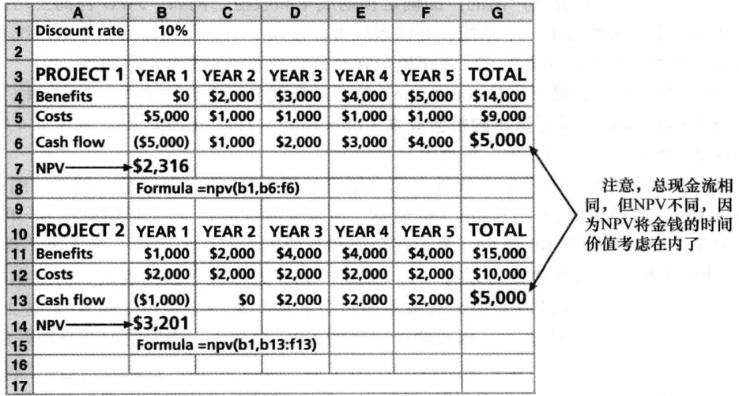

计算步骤：
1. 为项目生命周期和其产出的产品确定预期成本和收益。
2. 确定折现率。折现率（discount rate）是将未来现金流折现的比率。它也被称为资本率（capitalization rate）或者资本的机会成本（opportunity cost of capital）。
3. 计算NPV。

#### 4. 投资回报率
投资回报率（ROI）是项目的收益减去成本并除以成本的结果，越大越好。
计算方式：$ROI=(折现收益总额-折现成本总额)/折现成本$
要求回报率（required rate of return）是每项投资中要求要达到的最低回报率。

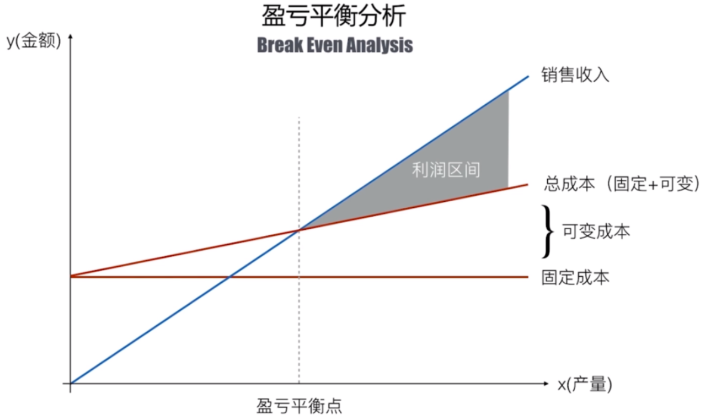

#### 5. 投资回收期分析
投资回收期（payback period）是指以净现金流的形式补偿项目总的投资所需要的时间。
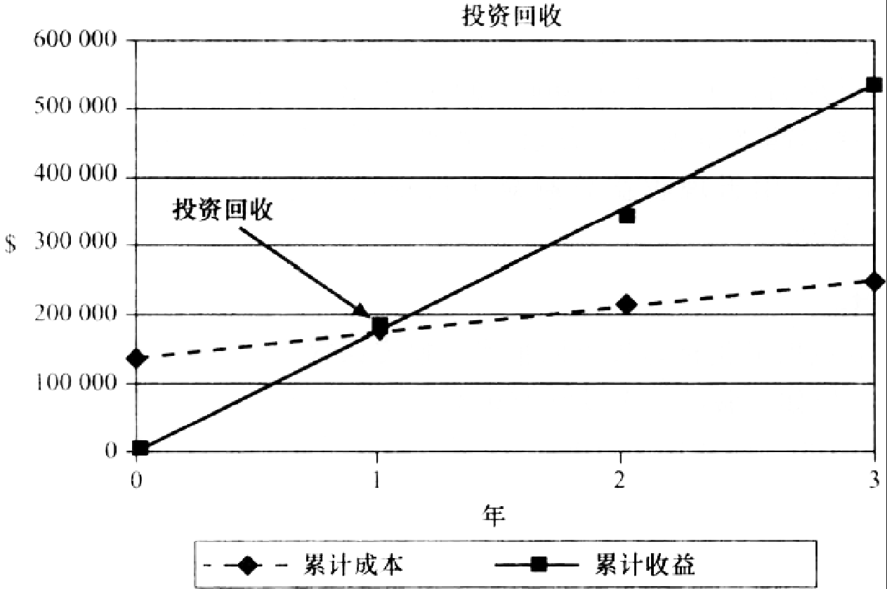

#### 6. 使用加权评分模型
加权评分模型（weighted scoring model）是一种基于多种标准进行项目选择的系统方法。
$最终得分 = \sum_{i=1,2,...,n} a_i * C_i$

对IT项目而言，其可选用的准则包括：
- 支持核心的业务目标
- 有极具实力的内部发起人
- 有很强的客户支持
- 运用符合实际的技术
- 可以在1年或更短的时间内得以实施
- 提供正的净现值
- 在低风险水平下满足范围、时间和成本目标

构建加权评分模型的步骤包括：
- 根据每个准则的重要性赋以权重，所有准则的权重总和必须等于100%。
- 对每个项目的每一个准则进行评分（例如，0～100）。
- 分别将每个准则的权重乘以各个准则的得分，然后相加得到每个项目的加权得分。

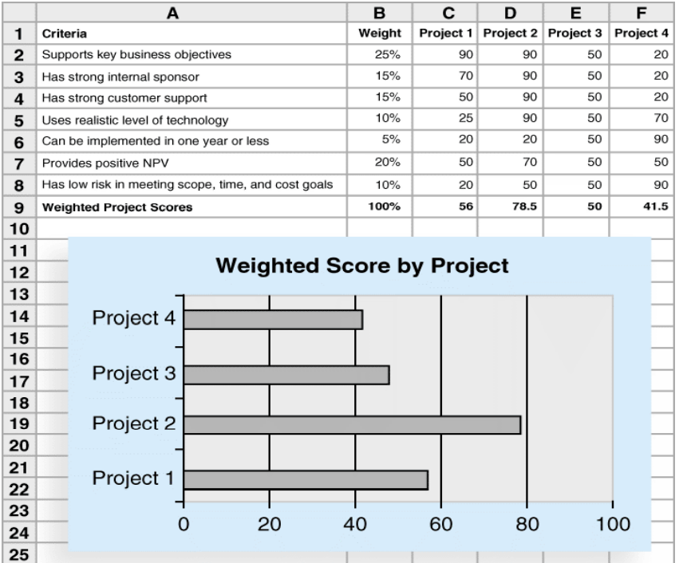

#### 7. 实施平衡记分卡
平衡记分卡（balanced scorecard）是一种方法论，将组织的价值驱动因素（例如，客户服务、创新、执行效率以及财务指标等）转换为一组定义好的衡量维度。
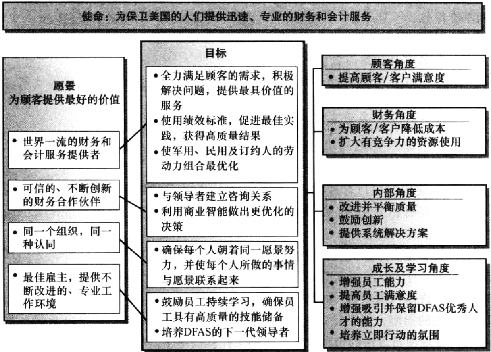

### 4.2.5 制定项目章程
项目章程（project charter）是用来正式确认项目存在并明确项目目标和项目管理的一种文件。
- 一些组织不使用项目章程，而使用简单的协议函来启动项目，而另一些组织则使用非常长的文件或正式合同的形式启动项目。
- 主要干系人需在项目章程上签字，以表示承认在项目需求和目的上已达成一致。启动过程的主要输出是项目章程。

下列输入有助于指定项目章程：
- 项目工作说明书
- 商业论证
- 合同
- 企业环境因素
- 组织过程资产信息：组织过程资产（organizational process assets）包括正式和非正式的计划、策略、程序、指南、信息系统、财务系统、管理系统、经验教训、历史信息等影响项目成功与否的一切内容。

**组织过程资产和事业环境因素的区别**
| 组织过程资产                                                                                           | 事业环境因素                                                                             |
| ------------------------------------------------------------------------------------------------------ | ---------------------------------------------------------------------------------------- |
| 组织过程资产是项目组可选择的、可裁剪的                                                                 | 事业环境因素是不可选择的、只能适应的、不可裁剪的                                         |
| 带程序的项目产出一般为组织过程资产，如变更控制程序、财务控制程序、问题与缺陷管理程序、风险控制程序等。 | 带系统的要素一般为事业环境因素，如项目管理信息系统、配置管理系统、信息收集与发布系统等。 |
| 组织过程资产是历史经验信息，对项目管理起到“帮助”作用                                                   | 事业环境因素都是可观存在的，对项目管理起到“限制”作用                                     |

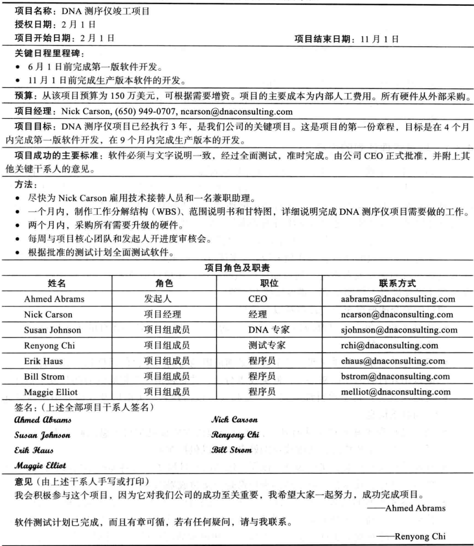

章程的格式可能会根据项目的类型、规模和复杂性以及其他一些因素而有很大的差异。
- 项目名称和授权日期。
- 项目经理姓名和联络信息。
- 总的进度，包括计划开始日期和完成日期；如果可以进行总体里程碑计划，也应该包括或参考总体里程碑计划。
- 项目概要预算或预算文档的参考信息。
- 项目目标的简要说明，包括批准项目的商业需求或者其他证明。
- 项目的成功标准，包括项目审批要求及项目签署人。
- 简述计划使用的项目管理方法，其应该描述干系人的需要和期望、重要的假设、限制条件，还有相关文件，例如沟通管理计划。
- 角色和职责矩阵图。
- 签名部分，主要干系人在此签名。
- 评述部分，干系人在此可以记录与项目有关的一些重要评述。

困难的是让人们具有正确的知识和根据来撰写项目章程并签字。

## 4.3 创建项目管理计划
项目管理计划(project management plan）是用于协调所有项目计划文档，并帮助指导项目的执行和控制的一种文件。
- 在其他知识领域所创建的计划可以被认为是整个项目管理计划的补充部分。
- 记录规划的假设、决定、沟通、内容/程度/关键管理审查的时间。
- 为进度衡量和项目控制提供基准。

作用：
1. 指导项目的执行；
2. 帮助管理者管理和控制团队；
3. 为绩效评估和衡量提供一个基准；
4. 作为利益相关者之间沟通的平台。

- 输入：项目章程、计划过程的输出、企业环境因素及组织过程资产信息。
- 工具和技术：专家评审
- 输出：项目管理计划

### 4.3.1 项目管理计划的内容
项目管理计划是：
- 独特、动态、灵活、可改变。
- 适合具体项目的需要。
- 根据每个项目的需要而细化。

项目管理计划包括：
- 项目的简介或者概况
- 项目如何组织的描述
- 在项目中所采用的管理和技术过程
- 描述将要进行工作的章节、进度安排和预算。

### 4.3.2 根据指南来创建项目管理计划
软件项目管理计划（SPMP）纲要示例项目 —— 管理计划部分
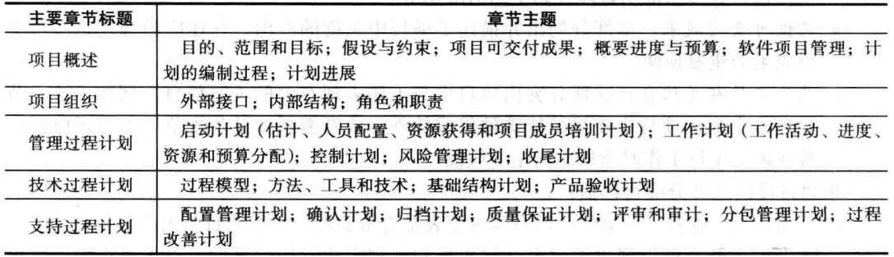

## 4.4 指导和管理项目实施
指导和管理项目实施的主要内容是管理和实施在项目管理计划中确定的工作，还包括批准的变更请求、企业环境因素以及组织过程资产。
项目的大多数时间通常都花费在执行阶段，正如项目主要预算也是在这个阶段。
因为项目产品主要都是在项目执行阶段生产出来的，所以项目的应用领域直接影响了项目的执行。

- 输入：项目管理计划、经批准的变更请求、企业环境因素、组织流程资产。
- 工具：专家判断、会议、项目管理信息系统。
- 输出：可交付成果、工作绩效数据、变更请求、项目管理计划更新、项目文件的更新。

### 4.4.1 协调计划和执行
- 项目计划和实施是两个交叉的密不可分的活动。
- 愿意做这项工作的人应该帮助计划这项工作。
- 项目经理必须征求团队的意见，以制定现实的计划。

### 4.4.2 提供强大领导力和支持性文化
- 项目经理必须以身作则，证明制定并遵循良好的项目计划的重要性。
- 出色的项目执行还需要支持性的组织文化
  - 提供指导方针和模板
  - 根据计划跟踪绩效
- 项目经理可能仍然需要打破常规来实现项目目标，而高级管理人员必须支持这些行动。

### 4.4.3 利用产品、业务和应用领域知识
IT项目经理有一些先前的技术经验或至少有一些IT产品的工作知识通常是有帮助的。
- 小型项目，项目经理需要完成一些技术工作或者指导项目成员去完成项目。
- 大型项目，项目经理必须了解项目的业务和应用领域。

### 4.4.4 项目执行工具和技术
- 专家评审法：专家可以帮助项目经理及其团队做出与项目执行相关的许多决策。
- 会议：会议可以让人们发展关系，学会重要的肢体语言或语调，并进行对话来帮助解决问题。
- 项目管理信息系统：目前市场上有数百种项目管理软件产品，许多组织正在转向可通过互联网访问的强大企业项目管理系统。

## 4.5 监控项目工作
监测项目的工作包括收集、衡量与发布绩效信息。监测项目工作还涉及评估度量与分析趋势以确定可以做出怎样的过程优化。
进度表和成本预算、变更确认以及工作绩效信息提供关于项目执行情况的信息。
变更请求包括推荐的纠正措施、预防措施和缺陷补救措施。

- 输入：项目管理计划、进度和成本预测、经验证的变更、工作绩效信息、企业环境因素、组织过程资产。
- 输出：变更请求、工作绩效报告。

## 4.6 执行综合变更控制
综合变更控制（integrated change control）涉及在项目的全生命周期中识别、评估及管理变更。

- 输入：项目管理计划、工作业绩信息、变更请求、企业环境因素、组织流程资产
- 工具：CCB；配置管理；沟通
- 输出：经批准的变更请求、变更日志、项目文件更新

三个主要目标：
- 影响那些产生变更的因素以确保变更都是有利的；
- 确定一个变更已经出现过；
- 及时地管理真正的变更。

如何识别项目变更？项目管理计划为识别和控制项目变更提供了基线。
- 基线（baseline）：批准的项目管理计划加上批准的变更。

### 4.6.1 IT项目中的变更控制
所有的项目都会有一些变更，管理它们是项目管理中的关键问题，特别是对IT项目。
建立一个严格的变更控制系统对于项目来说是非常重要的。

### 4.6.2 变更控制系统
一个变更控制系统（change control system）是一个正式的、文档化的过程，描述了正式文档何时以及如何可以被变更。
它还描述了哪些人被授权去进行变更、变更所需的书面工作以及项目将要使用的自动或手工跟踪系统。
一个变更控制系统通常包括一个变更控制委员会（CCB）、配置管理以及一个用于沟通变更的流程。

**变更控制委员会**
- 一个变更控制委员会（change control board，CCB）是负责批准或否决项目变更的正式团体。
- 变更控制委员会的主要职责是为准备变更请求提供指南、评价变更请求以及管理和实施核准的变更。
- 包括整个组织的关键干系人。

**配置管理**
- 配置管理（configuration management）确保关于项目产品的描述是正确且完整的。
- 它涉及识别并控制产品特性中的功能和物理设计以及相关的支持文档。
- 他们的职责是识别项目产品的功能和物理特性并作文档记录、控制关于这些特性的任何变更、记录并报告这些变更、对产品进行审计以确保它与需求相一致。

**沟通**
...

> 一个变更失控的项目案例
> 王先生刚出任项目经理，并承接了一个中型软件项目。上任时公司高层再三叮咛他一定要尊重客户，充分满足客户需求。项目开始比较顺利，但进入到后期，客户频繁的需求变更带来很多额外工作。
> 王先生动员大家加班，保持了项目的正常进度，客户相当满意。但需求变更却越来越多。为了节省时间，客户的业务人员不再向王先生申请变更，而是直接找程序员商量。程序员疲于应付，往往直接改程序而不做任何记录，很多相关文档也忘记修改。很快王先生就发现：需求、设计和代码无法保持一致，甚至没有人能说清楚现在系统“到底改成什么样了”。
> 版本管理也出现了混乱，很多人违反配置管理规定，直接在测试环境中修改和编译程序。但在进度压力下，他也只能佯装不知此事。但因频繁出现“改好的错误又重新出现”的问题，客户已经明确表示“失去了耐心”。
> 而这还只是噩梦的开始。一个程序员未经许可擅自修改了核心模块，造成系统运行异常缓慢，大量应用程序超时退出。虽然最终花费了整整3天的时间解决了这个问题，但客户却投诉了，表示“无法容忍这种低下的项目管理水平”。更糟糕的是，因为担心系统中还隐含着其他类似的错误，客户高层对项目的质量也疑虑重重。
> 随后发生的事情让王先生更加为难：客户的两个负责人对界面风格的看法不一致，并为此发生了激烈争执。王先生知道如果发表意见可能会得罪其中一方，于是保持了沉默。最终客户决定调整所有界面，王先生只好立刻动员大家抓紧时间修改。可后来当听说因修改界面而造成了项目一周的延误后，客户方原来发生争执的两人这次却非常一致，同时气愤地质问王先生：“为什么你不早点告诉我们要延期!早知这样才不会让你改呢!”王先生委屈极了，疑惑自己到底错在哪里了。

1. 没有明确的授权。事先应该明确客户方有权提出变更申请的人员和实施方有权受理变更的人员，并要控制双方人数。
2. 对变更没有进行必要的审核。并不是所有的变更都要修改，也不是所有变更都要立刻修改，审核的目的就是为了决定是否需要修改和什么时候修改。
3. 对变更的影响没有评估。变更都是有代价的，应该评估一下变更的代价和对项目的影响，要让客户了解变更的后果，并与客户一起做判断。
4. 应该让客户确认是否接受变更的代价。在评估代价并且与客户讨论的过程中，可以请客户一起做判断：“我可以修改，但您能接受后果吗?”。

要特别注意的是：要在项目开始就对项目组和客户进行宣传和培训，让所有成员都理解变更控制的重要意义；在项目过程中要对变更控制的执行情况进行审计，发现违反规定的事件要严肃处理，否则过程很快就会失效。
实施变更之前有四个重要控制点：
授权、审核、评估和确认；
在实施过程中要进行跟踪和验证，确保变更被正确执行。

信息技术项目变更控制
- 以前的观点：项目组应该努力在预算范围内按时完成计划中的工作。
- 问题：利益相关者很少事先就项目范围达成一致，而且时间和成本估计也不准确。
- 现代观点：项目管理是一个不断沟通和协商的过程。
- 解决方案：变化往往是有益的，项目组应该为其制定计划。

## 4.7 项目或阶段收尾
项目综合管理的最后过程是项目或阶段收尾，这需要你必须将所有活动终止，并将已完成或取消的工作移交给适当的人员。
- 输入：项目管理计划、已接收的交付物以及组织过程资产。
- 工具和技术：专家评审。
- 输出：最终产品、服务或成果转移；组织过程资产更新。

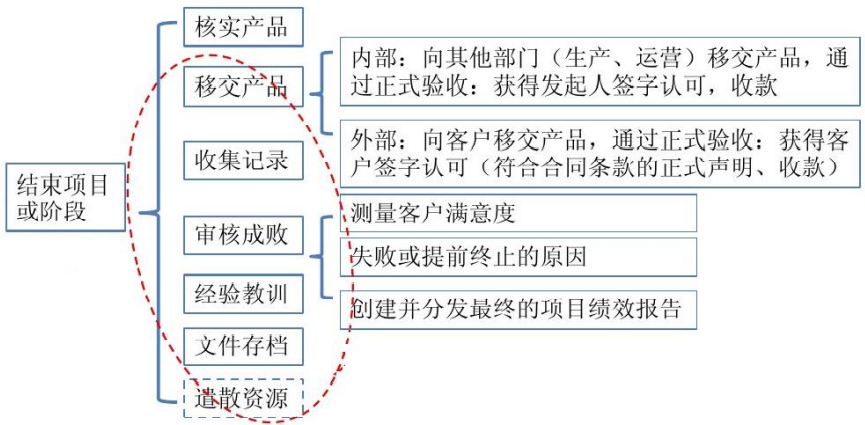

## 4.8 使用软件辅助项目综合管理
项目团队可以使用各种软件辅助项目综合管理。
- 利用字处理软件生成文档
- 利用演示软件进行展示
- 利用电子制表软件、数据库或定制软件跟踪信息
- 使用各种通信软件传送信息。

项目管理软件还是开发和综合项目计划文档、实施项目管理计划和相关项目计划、监控项目活动以及执行综合变更控制的重要工具。

项目组合管理软件示例截屏
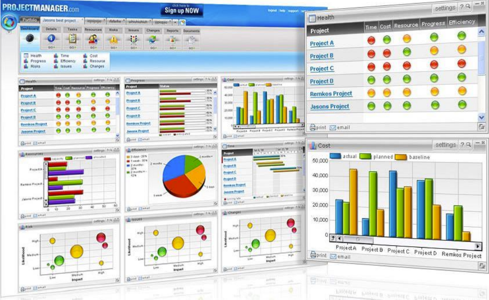

业务服务管理（business service management，BSM）工具可以追踪业务流程的执行，有助于将项目与企业战略相匹配。

## 4.9 本章小结
项目整合管理在整个项目的生命周期中协调所有其他的知识领域。
项目综合管理包括下述过程：
- 制订项目章程。
- 编写项目管理计划涉及协调各方面的计划工作。
- 指导和管理项目执行涉及实施项目计划中包含的各项活动。
- 监控项目工作以满足项目的执行目标。
- 综合变更控制指在项目生命周期中，识别、评估和管理变更。
- 项目或阶段收尾涉及把所有的项目活动都完成。
