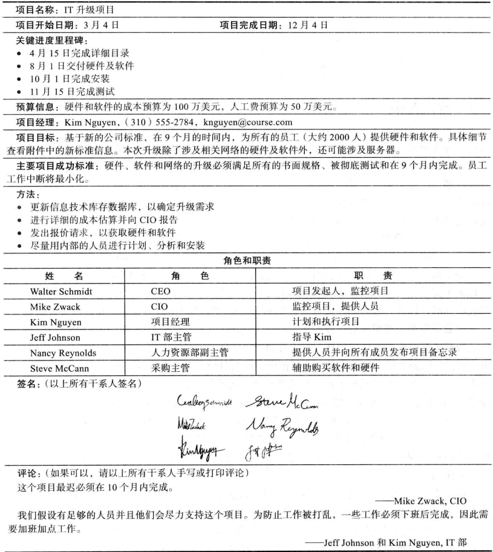
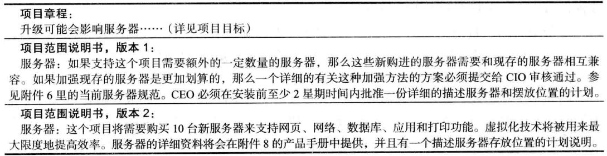

## 1.0 学习目标
- 理解好的项目范围管理的重要性。
- 描述范围管理计划过程。
- 讨论需求收集和记录的方法，以满足项目干系人的需求和期望。
- 解释范围定义的过程，描述项目范围说明书的内容。
- 讨论使用类比、自上而下、自下而上和思维导图法构建一个工作分解结构（WBS）的过程。
- 解释范围验证的重要性，及其与范围定义和范围控制的相互关系。
- 理解范围控制的重要性，了解防止IT项目中出现与范围相关问题的方法。
- 描述软件在项目范围管理中如何起到辅助作用。

> 开篇案例
> Kim Nguyen正在召开一个项目组首次会议，讨论她所负责的IT升级项目的工作分解结构。
> 公司正在优先开发几个因特网应用软件，这个IT升级项目要编制并实施一个计划，让公司所有员工的IT设备在9个月内达到新的公司标准。
> 该新标准规定每个台式机或笔记本电脑的最低配置要求，包括处理器型号、内存大小、硬盘容量、网络接口类型以及安装的软件等。
> Kim知道要进行升级，他们必须首先为公司2000多名员工列出一个所有现有硬件、网络和软件的清单。
> Kim和其他干系人一块制定了项目章程和初步的范围说明书。项目章程包括项目的粗略成本和进度估算，以及关键干系人的签字；初步的范围说明书对项目范围相关的软件、硬件和网络需求以及其他信息提供了初始的界定。
> Kim召集项目团队人员和其他干系人开会是为了进一步对项目范围进行界定。项目会涉及哪些工作？由谁做？如何才能避免可能的范围蔓延？她想通过这次会议征集大家对这些问题的看法。
> 公司首席执行官Walter Schmidt擅长于这一类大型项目管理，他使用一种新的项目管理系统使每个人对项目的状态和进度进行全面和细致的了解。
> Kim知道好的WBS是范围、时间、和成本绩效的基础，但她并不清楚怎样着手建立WBS或分配成本。她该怎么做呢？

## 5.1 什么是项目范围管理
范围（scope）是指开发项目产品所涉及的所有工作和用来开展工作的所有过程。
- 产品范围：产品或服务中包含的特性或功能。
- 项目范围：创建项目产品所涉及的工作以及用于创建这些产品的过程。

项目范围管理（project scope management）是指对项目包括什么与不包括什么的界定和控制的过程。
它确保项目团队和干系人在项目开发什么产品以及开发产品使用什么过程这两方面达成共识。
有效的范围管理可以保证项⽬只做必须做的事情，避免范围蔓延和做⽆⽤功，同时也避免不清晰的需求所导致的严重的系统缺陷。

项目范围管理涉及的6个主要过程是：
1. 制定范围管理计划是指确定项目的范围和需求如何管理。
2. 收集需求（collecting requirement）是指定义并记录项目最终产品的特点和功能，以及创造这些产品的过程。
3. 定义范围（scope definition）是指评审范围管理计划、项目章程、需求文档和组织过程资产来创建一份范围说明书。
4. 创建工作分解结构（creating the WBS）是指将主要的项目可交付成果分解成更细小和更易管理的部分。
5. 验证范围（validation scope）是指项目可交付成果的正式接受。
6. 控制范围（controlling scope）是指对整个项目生命周期内的范围变化进行控制。

## 5.2 范围管理计划
- 输入：项目管理计划、项目章程、企业环境因素、组织流程资产
- 工具：专家判断、会议
- 输出：范围管理计划、需求管理计划

注：
- 范围管理计划是项目管理计划的一个附属部分。
- 根据项目的需要，它可以是非正式的和广泛的，也可以是正式的和详细的。

一个范围管理计划包括：
- 如何准备一个详细的范围说明书
- 如何创建一个WBS
- 如何维护和批准WBS
- 如何获得正式验收已完成的项目可交付成果
- 如何控制项目范围变更的请求

需求（IEEE定义）：
1. 用户解决问题或者达到目标所需要的一种条件或能力。
2. 一个系统或系统组件为了满足合同、标准、规范或者其他正式提出的文档，必须满足或具备的条件或能力。
3. 上述条件或能力的一份文档说明。

需求管理计划记录了如何分析、记录和管理项目需求。
需求管理计划包括以下信息：
- 如何计划、追踪和报告需求活动
- 如何执行配置管理活动
- 如何对需求进行优先次序排序
- 如何使用产品指标
- 如何跟踪和捕获需求的属性

## 5.3 收集需求
弥补软件的需求缺陷的相关成本

收集需求的方法：
- 头脑风暴
- 干系人访谈
- 焦点小组会议、引导式研讨会
- 群体创新和决策技术
- 问卷和调查
- 观察法
- 原型法和文档分析法
- 基准比较法

需求文档：
- SMART：Specific、Measurable、Achievable、Relevant、Time table
- 包括：业务、干系人、解决方案、过渡和准备、项目、质量

需求说明书：
1. 描述当前局面的不足以及项目启动的原因
2. 可跟踪的业务目标和项目目标
3. 功能要求（需求清单或模型）
4. 非功能要求（如服务水平、绩效、安全、合规等）
5. 质量要求
6. 验收标准
7. 体现组织指导原则和业务规则
8. 对组织其他领域的影响
9. 对执行组织内部或外部团体的影响
10. 对支持和培训的需求
11. 对需求有关的假设条和制约因素

2011年的一项研究揭示了一些有趣的数据：
- 88%的软件项目是增强现有的产品而不是创建一个新产品。
- 86%的受访者表示，客户满意度是衡量项目开发成功的最重要的指标。
- 83%的软件开发团队仍在使用微软办公应用，如用Word和Excel作为沟通需求的主要工具。

记录需求的步骤：
1. 阅读项目章程，参考项目范围和需求管理计划。
2. 查阅干系人记录与干系人管理计划。

需求文档通常由软件生成，可以是文档、图像、程序、录像和其他媒介。

需求跟踪矩阵（Requirements Traceability Matrix，RTM）是列出各种需求、需求属性和需求状态的一种表格，以确保所有需求被跟踪。
需求跟踪矩阵的主要目的是通过对需求的分解、执行和验证来保持每个需求源的联系。

## 5.4 定义范围
合理的范围定义对项目的成功非常重要：
- 项目定义有助于提高时间、成本及资源估计的精确度，
- 定义绩效测量及项目控制的基线，
- 帮助理清和明确工作职责。

- 输入：项目章程、范围管理计划、需求文档、组织过程资产、项目文件以及以前做过的类似项目的经验教训。
- 工具：专家判断、产品分析、可供选择的工作方法识别和引导式研讨会。
- 输出：项目范围说明书和项目文档更新。

范围声明是一份描述所有项目利益相关者对项目范围的共识的文件。
- 它是未来项目或项目阶段接受决定的基础。
- 它是识别和确定项目范围变化的主要依据。

项目范围说明书包括：
- 产品范围描述
- 用户可接受的产品指标（验收标准）
- 所有可交付成果的详细信息
- 项目界限
- 项目的限制条件
- 假设条件

项目章程示例

进一步定义项目范围

## 5.5 创建工作分解结构
工作分解结构（WBS）是对项目所涉及工作面向交付成果的分组，它定义了项目的全部范围。
WBS是项目管理中的基础文档，提供了计划和管理项日进度、成本、资源和变更的基础。

主要的工具或技术是分解，也就是说，把项目可交付成果划分为更小的部分。
创建WBS过程的输出是范围基线和项目文档更新。
基线范围包括批准的项目范围说明书和与之相关的WBS以及WBS字典。

一个工作包（work package）即为WBS最底层的一项任务。

工作分解的主要方式：
- 根据项目的产品组成
- 根据项目实施阶段
- 根据项目的组织结构

按产品组织的内部局域网WBS示例

按阶段组织的内部局域网WBS示例

使用Microsoft Project制作的局域网甘特图

创建一个良好的WBS是非常困难的。
创建一个良好的WBS，你必须首先理解这个项目以及项目的范围和干系人的需求和知识。
项目经理和项目团队必须组成一个整体来决定如何组织工作和WBS中包含了多少层级。
做这项工作的人应该通过创建WBS有助于计划整个工作。

在创建WBS时，应注意分解的活动至少应满足四个要求。
1. 分解的工作对于完成上层相应的交付物是必要的和充分的。
2. 工作的独立性。也就是说，一旦工作开始，就可以不间断地完成。
3. 对工作完成情况的判断。即可以清楚地判断工作是否已经开始，完成了多少工作，以及工作是否已经完成。
4. 工作的交付成果。即明确工作完成后将获得哪些成果。

### 5.5.1 制定工作分解结构的方法
制定工作分解结构（WBS）的方法包括：使用指南、类比法、自上而下和自下而上的方法、思维导图法。
> 结合多种方法是最好的方法。

1. 使用指南
   - 一些组织，例如美国国防部（DOD）为特定项目定制了WBS的格式和内容。
   
2. 类比法
   - 使用一个相似项目的WBS作为出发点。
   
3. 自上而下和自下而上的方法
   
   - 自上而下法（top-down approach）：从项目最大的条目开始，将它们分解为次一级的条目。这个过程实际上就是对于工作的进一步细分。
   - 自下而上法（bottom-up approach）：首先识别尽可能多的与项目有关的具体任务。随后，将这些具体的任务集中并组织成概要任务或WBS中的较高层次。
4. 思维导图法
   - 一种从核心思想向外辐射出分支的技术，将思想和想法结构化。
   - 

从思维导图生成的带WBS的甘特图

### 5.5.2 WBS字典
许多WBS任务是模糊的，必须多加解释，以便人们知道要做什么，并能估计出做这项工作需要多长时间和花费多少钱。

WBS字典（WBS dictionary）是一个描述WBS每项条目详细信息的文件。

WBS字典条目示例

### 5.5.3 创建WBS和WBS字典的建议
- 每一个单元的工作应该在WBS中只能出现一次。
- 每一个WBS条目中的工作内容是该条目以下所有条目之和。
- 每一个WBS条目都只对应一个负责人，虽然很多人可能都在做这项工作。
- WBS和工作时间如何执行必须保持一致；首先要服务于项目团队，在实用性的前提下其次才考虑其他的目的。
- 项目团队成员应该全身心投人WBS的创建中去从而确保连贯性和大宗买进。
- 每一个WBS条目都必须记录在WBS字典中，确保精确理解条款包括或不包括的工作范围。
- WBS必须对于不可避免的变更能够柔性适应，同时要按照范围说明书的内容保持对于工作内容的控制。

## 5.6 确认范围
创建一个优秀的项目范围说明书和项目的WBS是很困难的，确认项目范围并最小化范围变化就更加困难。
范围蔓延（scope）：项目范围不断扩大的趋势。

范围检查（scope verification）是指整个项目可交付成果的正式验收。
这份验收通常通过客户检查实现，并在关键可交付成果上签字。

- 输入：项目范围管理计划、范围基线、需求文档、需求跟踪矩阵、验证的可交付成果以及工作绩效数据。
- 工具：检查以及群体决策技术。
- 输出：被接受的可交付成果、请求变更、工作绩效信息以及项目文档更新。

范围蔓延的原因 
- 模糊的或不完善的范围定义
- 缺乏任何正式的范围或需求管理
- 收集产品需求的过程是不一致的
- 缺乏利益相关者的参与
- 项目运行时间过长

控制范围蔓延的措施
- 实时跟踪项目进度、资源和绩效
- 提供多种视图，使项目可视化
- 团队可以共享所有与项目有关的信息
- 创建一个变更控制流程来审查和批准变更
- 可以访问强大的报告，以做出数据驱动的决策

## 5.7 控制范围
范围控制涉及对项目范围的变更管理，同时考虑到项目目标和业务策略。
范围控制的目标：
- 影响那些导致范围变更的因素
- 确保变更是按照综合变更控制中开发的过程来处理的
- 当变更出现的时候对其进行管理。

偏差（variance）是计划的与实际的效果之间的区别。

- 输人：项目管理计划、需求文档、需求跟踪矩阵、工作绩效数据以及组织过程资产。
- 工具：实施偏差分析。
- 输出：工作绩效信息、变更请求、项目管理计划更新、项目文档更新、组织过程资产更新。

最佳实践：避免出现主要的范围问题。
1. 范围要符合实际。不要使项目大到不能完成。可将大的项目分解为一系列小的项目。
2. 使用户参与项目范围管理。将关键用户安排到项目团队中并给予他们需求定义和范围确认的权利。
3. 如果可能，使用现有的硬件和软件。许多IT人士喜欢使用最新及功能最强大的技术，但是新技术通常会引入风险。
4. 遵守良好的项目管理过程。如本章及其他章节所述，管理项目范围及项目的其他方面都需要有很好地定义的过程。

### 5.7.1 对于改善用户输入的建议
- 为IT项目开发一个良好的项目选择过程。
- 让用户参与到项目团队中来。
- 按照指定的日程表召开例会。
- 经常向用户和项目发起人提交一些东西。
- 不要承诺在特定的时间框架内不能交付的物品。
- 定位用户和开发人员。

### 5.7.2 对于减少不完善和不断变化的需求的建议
- 制订并遵循需求管理过程，这个过程包括了初始的需求确定程序。
- 使用诸如原型开发、用例建模和联合应用设计等技术来彻底理解用户需求。
  - 原型开发（prototyping）：开发系统或者系统的某些方面的可运行的副本，以帮助定义用户需求。
  - 用例建模：一种对业务事件、启动者及系统响应方式进行识别与建模的过程。
  - 联合应用设计（JAD）：使用高度组织化和集中式的工作会议将项目干系人结合在一起来共同定义设计信息系统。
- 让所有的需求用书面文件体现出来，并保持它们实时更新并一直有效。
- 创建一个需求管理数据库用以管理文档和控制需求。
- 提供足够的测试来说明项目的产品都可以像预期的那样。
- 以系统化的视角采用一种流程来评审提交的请求变更。

## 5.8 使用软件辅助项目范围管理
- 文字处理软件有助于创建几个与范围有关的文件。
- 电子表格有助于进行财务计算，权衡评分模型，以及开发图表和图形。
- 通讯软件，如电子邮件和网络，有助于澄清和交流范围信息。
- 项目管理软件有助于创建一个WBS，这是甘特图上任务的基础。
- 有专门的软件可以协助项目范围管理。

一些有用的图表工具：
- 亿图图示
- Visio
- WBS Chart Pro
- Mind Master
- Free Mind
- Mind Mapper
- Mind Manager
- Processon.com

## 5.9 本章小结
项目范围管理包括用以确保项目解决了成功完成项目所需要的全部工作的过程。
主要的过程包括范围管理计划、需求收集范围界定、WBS创建、范围确认和范围控制。
