## 6.0 学习目标
- 理解项目进度和好的项目时间管理的重要性。
- 讨论计划进度管理的过程。
- 定义开发项目进度的基础活动。
- 描述项目经理是如何使用网络图和依赖来辅助活动排序的。
- 理解资源估算和项目进度之间的关系。
- 解释各种工具和技术是如何帮助项目经理进行活动工期估算。
- 使用甘特图来计划和跟踪进度信息，找到项目的关键路径，同时描述关键链调度和项目群评审技术是如何影响进度开发的。
- 讨论现实检查和纪律是如何用于项目进度的变更控制和管理的。
- 描述项目管理软件是如何帮助项目经理进行项目时间管理的，同时在使用软件之前审阅一下使用注意事项。

> 开篇案例
> Sue Johnson是一个咨询公司的项目经理，公司签订了一个合同，给当地一个学院提供新的在线注册系统。这个系统必须在5月1号之前投入运行，从而让学生能够在秋季学期注册时使用。如果系统不能按时完成，合同中有一个严格的惩罚条款。如果项目进展顺利而且满足进度，那么Sue和她的团队就会因为工作好而获得丰厚的奖金。Sue知道满足进度、范围、成本和质量要求是她的责任。她和她的团队设计了详细的进度表和网络图来管理项目。
> 计划项目的进度是较容易的，但是按计划执行项目就比较困难了。管理人员和解决进度冲突是两个大的挑战。客户的许多雇员休假没有计划，要重新安排项目评审会议。这些变化使得项目组很难遵循计划的系统进度，因为Sue必须让他们的客户在系统开发生命周期的各个阶段都签字。项目组的一个高级程序员辞职了，她知道要一个新人接手需要附加的时间来保持进度。虽然还处于项目的早期阶段，但是Sue知道项目已经落后了。那么她将怎么样来达到5月1日的上限时间呢？
> 现在是3月15日，再过一个半月新的在线注册系统就要启用了。但项目目前是一片混乱，苏认为她能处理好所有在项目进行过程中出现的冲突，不向其上司或大学校长承认事情进展得不顺利。她花了大量的时间来准备项目的进度计划，并且她认为自己的项目管理软件使用得很好，可以跟上项目的状态。事实上，项目中有5位主要的程序员都使自己的任务在软件上每周自动更新，并说一切按预定计划进行。他们很少注意实际的计划，而且憎恨填写状态信息。苏并没有核实他们所做的大部分工作，检查它们是不是真正的完成了。另外，注册办公室主任对项目不感兴趣，将管理权限责任授权给他的一个文员，而该文员对整个注册过程并不理解。当苏和她的团队开始测试新系统时，她才发现她的团队使用的是去年的课程数据。由于大学在秋季将从过去的学期制转向半学期制，使用去年的课程数据会导致一些问题。他们怎么能把这个需求漏掉呢？
> 当苏为了寻求帮助而和她的经理一起步入会议室时，她害羞地低垂着脑袋。她通过惨痛的教训知道了控制进度是多么的困难。为了核实关键可交付成果是否满足了客户的需求，苏希望她能多花一些时间与关键的项目干系人进行面对面的沟通，尤其是她这边的程序员与校方注册办公室的代表之间的沟通。

思考
1. 在项目进行过程中出现了哪些问题？
2. 出现这些问题的原因是什么？
3. 如何预防这些问题？需要采取哪些措施？

## 6.1 项目进度的重要性
- 时间很容易被度量和记住。
- 不管项目中发生了什么，时间总是在流逝。
- 通常人们在比较计划和实际的项目完成时间时，并不考虑项目中经过审批的变更。
- 个人的工作方式和文化差异也会造成进度上的冲突。
  - 一些人喜欢详细的进度，注重任务的完成。其他人喜欢保持事情的开放性和灵活性。
  - 假期，午休

项目时间管理（project time management），简单的定义就是确保项目按时完成所需的过程。
在项目的时间管理中，有7个主要的过程：
1. 计划进度管理
2. 定义活动
3. 排序活动
4. 估算活动资源
5. 估算活动工期
6. 指定进度计划
7. 控制进度

项目时间管理概述
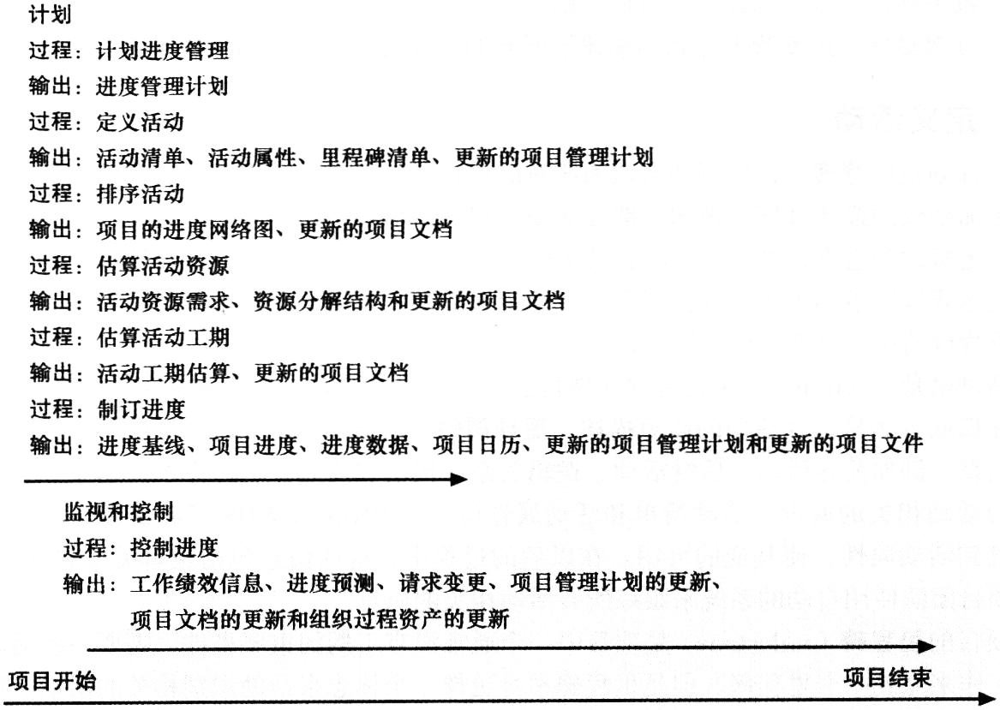

## 6.2 计划进度管理
- 输入：项目管理计划、项目章程、企业环境因素、组织过程资产
- 工具和技术：专家判断、分析技术、会议
- 输出：进度管理计划

进度管理计划，就像范围管理计划那样，基于项目的需求可以是非正式的和广泛的或正式的和详细的。

一般来说，一个进度管理计划包括以下信息：
- 项目进度模型的开发
- 在开发项目进度模型中使用的方法和工具
- 精度水平和计量单位
- 控制阈值
- 性能测量的规则
- 报告格式
- 过程描述

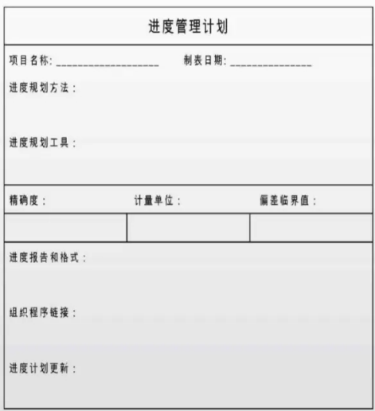

## 6.3 定义活动
定义活动是指识别特定的行动，它通过非常详细的确定资源和进度估算来产生项目的可交付成果。

- 输入：进度范围计划、范围基线、企业环境因素、组织过程资产
- 工具和技术：分解、滚动规则、会议
- 输出：活动列表、活动属性、里程碑清单、更新的项目管理计划

活动清单（activity list）是包含在项目进度中的活动列表。这个清单应该包括：
- 活动名称
- 活动标识或者编号
- 活动的简短描述

活动清单包括各项活动的标识和详细的工作范围，可以清晰地识别和细化。
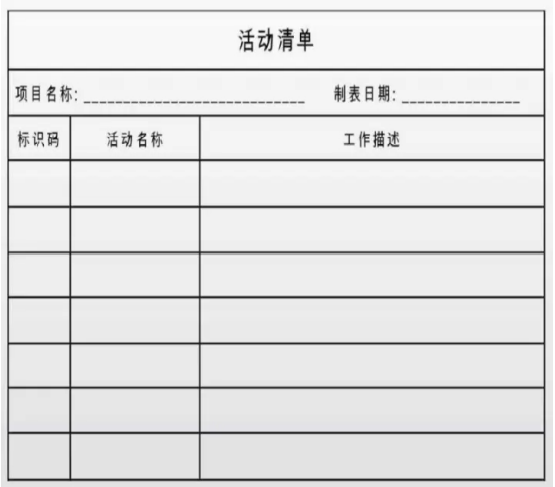

活动属性（activity attribute）提供了与进度相关的更多信息，例如前导活动、后继活动、逻辑关系、提前和滞后、资源需求、约束、强制日期以及与活动相关的假设。

里程碑（milestone）是项目中一个通常没有工期的重要事件。
- 帮助识别相关的活动
- 帮助设定进度目标和监控进展

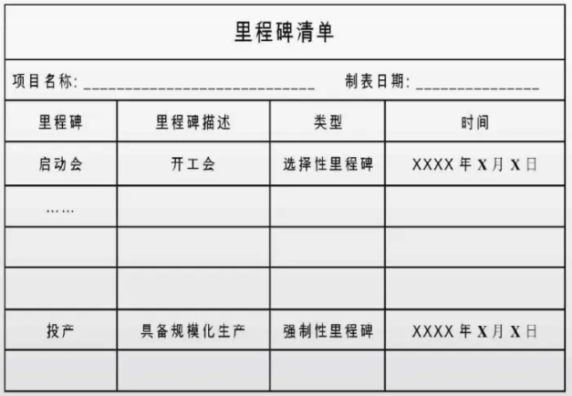

> 并不是每个为项目创建的可交付成果或输出都是真正的里程碑。

活动信息的重要性
- 其他时间管理流程的必要输入
- 三重约束（创建项目进度的基础）
  - 活动定义（范围）
  - 活动排序（时间）
  - 活动资源估算和活动工期估算（成本）

> 开展项目时间管理时，在转向下一个步骤之前，项目团队应当与项目干系人一起审核活动清单和活动属性。

## 6.4 排序活动
在对活动进行排序时，通常会考虑以下因素：
- 技术要求和规格
- 安全和效率
- 公司政策和偏好
- 资源可用性

活动排序方法
- 项目管理软件
- 手工技术
- 自动技术

排序活动
- 输入：进度管理计划、活动清单和属性、项目范围说明书、里程碑清单和组织过程资产。
- 工具和技术：识别和集成依赖项、紧密关系绘制-进度模型、领先和滞后、日程安排软件
- 输出：项目进度网络图

### 6.4.1 依赖
依赖（dependency）或关系（relationship）与项目活动或任务的排序相关。
- 强制依赖（mandatory dependencies）是项目工作中内在的一种关系。某些时候被称为硬逻辑。
- 自由依赖（discretionary dependencies）是由项目团队定义的项目活动之间的关系。自由依赖有时又称为软逻辑，应该谨慎使用，因为它们将可能限制以后的进度安排。
- 外部依赖（external dependencies）涉及项目和非项目活动之间的关系。

### 6.4.2 网络图
一个网络图（network diagram）是项目活动之间的逻辑关系或者顺序的示意性的表示。

两种主要格式：
- 双代号网络图（Activity-On-Arrow，AOA）
- 箭线图法（Arrow Diagramming Method，ADM）

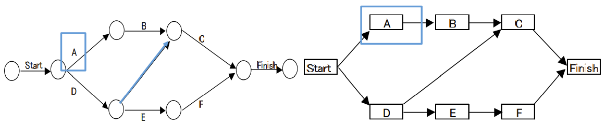
- 具有依赖关系的活动
- 活动顺序或关系

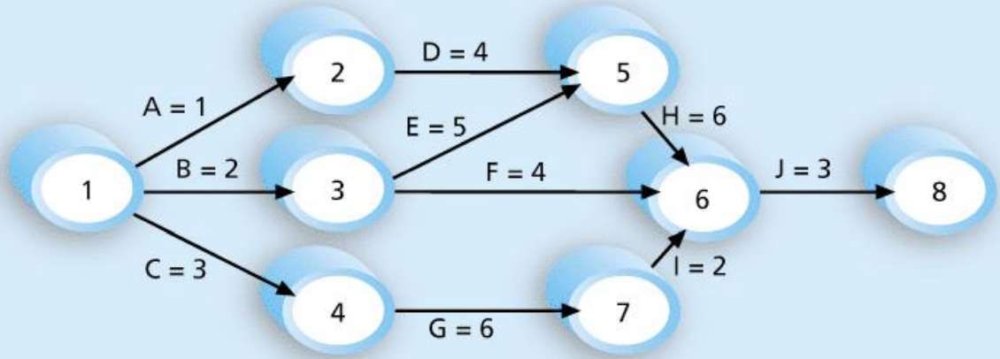
注：假定所有的工期都是以天为单位；A=1表示活动A的工期为1天。

- 网络图表示的是那些完成项目所必须执行的活动
- 并不是WBS上的每个项都出现在网络图上，只有与活动有关的依赖项需要显示。

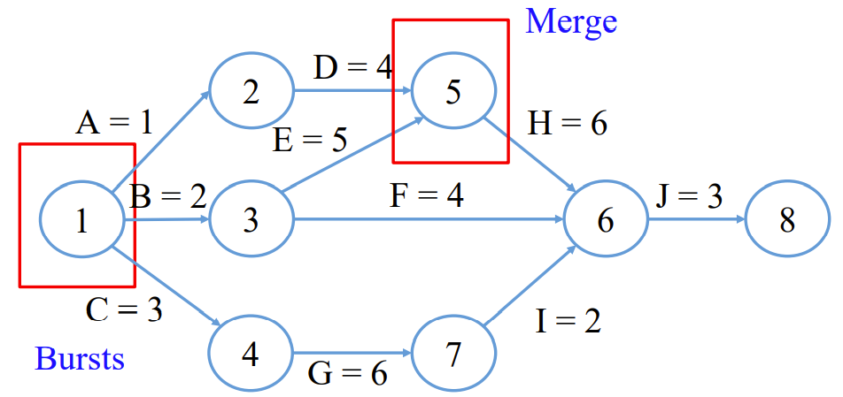
创建AOA网络图的步骤：
1. 找出从节点1开始的所有的活动。画出结束节点，然后把节点1和每个结束节点之间用箭线连接起来。把代表活动的字母或者名字放置到相关的箭线上。
2. 继续按照从左到右的顺序绘制网络图。注意分叉和合并。
   - 分叉（bust）发生在一个节点后面跟着两个或更多活动的情况。
   - 合并（merge）发生在两个或者多个节点领先于一个单独的节点。
3. 继续画AOA网络图直到所有的活动都被包含在图上。
4. 按照一般的习惯，所有的箭头都应该朝向右方，在AOA网络图上不能有交又。

前导图法（Precedence Diagramming Method，PDM）
- 活动用方框表示
- 箭线表示活动之间的关系
- 比ADM方法更流行并被项目管理软件所使用
- 更擅长显示不同类型的依赖关系

活动间的四种依赖或关系（图：任务相关性类型）
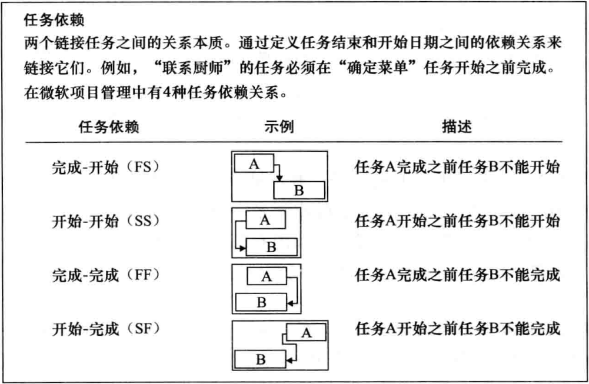

项目X的前导图方法（PDM）的网络图
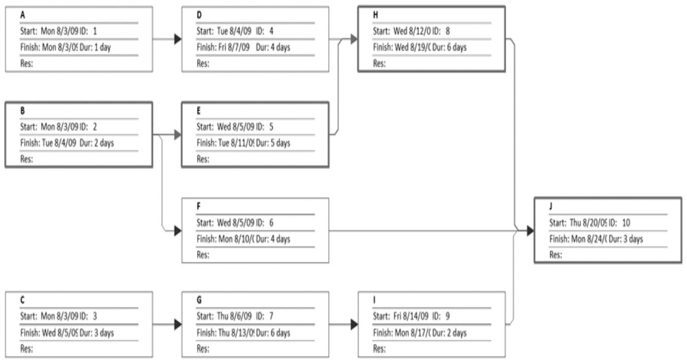

## 6.5 估算活动资源
在估算每个活动的工期之前，你必须清楚地知道分配给每个活动的资源（人、设备和材料）的数量和种类。

在活动资源估算过程中需要回答的重要问题包括：
- 在完成项目的特定活动时将有多困难？
- 组织做类似活动中的历史是什么？
- 所需资源是否可用？

估算活动资源
- 输入：项目进度管理计划、活动清单、活动属性、资源日历、风险登记、活动成本估算、企业环境因素、组织过程资产
- 工具和技术：专家判断、备选方案分析、估计数据、项目管理软件
- 输出：活动资源需求清单、资源分解结构、更新的项目文档

活动资源需求清单是指生产产品所需的所有资源，包括材料、人员、设备、能源和其他消耗品。
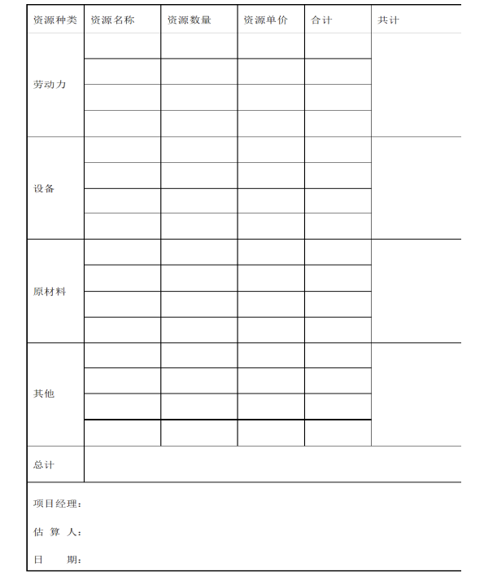

资源分解结构（resource breakdown structure）是一种可以按照种类和类型确定项目资源的层次结构。
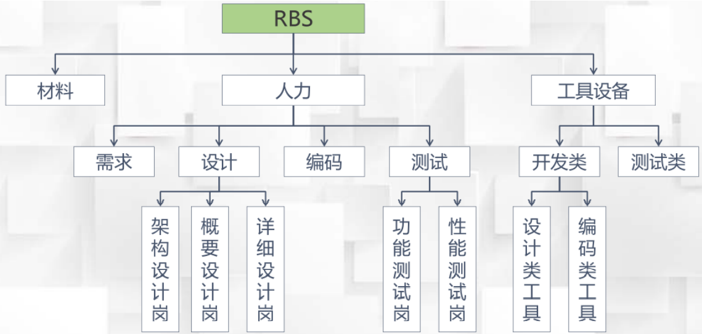

## 6.6 估算活动工期
工期（duration）包括活动上花费的实际时间和占用时间。
人工量（effort）是完成任务所需要的工作天数或者工作小时数。
- 工作通常不等于持续时间
- 从事工作的人应该帮助制定估计值，专家应该审查这些估计值

在进行活动持续时间估计时，最重要的考虑因素之一是资源的可用性。

- 输入：进度管理计划、活动清单和属性、活动资源需求、资源日历、项目范围说明书、风险登记、资源分解结构、企业环境因素、组织过程资产
- 工具和技术：专家判断、类比、参数估计、三点估计、自上而下估计
- 输出：活动工期的估算、项目文件的更新

工期估算通常提供为离散的数字，或者一个时间范围，或者一个三点估算。
三点估算（three-point estimate）包括乐观、最可能和悲观的估算。
三点估算法在执行PERT估算和执行蒙特卡罗模拟时需要。

## 6.7 制订进度
- 输入：以上所有项目时间管理流程
- 工具和技术：甘特图、关键路径分析、关键链调度、PERT分析
- 输出：项目进度表、进度基线、进度模型数据、项目日历、项目管理计划的更新、项目文档更新

| -    | Schedule management plan                                                                                                                                                                 | Project schedule                                                                                                                                                   |
| ---- | ---------------------------------------------------------------------------------------------------------------------------------------------------------------------------------------- | ------------------------------------------------------------------------------------------------------------------------------------------------------------------ |
| 概念 | 进度管理计划是项目管理计划的组成部分，为编制、监督和控制项目进度建立准则和明确活动。根据项目需要，进度管理计划可以是正式或者非正式的，非常详细或者高度概括的，其中应包含合适的控制临界值 | 项目进度计划是进度模型的输出，为各个相互关联的活动标注了计划日期、持续时间、里程碑和所需资源等信息。项目进度计划中至少要包括每个活动的计划开始日期与计划完成日期。 |
| 区别 | 包括：项目进度模型；使用的方法和工具；精度水平和计量单位；控制阈值;性能测量的规则;报告格式;程序描述                                                                                      | 包括：横道图、里程碑图、项目进度网络图                                                                                                                             |

- 制订进度使用前面所有项目时间管理过程的结果来决定项目的开始和结束日期和它的活动。
- 最终目标是创建一个可行的项目进度表，该进度从项目的时间维上提供监控项目进展的基础。

项目进度基线
- 监控项目
- 评审绩效
- 验证工作
- 评估变更

### 6.7.1 甘特图
甘特图（Gantt chart）提供了一套显示项目进度信息的标准格式，通过以日历的模式列出项目活动及其相应的起止日期。
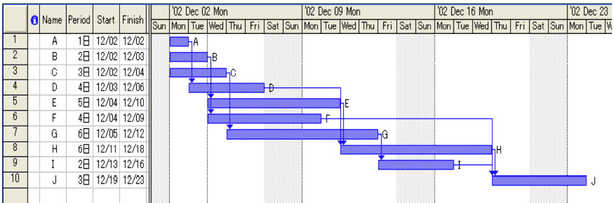
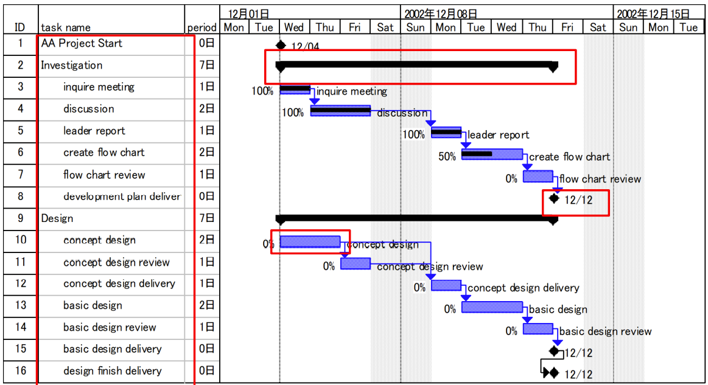

#### 1. 在甘特图上增加里程碑
- 许多人喜欢关注于满足里程碑，尤其是对于大型项目。
- 里程碑强调项目的重要事件或项目的成果输出。
- 通常你可以通过输入零工期的任务来创建里程碑，也可以把任何任务标记为里程碑。

**SMART准则**认为里程碑应当是：
- 明确的（Specific）
- 可度量的（Measurable）
- 可分配的（Assignable）
- 现实的（Realistic）
- 有时间限制的（Time-framed）

#### 2. 使用跟踪甘特图来比较计划和实际的日期
跟踪甘特图示例
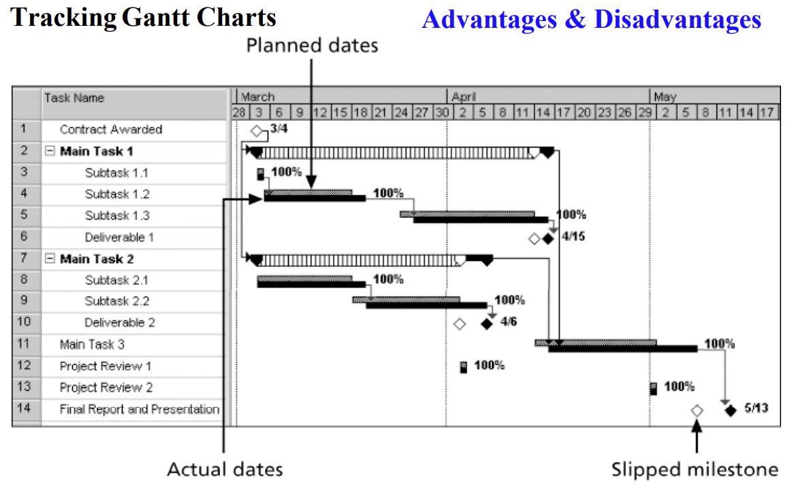

### 6.7.2 关键路径法
- 关键路径法（critical path method，CPM），又称为关键路径分析（critical path analysis），是一种用来预测整个项目工期的网络图技术。
- 项目的关键路径（critical path）决定了项目最早完成时间的活动序列，是网络图的最长路径，其时差或者浮动时间最少。
- 时差（slack）或浮动时间（flot）指的是在不延误后继活动或者项目完成时间的情况下，任务可以推后的时间。

#### 1. 计算关键路径
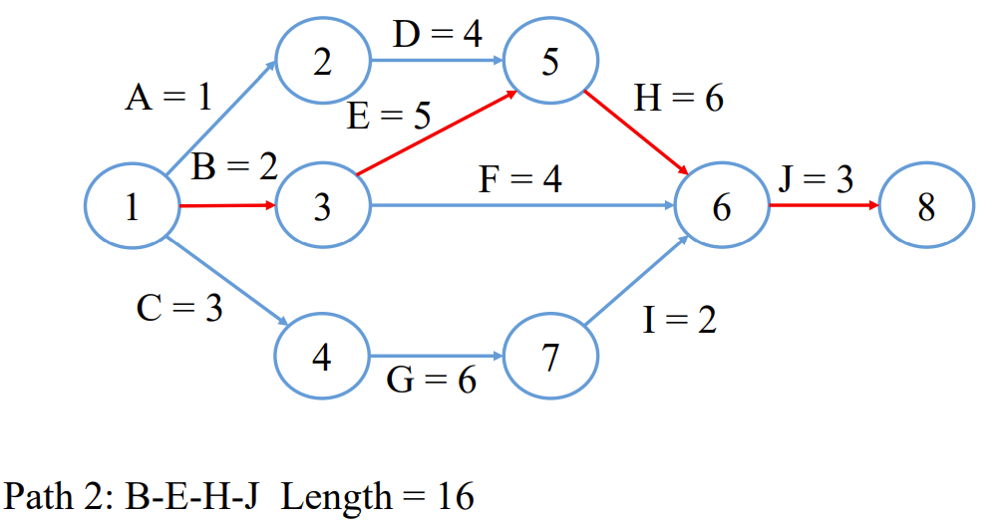

#### 2. 在关键路径上种草
#### 3. 使用关键路径分析来保持进度均衡
- 自由时差（free slack）或自由浮动时间（free float）是一个活动在不延误紧接活动的最早开始时间的情况下可以被延误的时间。
- 总时差（total slack）或者总浮动时间（total float）是一个活动从它最早开始时间起，在没有拖延计划项目完成日期的情况下被耽搁的时间。

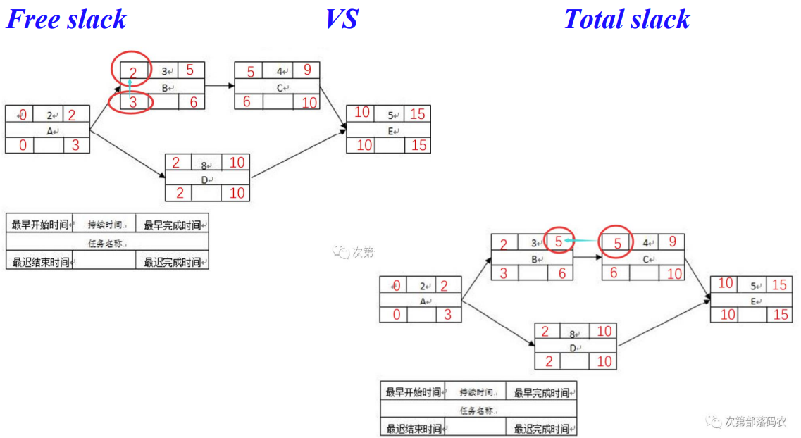
- 最早开始时间（early start date）是基于项目网络逻辑可以开始的最早的可能时间。
- 最早完成时间（early finish date）是基于项目网络逻辑最早可能完成的时间。
- 最晚开始时间（late start date）是一个活动在不延迟项目完成时间的最晚可能开始的时间。
- 最晚完成时间（late finish date）是一个活动在不延迟项目完成时间的最晚可能完成的时间。

计算最早和最晚开始和完成时间
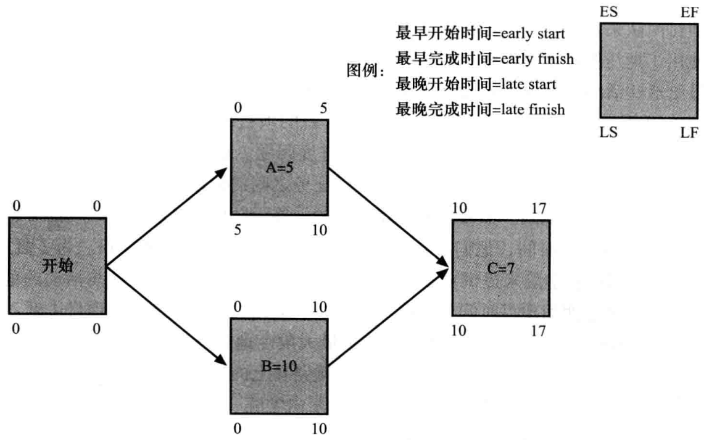

**正推法**（forward pass）决定每个活动的最早开始和最早完成时间。
- 首先确定项目的开始日期；
- 项目的开始日期为网络图中第一个活动的提前开始时间；
- 从左到右、从上到下排列任务；
- 当一个任务有多个前置任务时，选择最大的提前完成日期作为其后续任务的提前开始日期。
- 公式
  - $ES+Duration=EF$
  - $EF+Lag=ESs$

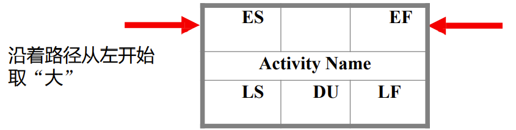
正推法：从网络图左侧开始，为每项活动制定最早开始ES和最早结束EF时间，进行到网络图结束（最右边）。
1. 任一活动的最早开始时间，等于所有前置活动的最早结束时间的最大者；
2. 任一活动的最早结束时间，等于该活动的最早开始时间+该活动工期；
3. 没有前置活动的，ES等于项目的开始时间。

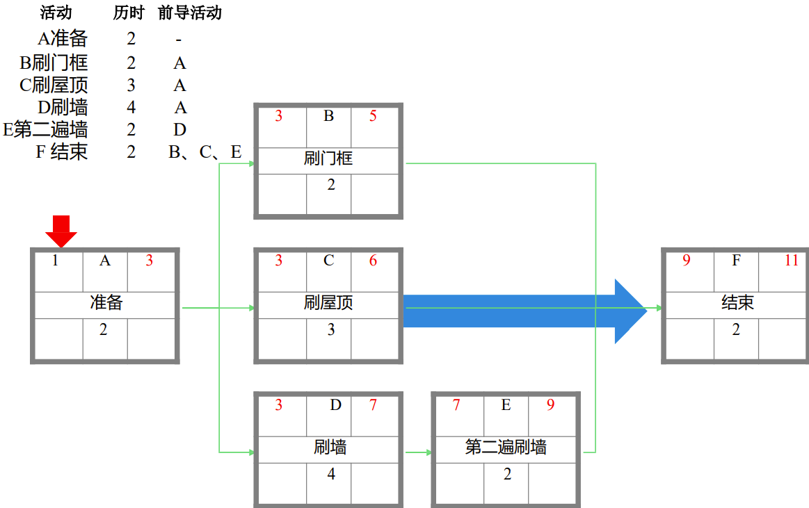

**逆推法**（backward pass）可决定最晚开始和最晚完成时间。
- 首先，确定项目的结束日期；
- 项目的结束日期为网络图中最后一个活动的最晚完成日期；
- 从右到左，从上到下计算；
- 当一个前置任务有多个后置任务时，选择最短和最晚开始日期作为其前置任务的延迟完成日期。
- 公式
  - $LF-Duration-LS$
  - $LS-Lag=LFp$

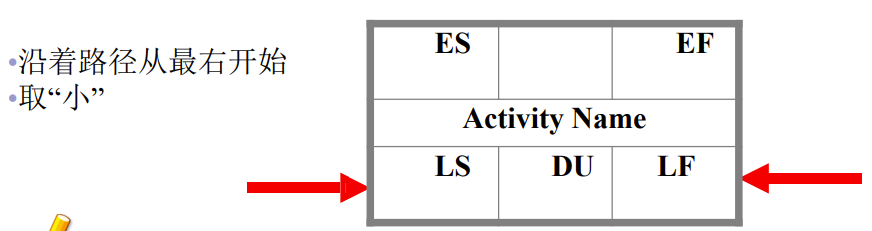
逆推法：从网络图右侧开始，为每项活动制定最迟开始和最迟 结束时间，进行到网络图开始（最左边）。
1. 任一活动的最迟结束时间，等于所有后续活动的最迟开始时间的最小者；
2. 任一活动的最迟开始时间，等于该活动的最迟结束时间- 该活动工期；
3. 没有后续活动的，LF等于项目的结束时间或者规定的时间。

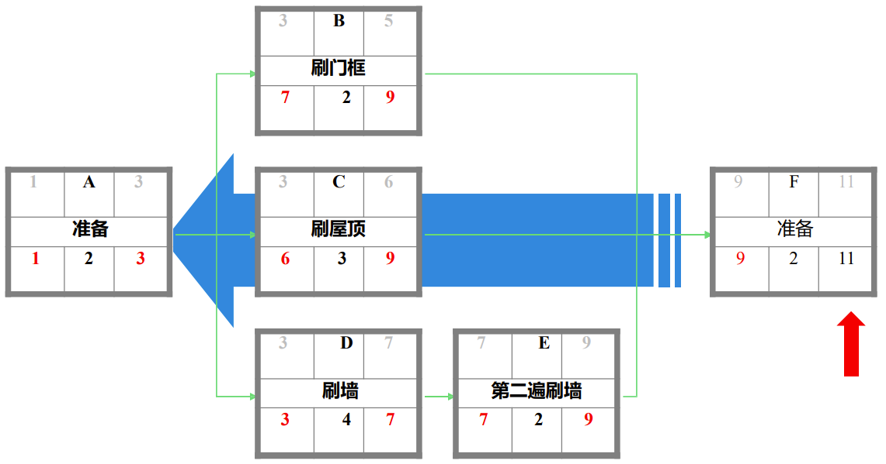

#### 4. 使用关键路径来缩短项目的进度
缩短项目进度的三种主要技术
- 通过给这些活动分配更多的资源或者改变它们的范围，来缩短关键路径上的活动工期。
- 赶工（crashing）是一种为了以最少的成本最大限度地压缩工期，而在成本与进度之间进行均衡的技术。
- 快速跟进（fast tracking）包括并行执行那些通常以顺序方式执行的活动。

#### 5. 更新关键路径数据的重要性

### 6.7.3 关键链调度
- Dr Goldratt 将约束理论（1986）技术应用到项目管理领域，于1997年出版了著作《关键链》，提出了关键链项目管理(Critical Chain Project Management，CCPM)方法。
- 关键链（critical chain）是在综合考虑工作约束和资源约束下计算出来的制约整个项目周期的一个工作序列。
- 关键链管理将关键路径、时间资源费用等优化直接囊括其中，它强调在制定项目计划时考虑资源的约束，在项目执行过程中进行动态管理。

关键链调度（critical chain scheduling）是一种进度计划方法，在创建项目进度时考虑有限的资源，并且将缓冲包括进来以保护项目完成期限。
- 稀缺资源的可得性
- 多任务处理：当资源一次处理多个任务时，尝试最大限度地减少多任务处理
- 时间缓冲区：完成任务的额外时间

关键链调度示例
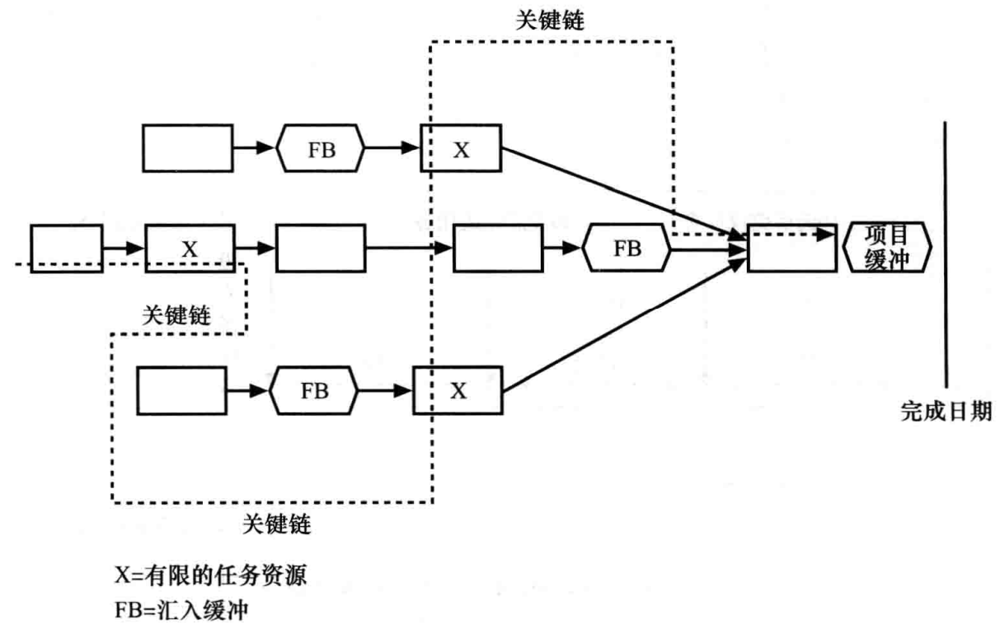

### 6.7.4 计划评审技术（PERT）
计划评审技术（program evaluation and review technique，PERT）是在单个活动工期估计高度不确定的情况下，用来估计项目工期的技术。

PERT使用概率时间估算（probabilistic time estimate），是基于乐观的活动工期估算、最可能的活动工期估算和悲观的活动工期估算这三点来进行工期估算，而不是像CPM那样，使用一个特定的或者离散的工期估算。
- 乐观时间：在平稳条件下完成过程所需的时间，用O表示。
- 最可能的时间：在正常条件下完成该过程所需的时间，用M表示。
- 悲观时间：在不利条件下完成该过程所需的时间，用P表示。

$$
PERT加权平均T = \frac{(乐观时间O + 4 \times 最可能的时间M + 悲观时间P)}{6}
$$

$$
标准差\delta = \frac{悲观时间P - 乐观时间O}{6}
$$

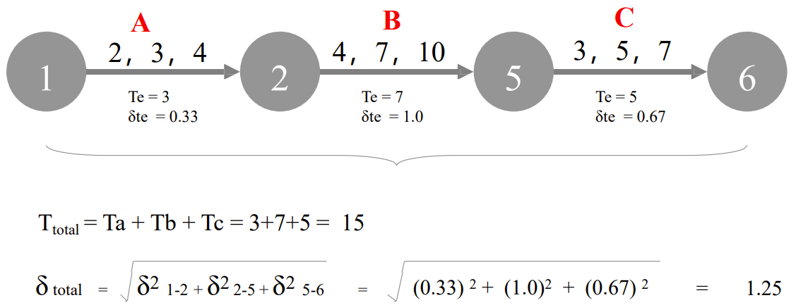

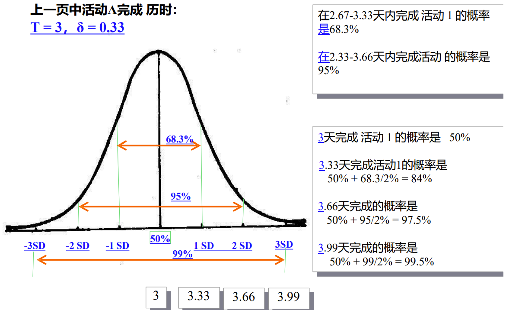

| -                          | 关键路径法(CPM)                      | 计划评审技术(PERT)                         |
| -------------------------- | ------------------------------------ | ------------------------------------------ |
| 类型                       | 肯定型                               | 概率型                                     |
| 活动流向                   | 所有活动均由始点流向终点，无回路     | 所有活动均由始点流向终点，无回路           |
| 活动时间                   | 确定                                 | 服从概率分布，用平均值来表示               |
| 网络基础                   | 箭线图或双代号网络图                 | 箭线图或双代号网络图                       |
| 进度控制基础               | 关键路径                             | 关键路径                                   |
| 虚活动                     | 允许                                 | 允许                                       |
| 安全时间                   | 隐藏于各活动中                       | 隐藏于各活动中                             |
| 项目开工时间               | 尽早开工                             | 尽早开工                                   |
| 逻辑关系                   | 所有的活动都必须实现                 | 一般的活动必须实现，但条件变化时可预测概率 |
| 工作时间估计               | 50%可能的完成时间                    | 80%可能的完成时间（安全时间）              |
| 制约项目周期的识别         | 关键链                               | 关键路径                                   |
| 项目执行中不确定性因素消除 | 缓冲区域                             | 自由时差                                   |
| 识别时的难易度             | 循环往复，不断寻优                   | 一次确定                                   |
| 确定性                     | 不确定，不同的算法会得到不同的关键链 | 确定                                       |
| 形式上                     | 还需考虑资源约束                     | 有紧前紧后关系                             |

## 6.8 进度控制
进度控制的目标是了解：
- 计划的状态
- 影响导致进度变化的因素
- 确定时间表已更改，并在发生更改时进行管理
  - 在不同地方乘车的心理体验
  - 心理预期

进度控制：
- 输入：项目管理计划、项目进度、绩效数据、项目日历、进度数据和组织过程资产。
- 工具和技术：绩效考核、进度变更控制系统、进度工具和/或项目管理软件、方差分析、情景假设分析、调整时间提前滞后量、进度压缩、资源优化技术。
- 输出：绩效度量、请求变更、项目管理计划更新、项目文档更新和组织过程资产更新。

IT项目进度延迟的因素
1. 低估技术难度
2. 关键人员离职
3. 计划进度错误
4. 设备未到位
5. 客户需求变更

进度控制建议
- 对时间表进行现实检查
- 考虑到偶发事件
- 不要计划让每个人每时每刻都以100%的工作能力工作
- 与利益相关者召开进度会议，清晰和诚实地沟通进度问题

调度的现实检查：
- 首先审查项目章程中的计划草案或预计完工日期
- 与项目团队一起制定更详细的时间表
- 确保计划切合实际并得到遵守
- 如果出现进度问题，提前通知最高管理层

## 6.9 使用软件辅助项目时间管理

## 6.10 本章小结
项目时间管理通常被认为是项目冲突的主要根源。多数T项目超出了时间估算。
项目时间管理的主要过程包括计划进度管理、活动定义、活动排序、活动资源估算、活动工期估算、进度制订和进度控制。
