## 7.0 学习目标
- 理解项目成本管理的重要性。
- 解释基本的项目成本管理原理、概念和术语。
- 描述计划成本管理过程。
- 讨论成本估算的不同类型和实现方法。
- 了解成本预算的过程，并尝试为IT项目做成本估算。
- 了解挣值管理和项目组合管理在成本控制中起到的积极作用。
- 描述项目管理软件如何协助项目的成本管理。

> 开篇案例
> 胡安是一个系统分析师和网络专家，在一个大城市的供水系统工作，他很想帮助国家发展基础措施，他的下一个目标是成为一名项目经理，以便有更大的影响力。他的一个同事邀请他参加一个重大政府项目的评审会，其中包括“测量员助手”这个概念是开发一个复杂信息系统，该信息系统包括专家系统、面向对象数据库和无线通信系统。该系统为政府的测量员提供即时的图形信息，帮助他们工作。例如，测量员触摸手感装置上显示的地图之后，系统将提示他选择有关那个区域所需要的信息类型。该系统将对许多项目的计划和执行有帮助，从光缆的铺设到输水管线铺设。
> 然而，当项目评审会大部分时间花在讨论有关成本问题时，他非常惊奇。政府官员在讨论资助新项目之前，一直在评审许多现有的项目，评估它们到目前的执行情况及其在预算上的潜在影响。汇报人引用的很多术语和图表，胡安都不理解。他们总是谈挣值分析？胡安曾想他应当学习更多的测量员助理项目中将要应用的新技术，但现在他发现成本估算和项目收益是高级官员在会议上最感兴趣的事情。
> 在任何技术工作开始之前，必须花大量的精力研究财务情况。胡安多么希望自己学过一些会计和财务方面的课程，那样他就能够理解人们正在讨论的缩写和概念。尽管胡安获得了电子工程学位，但他在财务方面没受过正规的教育，经验也特别少。他认为自己能够懂信息系统和网络，也同样能理解项目中的财务问题。他草草地记下会后需要和同事们讨论的问题。
> 胡安对他的同事谈了这次会议之后，他对项目成本管理的重要性有了更好理解。特别是当他了解到在项目后期纠正缺陷需要更高成本之后，他认识到了在对项目做出主要开支之前详细研究的价值。他理解了好的成本估算和成本控制的重要性。项目经理表示他们正在实施的项目管理不善，并承认他们在项目的前期计划和分析方面做得不够，政府官员于是取消了几个项目。胡安知道，如果想在自己的职业生涯中有所长进，就不能仅注重项目的技术方面。他开始怀疑本市正在考虑的几个项目是否真的对得起纳税者的钱。成本管理问题又给胡安工作增添了一个新的空间。

## 7.1 项目成本管理的重要性
- IT项目在满足项目预算目标方面的记录不佳。
- 斯坦迪什集团的“混沌”(CHAOS)研究表明，平均成本超支（实际成本超过成本估算的附加比例或金额）的不成功的IT项目从1994年的180%降低到2010年的43%。
- 发表在《哈佛商业评论》的2011研究表明，平均成本超支达到27%。最重要的是发现大量的严重超期或“黑天鹅”（很少出现和不可预知的高影响力事件，但是在过去并不罕见）。

### 7.1.1 什么是成本
- 会计师通常将成本定义为实现一个特定目标而牺牲或放弃的资源。
- “成本”为“交换中所放弃的东西”。

错误感知
- 很多IT项目的原始成本估算很低，只是以非常模糊的项目需求为基础进行估算的，所以自然会发生成本超支。
- 许多IT专业人员认为成本估算与自己无关，是会计师的工作。相反，良好的成本估算是一项艰巨的、所有IT项目专业人员都应当具备和必须掌握的重要技能。

### 7.1.2 什么是项目成本管理
项目成本管理（project cost management）包括用来确保在批准的预算范围内完成项目的必要过程。

成本失控原因
- 对项目了解不足
- 组织体系不完善
- 方法问题
- 技术限制
- 需求管理不当

4个过程：
1. 计划成本管理，包括确定用于计划、执行、控制项目成本的政策、程序和文档。
2. 成本估算，包括完成项目所需资源的近似或估算成本。
3. 确定预算，包括将整体成本估算配置到各单项工作，以建立一个衡量绩效的基线。
4. 成本控制，包括控制项目预算的变更。

项目成本管理概要
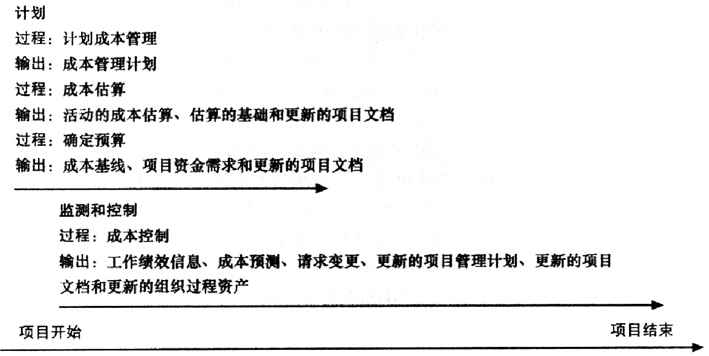

## 7.2 成本管理的基本原理
- 净现值分析（Net present value analysis）：通过将所有预期未来现金流入和流出折现到当前时间点，计算项目的预期净货币收益或损失。
- 投资回报率（Return on investment）：是用于评估效率或盈利能力的绩效指标。
- 投资回收期（Payback period）：以净现金流入的形式计算，收回项目投资总额所需的时间。

/
- 利润（profits）：收入减去支出。
- 利润率（profits margin）：利润和收入的比值。

/
- 可变成本，是指随着生产量、工作量和时间而变化的成本。
- 固定成本，是指不随生产量、工作量和时间变化的成本。
- 有形成本，是一个组织可以很容易地用货币来衡量的成本。
- 无形成本，是难以用货币计量的成本。
- 直接成本，是与项目的产品和服务的生产直接相关的成本。
- 间接成本，是与项目的产品和服务的生产不直接相关的成本，但是它们间接地与项目的绩效挂钩。
- 正常成本，是指根据计划进度在项目中产生的成本。
- 加速成本，是指项目在加速到计划外进度时产生的成本。
- 经常性成本，是指项目中经常发生的成本。
- 一次性成本，是指项目中仅一次性发生的成本。
- 机会成本，是那些因为你想做而放弃其他事情的成本。
- 沉没成本，是过去已经花掉的钱；在决定投资或继续投资什么项目时，不应包括沉没成本。

/
- 生命周期成本（life cycle costing）是对贯穿于整个项目生命周期的成本状况的总体认识。
- 现金流分析（cash flow analysis）是用于确定项目每年的估计成本和收益以及由此产生的年度现金流的一种方法。
- 学习曲线理论指出，当重复生产许多产品时，那些产品的单位成本随着数量的增多而呈现规律性的递减。
  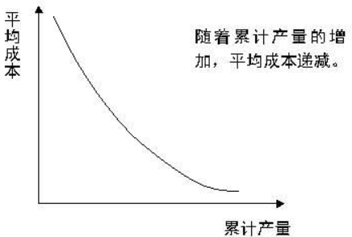

/
- 储备金（reserves），是包含于成本估算中，为减轻未来难以预测情形带来的成本风险而准备的那部分资金。
- 应急储备金（contingency reserves），是为一些可以部分预计的未来情况（也称已知的不确定事件）做准备，它包含于项目成本基线中。
- 管理储备金（management reserves），是为不能预测的未来情况（也称未知的不确定事件）做准备。
- 成本基线（cost baseline）是经过批准的按时间段分配的项目预算。

## 7.3 计划成本管理
- 输入：启动项目的基本文档
- 工具和技术：专家判断、分析技术、会议
- 产出：成本管理计划

注：根据项目的需要，它可以是非正式的和广泛的，也可以是正式的和详细的。

成本管理计划包括：
- 基础：计量单位、准确度、精确度、组织程序链接
- 绩效：控制临界值、绩效测量规则、控制账户、EVM技术
- 跟踪汇报：跟踪方法、报告格式
- 方案程序：战略筹资方案、处理汇率波动、记录项目成本

## 7.4 成本估算

### 7.4.1 成本估算的类型
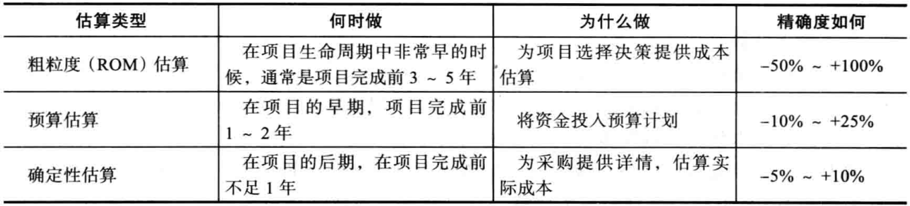

- 输入：成本管理计划、人力资源管理计划、范围基线、项目进度计划、风险登记册、业务环境因素、组织过程资产
- 输出：活动成本估算、估算基础、项目管理计划更新

### 7.4.2 成本估算的工具和技术
- 三点估算：包括估算最有可能的、乐观和悲观的项目成本。
- 参数估算：是在一个数学模型中应用项目特征（参数），以估算项目成本。
- 质量成本（8）
- 项目管理估算软件
- 供应商报价分析（12）
- 类比成本估算
- 储备分析
  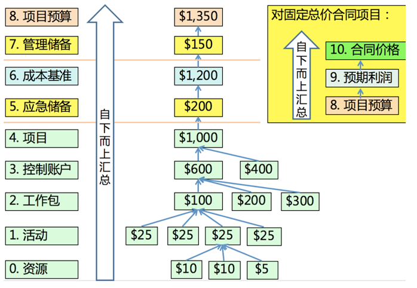
- 自下而上估算：估算单个工作项目或活动的成本，并将它们汇总成整体项目估算。
  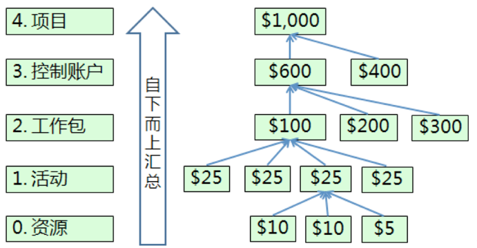
- 专家判断

### 7.4.3 IT项目成本估算的典型问题
- 估算做得太快
- 由缺乏经验的人估算
- 人们有低估困难的倾向
- 管理要求准确性

### 7.4.4 成本估算实例
1. 在开始任何成本估算之前，你必须收集尽可能多的项目信息，并了解所做估算将做何用。
2. 明确估算的基本规则和假设也是非常重要的。
3. 团队决定先估算每个WBS项的成本，然后团队审查项目进度计划草案，根据需要做出进一步假设。
4. 评审项目的成本估算是非常重要的。

测量员助手项目的成本估算
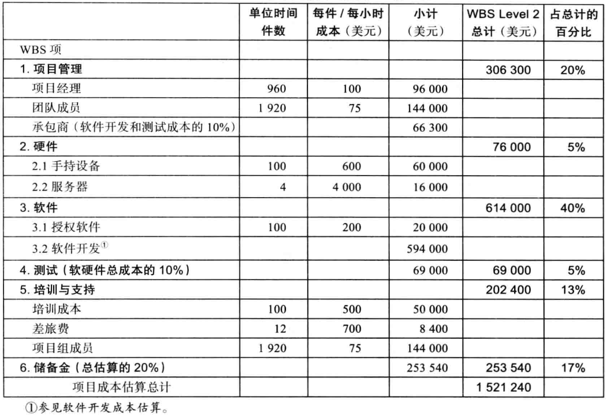

测量员助手软件开发估算
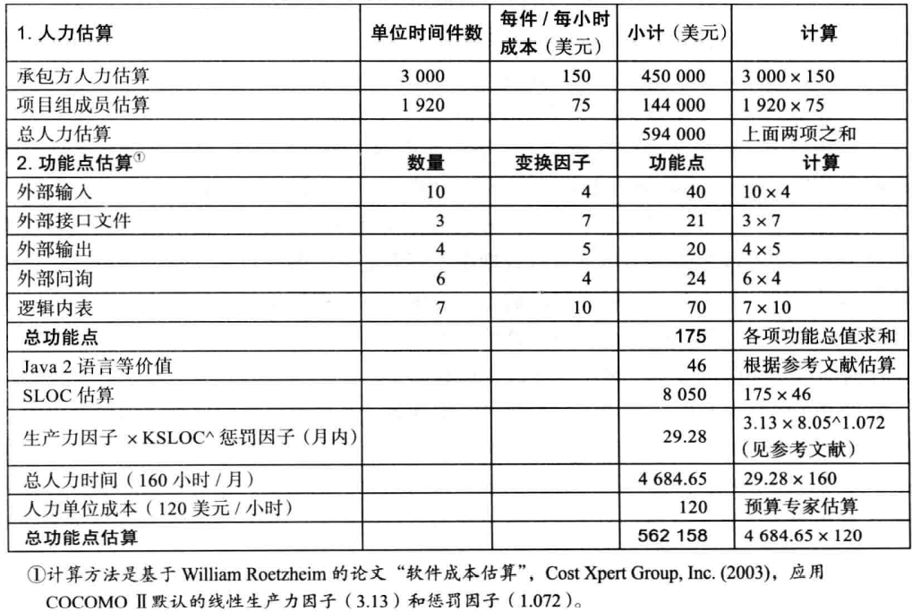

**成本计划——估算方法**
1. 代码行估算
   - 优点：每个项目都有；易于算代码行数
   - 缺点：
     - 项目初期需求不稳定的情况下难以估计代码量
     - 代码行强调编码的工作量，只是项目实现阶段的一部分
2. 功能点估算
   - $FP = UFC \times TCF$（UFC：未调整功能点计数；TCF：技术复杂度因子）
   - $UFC = 每个功能计数项 \times 对应复杂度$，$TCF = 0.65 + 0.01 \times 14 \times (0-5之间的取值范围)$
   - 功能计数项
     - 外部输入：增删改
     - 外部输出：报表、统计订单等
     - 外部查询：查
     - 外部接口文件
     - 内部逻辑文件
3. 用例点估算
   - UAW（未调整角色权值）：$角色数 \times 权值$
   - UUCW（未调整用例权值）：$用例数 \times 权值$
   - UUCP（未调整的用例点）：$UUCP = UAW + UUCW$
   - TCF（计算技术因子）：$0.6 + 0.01 \times ()$
   - ECF（计算环境因子）：$1.4 - 0.03 \times ()$
   - UCP（计算调整的用例点）：$UCP = UUCP \times TCF \times ECF$
4. 类比（自顶向下）估算
   - 以以往完成的类似的项目来推算将要开发的软件的总成本
   - 估算不是非常精确
5. 自下而上估算
   - 利用WBS，对每个具体工作包进行成本估算之后累加
   - 相对比较准确、花费时间少
6. 参数估算
   - 通过项目数据进行回归分析，得出回归模型
   - 使用条件：具有良好的项目数据；存在成熟的项目估算模型
   - 特点：简单、较准确
   - 整体公式：$E = a + b \times S^c$（单位人月）
     - abc：经验导出的系数
     - S：主要的输入参数（LOC、FP等）
     - Walston-Felix模型：$E = 5.2 \times (KLOC)^0.91$
     - COCOMO——结构化成本模型
       - 模型级别：基本、中等、高级
       - 项目类型：有机型、嵌入型、半嵌入型
       - 基本cocomo：$E= a \times (KLOC)^b$
       - 中等cocomo：$E= a \times (KLOC)^b \times 乘法因子$
         - 乘法因子的成本驱动属性：产品属性、平台属性、人员属性、过程属性
       - 高级cocomo：将项目分解为一系列子系统或子模型
7. 专家估算（领域熟悉时使用）
   - 每位专家的 $e_i = \frac{(a_i + 4m_i + b_i)}{6}$
   - 最终软件规模 $E= E_1 + E_2 + E_3...E_N$

## 7.5 成本预算
成本预算涉及将项目成本估算随时间分配给个体材料资源或单个工作项，这些个体材料资源或工作项是以项目工作分解结构为基础的。
主要目的：编制一个成本基线
成本基线是项目经理用来衡量和监控成本性能的分时段预算。

- 输入：成本管理计划、范围基线、活动成本估算、估算基础、项目进度、资源日历、风险登记表、协议和组织过程资产
- 输出：成本基线，项目资金需求、项目文档更新

成本基准
1. 经过批准
2. 按时间段分配
3. 不包括管理储备
4. 变更需要CCB
5. 用作与实际结果比较的依据

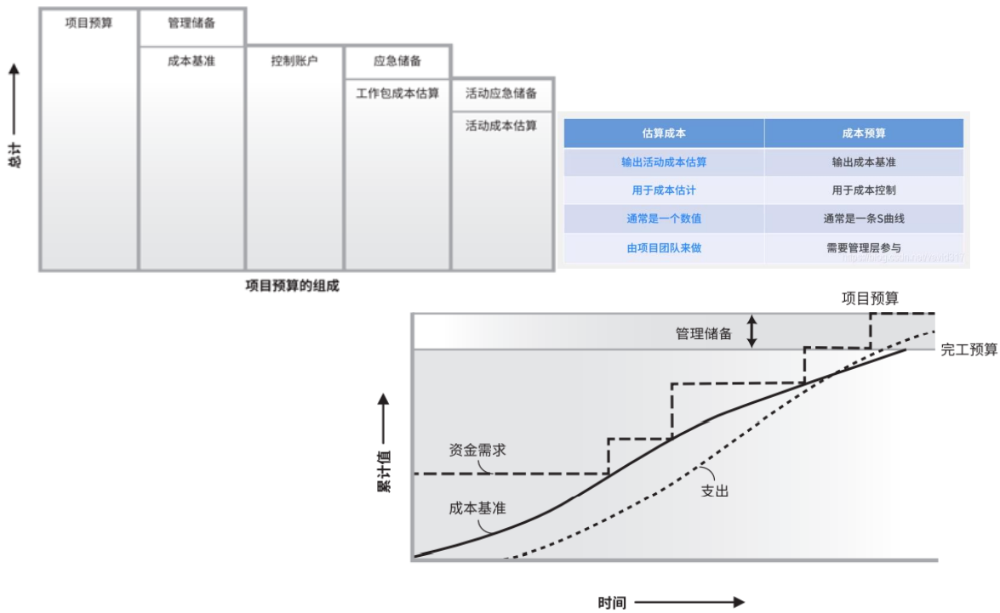

测量员助手项目成本基线
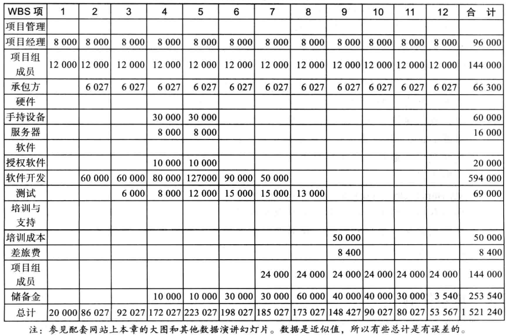

## 7.6 成本控制
项目成本控制包括监测成本执行情况、确保一个修改的成本基线中仅仅包括适当的项目变更，以及通知项目干系人那些经核准的、影响成本的项目变更。

- 输入：项目管理计划、项目资金需求、工作性能数据、组织过程资产
- 工具和技术：Project2010、变更控制系统、绩效评审会、绩效测量
- 输出：工作绩效信息、成本预测、变更请求、更新的项目管理计划、更新的项目文档、更新的组织过程资产

### 7.6.1 挣值管理
挣值管理（earned value management，EVM）是一种综合了项目范围、时间和成本数据的项目绩效测量技术。
给定成本执行基线，项目经理和他的团队可以通过输入实际的信息，并将其与基线比较，从而判断项目目前在多大程度上满足了范围、时间和成本目标。
基线是最初项目计划加上被批准的变更。

挣值管理涉及计算项目WBS中每项活动或概要活动的三个值：
1. 计划值（预算）（planned value，PV），是在给定时间内计划花费在某个活动上的已批准总成本估算的部分。
2. 实际成本（actual cost，AC），是在给定时间内，完成一项活动所产生的直接成本和间接成本的总和。
3. 挣值（earned value，EV），是实际完成工作的估算值。完成百分比（rate of performance，RP），是实际完成工作与在项目或活动周期给定时间内已完成计划工作的比率。

挣值公式
| 术语                                            | 公式                 |
| ----------------------------------------------- | -------------------- |
| 挣值（earned value，EV）                        | $EV = PV \times RP$  |
| 成本偏差（cost variance，CV）                   | $CV = EV - AC$       |
| 进度偏差（schedule variance，SV）               | $SV = EV - PV$       |
| 成本绩效指数（cost performance index，CPI）     | $CPI = EV / AC$      |
| 进度执行指数（schedule performance index，SPI） | $SPI = EV / PV$      |
| 完工估算（estimate at completion，EAC）         | $EAC = BAC / CPI$    |
| 完工时间估算                                    | $原始时间估算 / SPI$ |

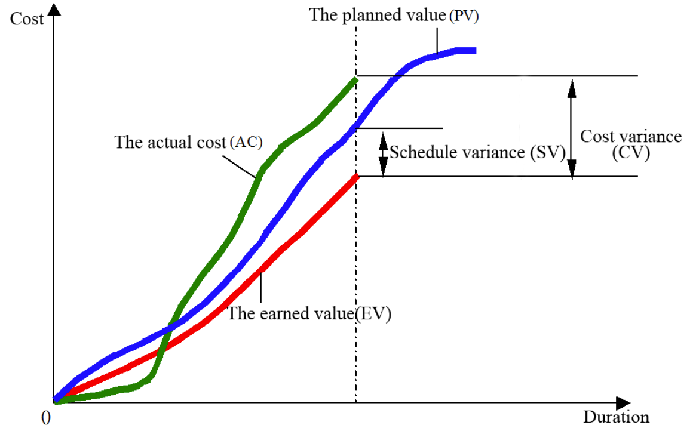
- 成本偏差（cost variance，CV）是挣值减去实际成本。
  - 如果成本偏差是一个负数，那么就意味着执行工作所用的成本高于计划成本，
  - 如果成本偏差是一个正数，则意味着执行工作所用的成本低于计划成本。
- 进度偏差（schedule variance，SV）是挣值减去计划值。
  - 负的进度偏差意味着执行工作用时比计划用时长，
  - 而正的进度偏差则意味着执行工作用时比计划用时短。
- 成本绩效指数（cost performance index，CPI）是挣值与实际成本的比值，可以用来估算完成项目的预计成本。
  - 如果成本绩效指数等于1或100%，那么预算成本和实际成本相等，或者说成本与预测完全相同。
  - 如果该指数小于1或100%，则项目超出预算。
  - 如果该指数大于1或者100%，则说明项目在预算范围内。
- 进度绩效指数（schedule performance index，SPI）是挣值与计划值的比值，可以用来估算完成项目的预计时间。
  - 与成本绩效指数相类似，进度执行指数为1或者100%，意味着项目进度符合进度计划。
  - 如果进度执行指数大于1或100%，则项目超前于进度计划。
  - 如果该指数小于1或100%，则项目进度落后于进度计划。

> 通常负的成本和进度偏差表明在那些领域存在问题，项目花费成本比计划的更多，用时比计划的更长。
> 同样，成本绩效指数和进度执行指数小于1或100%，也说明存在问题。

> 成本性能指标用来计算EAC一估算迄今为止基于性能完成一个项目的成本。
> 同样，进度执行指数可以用来计算完成一个项目估计的时间。

- 完工预算（budget at completion，BAC），项目的原始总预算。

5个月后项目的挣值图
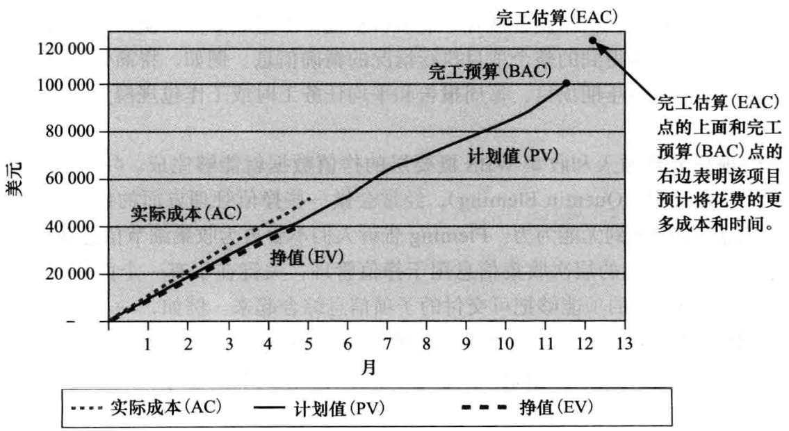

- 挣值管理在全球范围内被使用，而且在中东、南亚、加拿大和欧洲特别受欢迎。
- 大多数国家的大型国防和政府项目都需要挣值管理。
- 挣值管理也可用于如IT、建筑、能源和制造业等私人行业，然而大多数私营企业尚未应用挣值管理他们的项目数据，因为它太复杂，不符合成本效益。

### 7.6.2 项目组合管理
...

## 7.7 使用软件辅助项目成本管理
- 电子制表软件是进行资源规划、成本估算、成本预算和成本控制的常用工具
- 许多公司使用更复杂和统一的财务应用软件来获取成本信息
- 项目管理软件具有许多与成本相关的功能，尤其是企业PM软件
- 投资组合管理软件可以帮助降低成本

## 7.8 本章小结
- 什么是成本？
- 挣值管理/挣值分析
- 成本基线
- 项目成本管理流程
  - 计划成本管理
  - 估算成本
  - 确定预算
  - 控制成本
