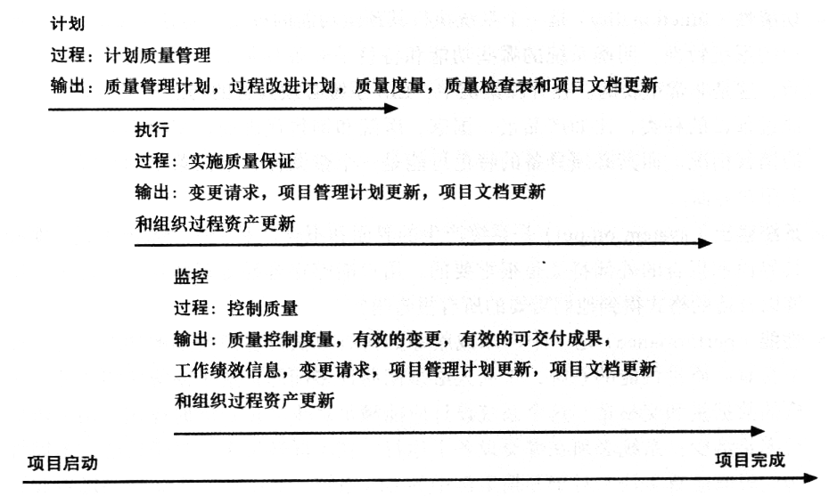

## 8.0 学习目标
- 理解项目质量管理对于IT产品和服务的重要性。
- 定义项目质量管理并理解项目质量与IT项目的各个方面是如何联系的。
- 描述质量管理计划以及它与项目范围管理的关系。
- 讨论质量保证的重要性。
- 解释质量控制过程的主要输出结果。
- 了解质量控制工具和技术，例如7种基本的质量管理工具、统计抽样、六西格玛法则和测试。
- 总结著名质量管理专家对于现代质量管理的贡献。
- 描述在IT项目中领导能力、质量成本、组织影响力、期望、文化差异和成熟度模型是如何与改进IT项目质量相关的。
- 讨论软件是如何辅助项目质量管理的。

> 开篇案例
> 一家大型医疗器械公司刚雇佣了一个资深顾问Scott来帮助解决公司新开发的行政信息系统(EIS)存在的质量问题。EIS是由公司内部程序员、分析员以及公司的几位行政官员共同开发的。许多行政管理人员也被EIS所吸引，EIS能够使他们便捷地按照产品、国家、医院和销售代理商分类对各种医疗仪器的销售情况进行跟踪。EIS系统在行政部门获得成功测试后，公司决定把EIS系统推广应用到各个管理层。
> 不幸的是，在经过几个月的运行之后，新的EIS产生了许多质量问题。人们抱怨他们不能进入系统。这个系统一个月出好几次故障，响应速度也在变慢。用户在几秒钟之内得不到所需信息。有几个人总忘记如何输入密码进入系统，因而增加了向服务台打电话求助的次数。有人抱怨系统中有些报告输出的信息不一致。EIS的行政负责人希望这些问题能够快速准确的解决，所以他决定从公司外部雇佣一名质量专家。据他了解，这位专家有类似项目的经验。Scott的工作将是领导由来自医疗仪器公司和他的咨询公司的人员共同组成的工作小组，识别并解决EIS中存在的质量问题，编制一项计划以防止质量问题。

1. EIS系统中存在哪些质量问题？
2. 对上述问题应采取什么措施？
3. 项目组如何知道他们的项目是否交付了高质量的产品？
4. 如果你是Scott，你会准备什么样的质量计划（保证和控制）来防止未来IT项目的质量问题？

## 8.1 项目质量管理的重要性
- 你认为你主要使用的软件的质量如何？
- 汽车行业、建筑行业、IT行业使用的技术进步性如何？而上述行业中哪些产品的质量最高呢？为什么？

## 8.2 什么是项目质量管理
质量（quality）
- 反映实体满足明确和隐含需求的能力特性总和(ISO8042:1994)
- 一组固有特性满足要求的程度(ISO9000:2000)

需求一致性和实用性
- 需求一致性（conformance to requirement）是指项目过程和产品满足书面规范的要求。
- 适用性（fitness for use）是指产品能像它被预期的那样使用。

项目质量管理的目的是确保项目满足它所应满足的需求。
- 客户是质量是否可接受的最终裁判者。
- 现代质量管理的一个基本准则是“质量是计划的，而不是检查的”。

质量责任：
- 最高管理层：对组织质量负责
- 项目经理：对项目整体质量负责
- 员工个人：对他们的工作质量负责

项目质量管理包括三个主要过程：
1. 计划质量管理（planning quality management），包括确认与项目有关的质量需求和标准以及如何满足它们。
2. 实施质量保证，包括对整体项目绩效进行定期的评估以确保项目能够满足相关的质量标准。
3. 控制质量，包括监控特定的项目结果，确保它们遵循了相关质量标准，并确定提高整体质量的方法。

项目质量管理一览

## 8.3 计划质量管理
计划质量管理：确定哪些质量标准与项目相关，以及如何满足这些标准。
- 输入：组织的质量方针、特定项目的范围说明书和产品描述以及相关标准和规章制度
- 工具和技术：实验设计（design of experiment）
- 输出：质量管理计划、过程改进计划、质量度量、质量检查表和项目文档更新

计划质量管理意味着预测形势和准备措施以获得需要的结果的能力。
- 选择合适的材料
- 培训与教导人们的质量观念
- 计划一个确保产生合适结果的过程

> 为确保质量而以一种能理解的、完整的形式来传达纠正措施。

- 指标是一种衡量标准。
- 质量指标专门用于描述项目或产品属性，以及质量控制过程将如何验证合规程度。（完成率、成本绩效、失败率、每日缺陷数量、每月总停机时间、代码行错误数、客户满意度得分、测试覆盖率）

IT项目中影响质量的重要范围部分包括：
- 功能性（functionality）是一个系统执行其预定功能的程度。
- 特色（feature）是吸引用户的系统特性。
- 系统输出（system output）是系统产生的界面和报告。
- 性能（performance）是一个产品或服务如何有效执行客户预期的功能。
- 可靠性（reliability）是指一个产品或服务在正常条件下表现出符合预期情况的能力。
- 可维护性（maintainability）说明进行产品维护的容易程度。

## 8.4 实施质量保证
实施质量保证：定期评估项目的整体绩效，以确保项目符合相关质量标准。
- 输入：质量管理计划、过程改进计划、质量度量、质量控制度量和项目文档
- 工具和技术：实验设计、基准比较法、鱼骨图、质量审计
  - 基准比较法（benchmarking）：通过将特定的项目实践或产品特性与那些在项目实施组织内部或外部的其他项目或产品的相应特性进行比较，从中产生质量改进的思想
  - 质量审计（quality audit）：对特定质量管理活动的结构化审查，它帮助确定所取得的经验教训，并且可以改进目前或未来项目的实施情况。
- 输出：变更需求、项目管理计划更新、项目文档更新和组织过程资产更新

质量保证（quality assurance）包括满足一个项目相应质量标准的所有相关活动。

两个概念：
- 持续改善（kaizen），意指更好的改善和改变。
- 精益（lean），的目的是实现客户价值最大化，同时尽量减少浪费。

## 8.5 质量控制
执行质量控制：监控具体项目结果，确保其符合相关质量标准。
质量控制（quality control）的一个主要目标也是提高质量，但这个过程的主要输出是验收决策、返工和过程调整。
- 验收决策（acceptance decision）：确定作为项目的一部分而生产的产品或服务是否通过验收的决策。
- 反工（rework）：指为使被拒收的项目达到和满足产品需求、规范或干系人的其他期望而采取的行动。
- 过程调整（process adjustments）：指根据质量控制的度量结果，纠正或防止进一步的质量问题而做的调整。

## 8.6 质量控制的工具和技术
1. 因果图（cause-and-effect diagrams）：是将关于质量问题的抱怨追溯至负有责任的生产运营环节的图，也被称为鱼骨图（fishbone diagram）或石川图（Ishikawa diagram）。
  - 
2. 控制图（control chart）：是数据的图形表示，表明一个过程随时间变化的结果。
   - 控制图的主要用途是防止缺陷，而不是检测或拒绝缺陷。
   - 质量控制图可以使你确定一个过程是受控还是失控。
     - 当一个过程是受控的，过程结果中的任何变化都是由随机事件产生的。受控的过程不需要调节。
     - 当一个过程是失控的，过程结果中的变化是由非随机事件产生的。你需要确认这些非随机事件的起因，并调节过程以纠正或消除这些起因。
   - 
   - 七点运行法则（seven run rule）指出：如果质量控制图上连续的7个数据点都在平均值以下、都在平均值以上，或者所有点都呈现出上升或下降的趋势，那么需要检查这个过程是否有非随机问题。
3. 检查表（checksheet）：是用来收集和分析数据。根据其格式，它有时被称为统计表或清单。
   - 
   - 对于提高处理投诉的过程此信息可能是有用的。
4. 散点图（scatter diagram）：显示两个变量之间是否有关系。数据点越接近对角线，两个变量越密切相关。
   - 
5. 直方图（histogram）：是一个变量分布的条形图。每个条代表某种问题或某种情况的属性或特征，条的高度代表其频率。
   - 
6. 帕累托图（pareto diagram）是一个柱状图，可以帮助你识别问题领域并进行排序。
   - 帕累托分析（pareto analysis）有时称为80-20法则，意思是，80%的问题经常是由于20%的原因引起的。
   - 
7. 流程图（flowchart）是显示过程逻辑和流程的图形，帮助分析问题是如何发生的，以及如何改善过程。流程图包括活动、决策点以及处理信息的顺序。
   - 
   - 运行图（run chart）：除了流程图外，也可用运行图去分层。运行图显示随着时间的推移，历史和格局的变化。你可以根据过往业绩使用运行图去进行趋势分析和预测未来。
   - 

### 8.6.1 统计抽样
统计抽样（statistical sampling）是选择感兴趣总体中的部分进行检查。
样本大小取决于你想要的样本有多大的代表性。一个简单的决定样本大小的公式是：
$样本大小 = 0.25 \times (可信度因子/可接受误差)^2$

常用可信度因子
| 期望可信度 | 可信度因子 |
| ---------- | ---------- |
| 95%        | 1.960      |
| 90%        | 1.645      |
| 80%        | 1.281      |

### 8.6.2 六西格玛
六西格玛（Six Sigma）：一种灵活的综合性系统方法，通过它实现、维持、最大化商业的成功。
六西格玛的完美目标是达到每100万个机会中只有3.4个缺陷、误差或错误。

DMAIC是一个基于科学和事实的系统的、闭环的持续改进过程。【DMADV】
- 界定（define）
- 度量（measure）
- 分析（analyze）
- 改进（improve）【设计（design）】
- 控制（control）【验证（verify）】

#### 1. 六西格玛质量控制的独特性来自何处
#### 2. 六西格玛以及项目选择与管理
#### 3. 六西格玛和统计学
标准差（“西格玛”，standard deviation）是测量数据分布中存在多少偏差。

正态分布和标准差

$\sigma$ 和缺陷个体
| 具体范围 $\pm \sigma$ | 在范围内的群体所占百分比 | 缺陷个体/10亿 |
| --------------------- | ------------------------ | ------------- |
| 1                     | 68.27                    | 317,300,000   |
| 2                     | 95.45                    | 45,400,000    |
| 3                     | 99.73                    | 2,700,000     |
| 4                     | 99.9937                  | 63,000        |
| 5                     | 99.999943                | 57            |
| 6                     | 99.9999998               | 2             |

质量的六个九（six 9s of quality）是一种质量控制的度量方法，相当于在一百万个机会中出现一个缺陷。
在电信行业，它意味着99.9999%的服务有效性或者一年内只有30秒的中断时间。
这个质量水平也被定为通信电路、系统故障或代码行误差的质量目标。

### 8.6.3 测试
软件开发生命周期中的测试任务

- 单元测试（unit test）是对每个独立组件（常常为一个程序）进行测试，以确保它尽可能无缺陷。
- 集成测试（integration testing）是在单元测试和系统测试之间进行，用来测试功能性的成组的组件，以确保整个系统的各子集模块协同运行。
- 系统测试（system testing）是将整个系统作为一个整体进行测试。
- 用户验收测试（user acceptance testing）是一个独立的测试，在系统交付验收之前由最终用户执行。

汉弗莱将软件缺陷（software defect）定义为在软件交付之前必须被更正的问题。

测试并不能完全防止软件缺陷的原因：
1. 测试一个复杂系统的规模是巨大的；
2. 用户将不断创造那些开发者从未考虑过的新方法去使用系统。

汉弗莱建议人们在进入系统测试的时候，要重新思考软件开发流程以避免产生潜在的软件缺陷。这就意味着开发者在每一个测试阶段必须负责提供无误的编码。

## 8.7 现代质量管理
现代质量管理
- 追求客户满意
- 注重预防而不是检查
- 承认管理层对质量的责任

值得注意的质量专家：戴明、朱兰、克劳斯比、石川馨、田口宏一和费根堡姆。

### 8.7.1 戴明及其质量管理14要点
戴明博士主要因其对日本有关质量控制方面的研究工作而闻名。
《走出危机》中的质量管理14要点：
1. 树立提高产品和服务质量的坚定目标。
2. 采用新的质量哲学。
3. 停止依靠检查来获得质量。
4. 放弃仅仅依据价格决定业务往来的习惯，应通过与单个供应商合作来减小总成本。
5. 不断并永远改进设计、生产和服务的每个过程。
6. 设立职业培训。
7. 采用和设立领导责任。
8. 驱除畏惧心理。
9. 打破部门之间的壁垒。
10. 消除对员工的口号、训词和定额目标。
11. 消除对员工的数字化定额和对管理层的数字化目标。
12. 消除那些剥夺职业精神的障碍；消除年度评级或奖赏制度。
13. 为每个人建立富于活力的教育机制和自我改进的计划。
14. 使公司里的每个人都投人工作以实现转变。

### 8.7.2 朱兰和高层管理参与对质量的重要性
约瑟夫·朱兰撰写了《质量控制手册》并提出了质量改进的10个步骤：
1. 建立对改进需要和改进机会的意识。
2. 设置改进目标。
3. 有效组织以达到目标（建立一个质量委员会，确认问题、选择项目、委派团队及指派协调员）。
4. 提供培训。
5. 执行项目以解决问题。
6. 报道进展。
7. 给予认可。
8. 传达结果。
9. 保持成果。
10. 通过每年对公司的常规系统和过程进行部分改进来维持发展动力。

### 8.7.3 克劳斯比和零缺陷追求
菲利浦·克劳斯比写了《质量免费》一书，因建议组织向零缺陷努力而著名。其提出了质量改进的14个步骤：
1. 明确管理层对质量的承诺。
2. 建立由各个部门代表共同组成的质量改进团队。
3. 决定现在的和潜在的质量问题所在。
4. 评估质量成本和解释它作为一个管理工具的用途。
5. 唤起全体员工的质量意识及其与个人的关系。
6. 采取行动纠正先前几步确认的问题。
7. 建立零缺陷计划委员会。
8. 培训监督人来积极实施与他们相关部分的质量改进计划。
9. 建立“零缺陷日”来让所有员工认识到已经获得改变。
10. 鼓励个人为自己和团队建立改进目标。
11. 鼓励员工向管理部门传达他们在向改进目标努力时面临的障碍。
12. 认可和赏识那些参与质量改进者。
13. 建立质量委员会以经常沟通。
14. 把全部再做一遍来强调质量改进计划永不停息。

### 8.7.4 石川馨的质量控制指南
石川馨写了《质量控制指南》，提出了质量圈和鱼骨图的概念。

质量圈（quality circle）是在公司一个单独部门中由非监督人和领导人组成的小组，他们自发研究如何改进他们部门工作的有效性。

### 8.7.5 田口及其鲁棒设计方法
田口宏一开发了工程实验过程优化的田口方法。

鲁棒设计法（robust design method）强调用科学调查代替试验法来消除缺陷。

### 8.7.6 费根鲍姆和工人的质量责任
阿曼德·费根鲍姆在《全面质量控制：工程和管理》中提出了全面质量控制（TQC）的概念。

### 8.7.7 马尔科姆·波多里奇国家质量奖
马尔科姆·波多里奇国家质量奖开始于1987年，是对那些通过质量管理取得了世界级竞争力水平的公司的承认。
- 该奖是由美国总统授予给美国的企业和组织的。
- 每年在制造业、服务业、小规模企业和教育/医疗卫生这几类企业中产生3个奖项。

### 8.7.8 ISO标准
ISO 9000是由ISO发展来的质量系统标准，包括三个连续循环的组成部分：计划、控制和归档。
- 提供了一套质量管理体系的标准要求。
- 帮助世界各地的组织降低成本并提高客户满意度。

## 8.8 提高IT项目质量
提高IT项目质量的一些建议包括：
- 建立促进质量的领导力
- 了解质量的成本
- 关注影响质量的组织影响和工作场所因素
- 遵循成熟度模型
  - 软件质量功能部署（SQFD）模型
  - 能力成熟度模型集成（CMMI）模型
  - 项目管理成熟度模型

### 8.8.1 领导
正如约瑟夫·朱兰在1945年所说：“最重要的是高层管理应当有质量头脑。如果上层管理不表示出特殊的兴趣，那么下面几乎什么也不会发生”。
朱兰和许多质量专家都认为质量问题的主要原因是缺乏领导。

### 8.8.2 质量成本
质量成本（cost of quality）是一致成本加上不一致成本。
- 一致（conformance）指交付满足要求的和适用的产品。
- 不一致成本（cost of nonconformance）指对故障或没有满足质量期望负责。

与质量相关的5类主要成本包括：
1. 预防成本（prevention cost）：计划和实施一个项目以使得项目无差错或使差错保持在一个可接受范围内的成本。
2. 评估成本（appraisal cost）：评估过程及其输出所发生的成本。
3. 内部故障成本（internal failure cost）：在客户收到产品之前，纠正已识别出的一个缺陷所引起的成本。
4. 外部故障成本（external failure cost）：指在产品交付给用户之前，与所有未检查出、未纠正错误相关的成本。
5. 测量和测试设备成本（measurement and test equipment cost）：为执行预防和评估活动而购置的设备所占用的资金成本。

### 8.8.3 组织影响、工作环境因素和质量
...

### 8.8.4 质量中的期望与文化差异
...

### 8.8.5 成熟度模型
成熟度模型（maturity model），是用于帮助组织改进他们的过程和系统的框架模型。

#### 1. 软件质量功能配置模型
软件质量功能配置模型（software quality function deployment（SQFD） model）着重于定义用户需求和软件项目计划。

结果：一套可衡量的技术产品规范以及它们的优先级。

#### 2. 能力成熟度模型集成
能力成熟度模型集成（capability maturity model integration，CMMI）是“为一个组织的各种过程提供的有关有效过程基本要素的一种过程改进方法。”

CMMI的级别（从低到高）：
- 0.不完整级别（incomplete）
- 1.执行级（performed）
- 2.管理级（managed）
- 3.定义级（defined）
- 4.量化管理级（quantitatively defined）
- 5.优化级（optimizing）

除非他们获得CMMI等级3，否则他们将不会获得多少机会，甚至是参与投标的机会。

#### 3. 项目管理成熟度模型
项目成熟度模型（PMI’s Maturity Model）为项目管理、项目群管理和项目综合管理的最佳实践设定标准，并阐述了实现这些最佳实践所需要的能力。

## 8.9 使用软件辅助项目质量管理
...

## 8.10 本章小结
- 项目质量管理：确保项目满足它所应满足的需求。
- 主要流程包括：计划质量管理、实施质量保证、控制质量
- 质量控制的工具和技术：因果图、控制图、检查表、散点图、直方图、帕累托图、流程图、统计抽样、六西格玛
- 值得注意的质量专家：戴明、朱兰、克劳斯比、石川馨、田口宏一和费根堡姆。
- 成熟度模型：SQFD、CMMI、OPM3
