## 9.0 学习目标
- 解释项目具有良好的人力资源管理的重要性，包括全球IT人力资源管理的现状和对未来的启示。
- 定义项目人力资源管理并了解其主要过程。
- 通过理解下面的理论来总结人力资源管理的关键概念：马斯洛（Abraham Maslow）、赫兹伯格（Frederick Herzberg）、麦克利兰（David McClelland）和麦格雷戈（Douglas McGregor）对激励理论的贡献；塞姆海恩（H.J.Thamhain）和威利蒙（D.L.Wilemon）有关影响员工的理论，以及斯蒂芬·柯维（Stephen Covey）关于如何使人和团队更有效地工作的研究。
- 讨论人力资源管理计划，并能够建立人力资源计划、项目的组织结构图、任务分配矩阵和资源直方图。
- 了解项目人力资源管理的一些重要问题，包括项目人员招募，解释人力资源分配、人力资源负荷和人力资源平衡的含义。
- 通过培训、团队建设活动和薪酬体系来帮助团队建设。
- 解释和应用一些工具和技术来帮助管理项目团队和总结团队管理的一般建议。
- 描述项目管理软件如何能够辅助进行人力资源管理。

> 开篇案例
> Ben是F-44飞机升级项目的负责人，在公司工作了30年，是一个非常认真和服理的人，以要求严格与苛刻著称。
> F-44项目由于升级部件没有及时送到受到损失，加拿大政府的惩罚条款非常严厉。
> Ben认为责任在IT部门，他们没有参与项目信息系统的升级工作，使项目组成员花几天甚至几周才能获得项目所需信息。
> Sarah是IT业务顾问，有与各种不同类型的人打交道的热情和能力。Ed是程序员，负责处理F-44飞机项目IT技术支持中的问题，找到解决问题的方法，对必要的软件、硬件进行升级。
> Ben与下属一起走进办公室，把书扔在桌子上开始对Sarah她们大喊。Sarah不吃那一套，与Ben面对面互相指责起来，吵得Ed睁不开眼睛！怎么办呢？

## 9.1 人力资源管理的重要性
许多公司的经理都说过：“人是我们最重要的资产。”
人的因素决定一个组织或者项目的成败。

### 9.1.1 全球IT人力资源管理
- 您如何看待目前国内的IT员工？
- 您如何看待目前国外的IT员工？

### 9.1.2 人力资源管理对未来的启示
- 提高福利
- 重新确定工作时间和激励机制
- 发现未来的劳动力
- 提供一些额外待遇：允许穿便装、灵活的工作时间、助学金、现场日托、健身俱乐部的折扣、相应的退休金
- 以绩效作为奖励的基础

## 9.2 什么是项目人力资源管理
项目人力资源管理就是最有效地发挥每个参与项目人员的作用的过程。
人力资源（HR）管理包括所有的项目干系人：发起人、客户、项目组成员、支持人员以及项目的供应商等。

人力资源管理包括以下4个过程：
1. 计划人力资源管理，包括对项目角色、责任以及报告关系进行识别和归档。
2. 组建项目团队，包括指派所需的人员到项目工作中。
3. 建设项目团队，包括为提高项目绩效而对个人技能和项目团队技能的建设。
4. 管理项目团队，包括项目成员绩效跟踪、人员激励、提供实时反馈、解决问题和冲突以及协调变更来提高项目绩效。

项目人力资源管理总结
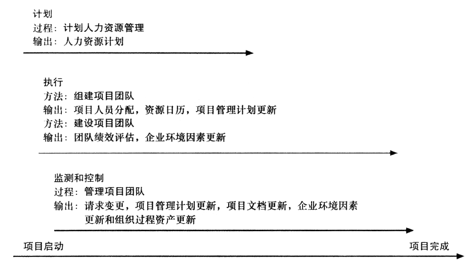

## 9.3 人员管理的关键理论
影响人们如何工作以及如何更好地工作的心理因素包括动机、影响力和权力以及有效性。

### 9.3.1 激励理论
激励
- 内在激励（intrinsic motivation）使人们根据自己的个人兴趣爱好而参与某一活动。
- 外在激励（extrinsic motivation）使人们为了获得报酬或者避免处罚而去做某些事情。

#### 1. 马斯洛的需求层次理论
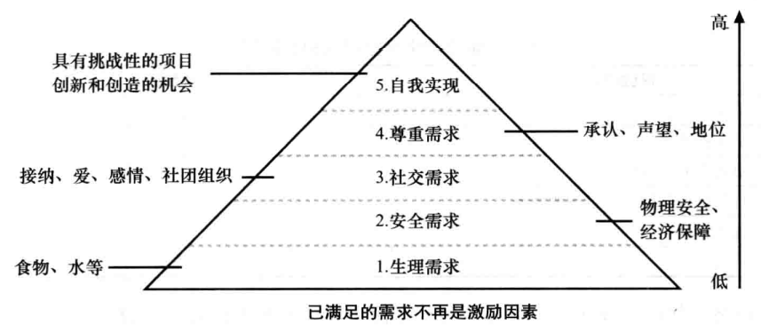

#### 2. 赫兹伯格的“激励-保健”理论
赫兹伯格保健因素和激励因素
| 保健因素                   | 激励因素 |
| -------------------------- | -------- |
| 更高的工资                 | 成就     |
| 更多的监督                 | 赏识     |
| 更吸引人的环境             | 工作本身 |
| 计算机或其他需要设备的配备 | 责任     |
| 健康福利                   | 晋升     |
| 培训                       | 成长     |

保健因素如果不满足，员工就会产生不满情绪，但是如果满足了也不能激励员工更卖力地工作。
激励因素：成就、赏识、工作本身、责任、晋升和成长。

#### 3. 麦克利兰的“获得-需求”理论
人的特殊需求可以通过后天的经历来获得（或学到）和塑造。
- 成就（achievement）需求：具有高成就需求（nAch）的人努力避免低风险和高风险的处境来提高他们实现价值的机会。
- 归属（affiliation）需求：具有高归属需求（nAff）的人渴望和睦的人际关系和需要获得他人的赏识。
- 权力（power）需求：具有权力需求（nPow）的人渴望拥有个人权力或制度权力。

[主题统觉测试](其他/TAT心理测试.md)（TAT）是根据麦克利兰的需求分类对不同人的个人需求进行测试的工具。
在测试时间受试者展示一系列主题模糊、含义不明的图片，然后要求受试者根据每一幅画面内容自由地讲述和阐发他所看到的画面。这一测试的假定是，当受试者在讲述故事时，他已经把自己的需求投射到故事中去了。

#### 4. 麦克格雷戈的X理论和Y理论
麦克格雷戈在1960年推行了人际关系管理的方法。
- X理论（古典系统理论）：人们天生不喜欢工作，只要可能，就会逃避工作。所以，经理们必须采取强迫、威胁以及各种控制计划才能使员工付出足够的努力来实现组织目标。
- Y理论（人际关系理论）：人们不是天生就不喜欢工作，而是把工作当成很自然的事情——就像玩或休息一样。
- Z理论：以日本激励员工的方法为基础，强调信任、品质、共同决策和文化价值。

### 9.3.2 塞姆海恩和威利蒙的影响力和权力理论
9条基本影响因素：
1. 权威（authority）：可发布命令的合法等级权力。
2. 委派（assignment）：项目经理可影响员工后来工作分配内容的能力。
3. 预算（budget）：项目经理可授权某人自由使用资金的能力。
4. 提升（promotion）：可提拔员工职务的能力。
5. 金钱（money）：可给员工增加工资和福利的能力。
6. 处罚（penalty）：项目经理可给员工实施处罚或免除处罚的能力。
7. 工作挑战（work challenge）：根据员工完成一项特定任务的喜好来安排工作的能力，以此作为内在激励因素。
8. 专长（expertise）：项目经理所拥有的其他人十分看重的特殊知识。
9. 友谊（friendship）：项目经理和他人之间建立良好的人际关系的能力。

权力（power）就是指影响行为的潜在能力，可驱使人们去做他们本来不会做的事。
- 强制权力（coercive power），指使用处罚、威胁或其他的消极手段强迫人们做他们不想做的事。
- 法定权力（legitimate power），指根据拥有权力的职位而让人们进行工作的权力。
- 专家权力（expert power），这种权力就是利用个人的知识和专长促使人们改变其行为。
- 奖励权力（reward power），就是使用一些激励来诱导人们去做事情。奖励包括现金、地位、肯定、晋升、特殊的工作任务。
- 感召权力（referent power），这种权力是建立在个人魅力的基础上的。

### 9.3.3 柯维的提升效率理论
提高项目工作效率的7种习惯：
1. 积极主动。
2. 开始执行时心中就已规划如何结束。
3. 优先的事优先做。
4. 考虑双赢。
5. 首先寻求理解别人，然后再寻求被别人理解。
6. 协同。
7. “磨快锯子”。

优秀的项目经理是共鸣式聆听（empathic listening），旨在理解的聆听。
当你在做共鸣式聆听之前，你必须有：
- 友好关系（rapport）：一种和谐、一致、协调或亲密的关系。
- 镜像（mirroring）：匹配对方的某些行为，一种帮助建立融洽关系的技巧。

IT专业人员需要培养移情倾听和其他人际交往技能，以改善与用户和其他利益相关者的关系。

## 9.4 制定人力资源计划
制定一个项目的人力资源计划，必须识别和记录项目的人员、职责、技能和相关报告。
人力资源计划往往包括组织结构图、人员和职责的详细信息，以及员工管理计划。

### 9.4.1 项目组织结构图
一个大型IT项目的组织结构图示例
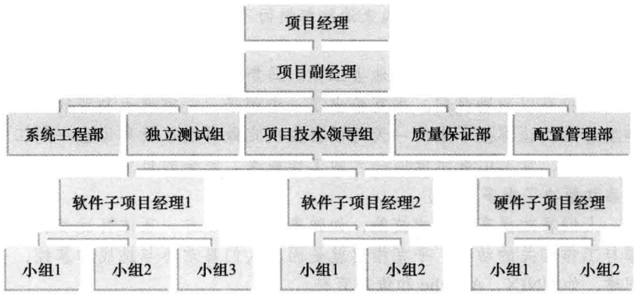

定义和分配工作框架的过程包括以下4个步骤：
1. 最终确定项目需求；
2. 定义工作如何完成；
3. 把工作分解为可管理的部分；
4. 分配工作责任。

工作定义和分配过程
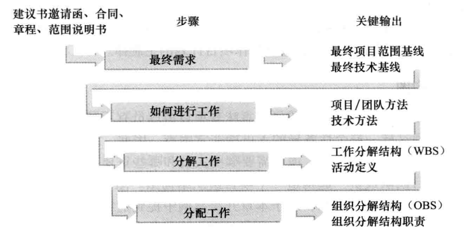

组织分解结构（organizaal breakdown structure，OBS）：显示每个组织单元负责哪项工作的组织结构图。

### 9.4.2 责任分配矩阵
责任分配矩阵（responsibility assignment matrix）：将WBS中描述的项目工作与OBS中负责实施的人员相匹配的矩阵。
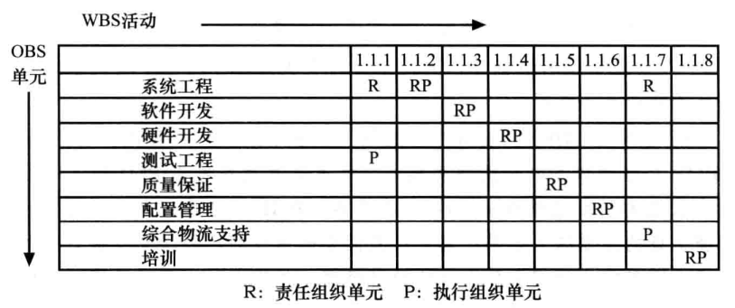

RACI表（RACI chart）：表示项目干系人的4种角色。
- 责任人（responsibility）：谁执行这个任务？
- 批准人（accountability）：谁签署的任务或对这个任务负全责？
- 审核人（consultation）：谁拥有完成这个任务所需的必要信息？
- 告知人（informed）：谁需要被通知任务状态和结果？

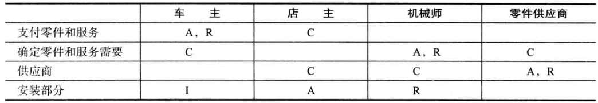

### 9.4.3 人员配置管理计划和资源直方图
人员配置管理计划（staffing management plan）描述了人员何时以及如何加入和调离项目团队。
人员配置管理计划通常包括资源直方图（resource histogram）——表示随着时间分配给一个项目的资源数量的条状图。
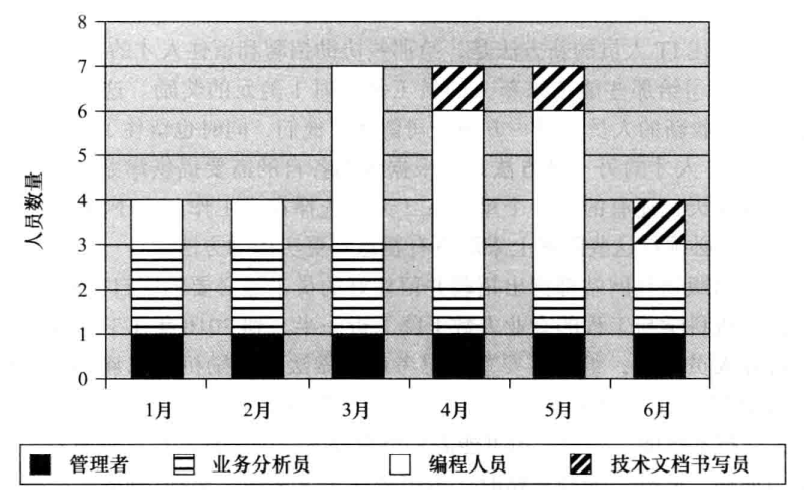

团队模型：
- 项目经理
- 产品经理
- 开发人员
- 测试
- 物流管理

## 9.5 组建项目团队
与组建项目团队相关的重要内容：人力资源分配、人力资源负荷和人力资源平衡。
一旦人员被分配到项目中，项目经理可以使用两种技术来帮助他们最有效地使用项目人员：资源负荷&资源平衡。

> 刘邦问群臣：我为什么会取得胜利，项羽为什么会失败？
> 大臣高起等人说：“您派有才能的人攻占城池与战略要地，给立大功的人加官封爵，所以能成大事业。而项羽恰恰相反，将士打了胜仗，他也不给奖励，心胸狭小，容不下有才能的人，所以他才失败。”
> 刘邦听了点点头说：“你们说的有道理，不过我最重要的取胜法宝是善于用人。要说运筹帷幄之中，决胜千里之外，我不如张良；要说镇守国家，安抚百姓，供应军饷，不让粮道断绝，我不如萧何；要说统领百万大军，攻无不克战无不胜，我不如韩信。这三个人，都是当代的人中之杰啊。我能用他们之所长，这才是我取得天下的根本原因。
> 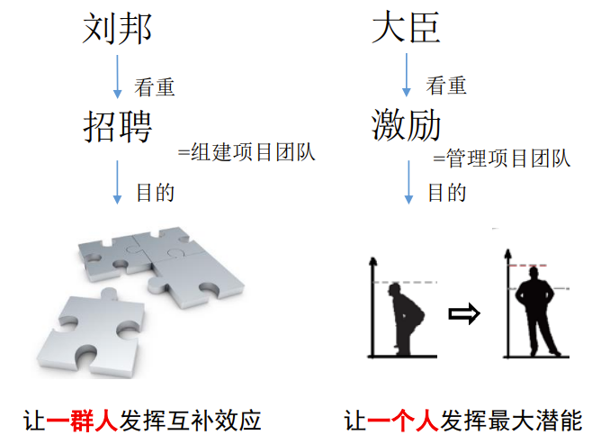

### 9.5.1 人力资源分配
人员获取过程的主要输出是项目人员分配、人力资源可用性信息和更新人员配置管理计划。许多项目团队也发现了人员获取过程对创建项目团队名录的用处。
人员配置计划中很重要的一步就是列出一个完整和准确的员工技能清单。
建立一套完善的程序来获取分包合同商和招聘新员工也是很重要的。
一种聘用和留住IT人员的新方法是，给那些协助招聘和留住人才的在职人员提供激励。

### 9.5.2 资源负荷
资源负荷（resource loading）是指在特定时段内，既定进度计划所需的个体资源的数量。
过度分配（overallocation）是指在给定时间内分配给某项工作的资源超过了它可用的资源。

显示个人过度分配的资源直方图示例
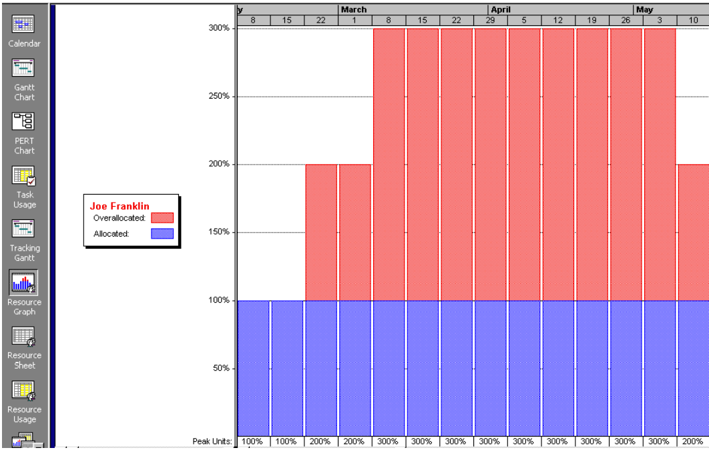

### 9.5.3 资源平衡
资源平衡（resource leveling）就是通过任务延迟来解决资源冲突的技术。
资源平衡的主要目的就是建立更平稳的资源分配使用。项目经理检查网络图中的时差或浮动时间来识别资源冲突。
资源平衡的目的就是在允许的时差范围内移动任务，从而使各个时段的资源负荷变化达到最小。

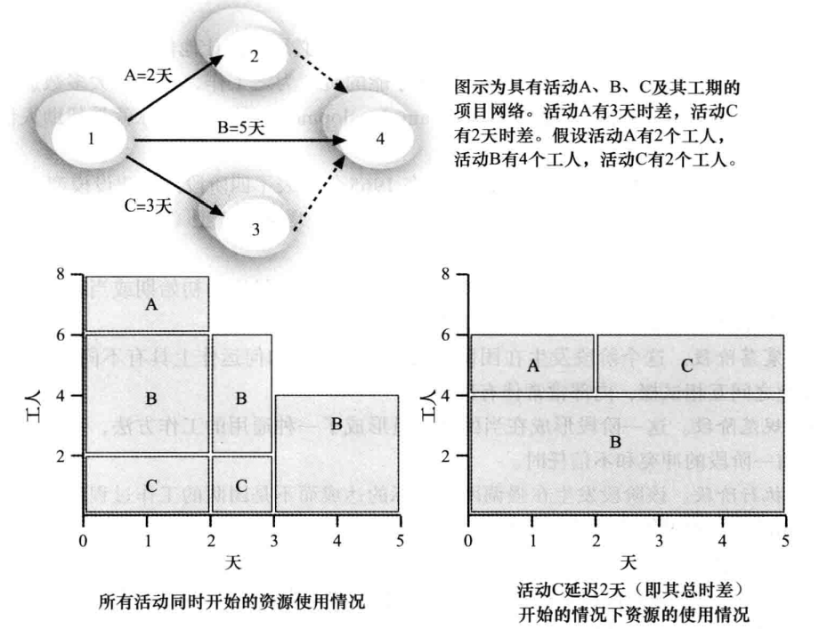

资源平衡的优点：
1. 当资源的使用情况比较稳定时，它们需要的管理就较少。
2. 资源平衡可使项目经理通过使用分包商或者其他昂贵的资源而使用零库存策略。
3. 资源平衡可以减少财务部与项目人员方面的一些问题。
4. 资源平衡还可以提高士气。

## 9.6 建设项目团队
团队建设（team development）的主要目标就是帮助人们更有效地一起工作来提高项目绩效。

塔克曼模型（Tuckman model）描述了团队建设的5个阶段：
1. 形成阶段。该阶段包括团队成员的引进，发生在项目组的初始期或当新成员被引进时。
2. 震荡阶段。这个阶段发生在团队成员对项目组应如何运作上具有不同观点的时期。
3. 规范阶段。这一阶段形成在当团队成员形成了一种通用的工作方法，而且合作与协作取代前一阶段的冲突和不信任时。
4. 执行阶段。该阶段发生在强调团队目标的达成而不是团队的工作过程的时候。
5. 终止阶段。该阶段包括项目组成功达到目标和完成工作后团队的解体。

### 9.6.1 培训
项目经理经常建议对员工进行一些特殊培训来帮助个人发展和团队开发。
进行适时的培训是非常重要的。组织也发现对现有员工在某特定领域进行培训比招聘已拥有该领域技能的员工会更经济。
有些成功应用六西格玛法则的组织采取了一个独特而有效的培训方法。

### 9.6.2 团队建设活动
团队建设活动两个常用的方法是使用体能挑战和心理偏好指示器。
- 研究表明，身体的挑战有助于使陌生人更有效的合作，但它也可能让已经功能失调的团队产生更大的问题。
- 了解和重视每个人的不同点以便作为一个团队更有效地工作，这是非常重要的。

#### 1. [梅耶斯——布里格性格类型指示器](https://www.apesk.com/mbti/dati.asp)
梅耶斯——布里格性格类型指示器（Myers-Briggs Type Indicator，MBTI）是一种判断个性倾向的常用工具。

MBTI中心理类型的4个维度包括：
- 外向（Extrovert）/内向（Introvert）（E/I）
- 感觉（Sensation）/直觉（Intuition）（S/N）
- 思维（Thinking）/感觉（Feeling）（T/F）
- 判断（Judgment）/感知（Perception）（J/P）

#### 2. 社交类型模型
下图给出了这4种社交类型模型，以及它们的两个关键要素：判定能力和响应能力。
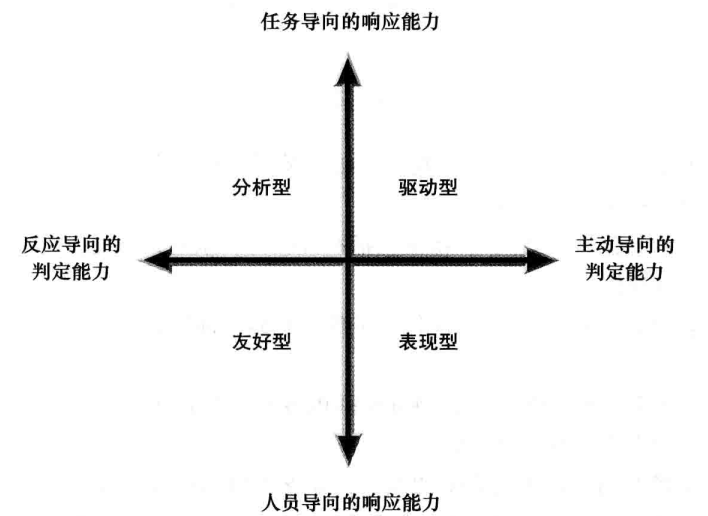

#### 3. [DISC模型](https://types.yuzeli.com/survey/disc40)
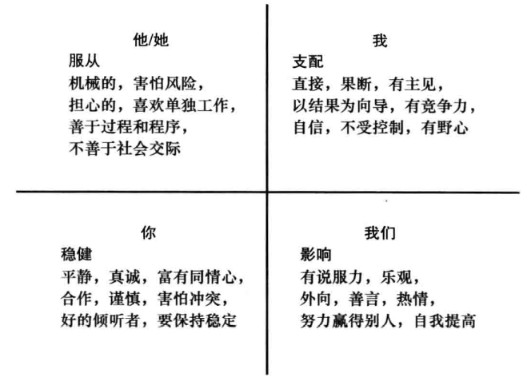

与社交类型模型相似，相反象限的人，比如支配型和稳健型或者影响型和服从型，在相互理解上会有问题。

### 9.6.3 奖励和赏识系统
如果管理层对团队协同工作进行奖励，他们就会促进或加强员工在团队中更有效率地工作。
有些组织为实现或超过公司或项目目标的员工提供奖金、旅游或其他奖励。

## 9.7 管理项目团队

### 9.7.1 管理项目团队的工具和技术
- 观察与交谈
- 项目绩效评价
- 人际技能
- 冲突管理

冲突处理模式：
- 对抗（confrontation）模式，又称问题解决模式：项目管理人员直面冲突来解决受影响的工作各方的分歧。
- 妥协（compromise）模式：项目经理使用公平交换的方法来解决冲突。
- 平滑（smoothing）模式，又称包容：项目经理不再强调或避免地区的差异，而强调达成一致性。
- 强制（forcing）模式：可以被看作是一种冲突解决的非赢即输的方法。
- 退出（withdrawal）模式，又称避免：项目经理撤退或退出一个实际或潜在的分歧。
- 协作（collaborating）模式：决策者将不同的观点和见解发展成共识和承诺。

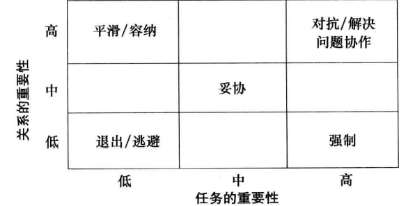

### 9.7.2 关于团队管理的一般性建议
团队中5个主要功能障碍是：
1. 缺乏信任
2. 害怕冲突
3. 缺乏承诺
4. 避免问责
5. 忽视结果

关于团队的一般建议：
- 对你的团队成员友好并要有耐心。
- 解决问题而不是责备人。
- 建立定期而有效的会议。
- 允许团队有时间来经历团队建设的基本阶段：形成阶段、震荡阶段、规范阶段、执行阶段和终止阶段。
- 把每个工作组的人数限制在3~7人。
- 规划一些社交活动来帮助项目团队成员和其他的干系人更好地相互了解。
- 强调团队的同一性。
- 培养项目团队成员，鼓励他们互相帮助。
- 认可个人和团队的成绩。
- 采取辅助的行动来与虚拟团队成员一块工作。

## 9.8 使用软件辅助人力资源管理
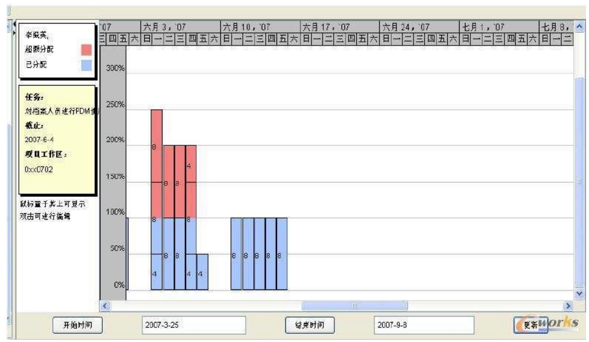

## 9.9 本章小结
- 项目人力资源管理就是最有效地发挥每个参与项目人员的作用的过程。
- 人员管理的关键理论
- 主要过程包括
  - 计划人力资源管理
  - 组建项目团队
  - 建设项目团队
  - 管理项目团队
